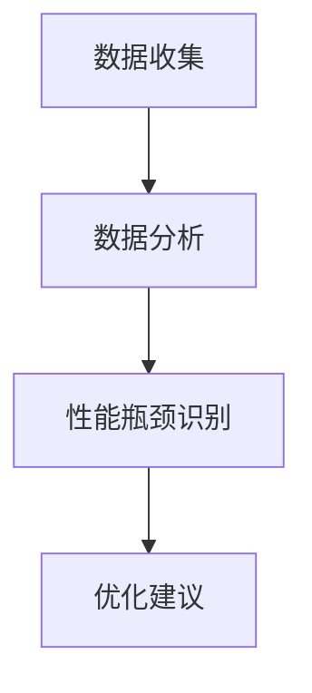

# Hadoop 性能评估方法

在大数据处理中，Hadoop是一个广泛使用的分布式计算框架。为了确保Hadoop集群的高效运行，性能评估是至关重要的一步。本文将介绍Hadoop性能评估的基本概念、关键指标、常用工具以及实际应用案例，帮助你全面掌握如何评估和优化Hadoop集群的性能。

## 1. 什么是Hadoop性能评估？

Hadoop性能评估是指通过一系列方法和工具，对Hadoop集群的运行效率、资源利用率、数据处理速度等进行量化和分析的过程。通过性能评估，可以发现集群中的瓶颈，优化资源配置，提升整体处理能力。

:::tip
性能评估不仅仅是测量速度，还包括资源利用率、任务完成时间、数据吞吐量等多个维度。
:::

## 2. 关键性能指标

在评估Hadoop性能时，以下是一些关键指标：

- **任务完成时间（Job Completion Time）**：任务从开始到结束的总时间。
- **数据吞吐量（Data Throughput）**：单位时间内处理的数据量。
- **资源利用率（Resource Utilization）**：CPU、内存、磁盘和网络的使用情况。
- **任务失败率（Task Failure Rate）**：任务失败的比例。
- **数据本地性（Data Locality）**：任务在数据所在节点上执行的比例。

:::caution
高任务失败率可能表明集群配置不当或资源不足，需要进一步分析。
:::

## 3. 常用性能评估工具

### 3.1 Hadoop自带的工具

Hadoop自带了一些工具，可以帮助你评估集群性能：

- **Hadoop JobTracker**：用于监控任务的执行情况。
- **Hadoop ResourceManager**：用于监控资源的使用情况。
- **HDFS Balancer**：用于平衡HDFS中的数据分布。

### 3.2 第三方工具

除了Hadoop自带的工具，还有一些第三方工具可以帮助你更全面地评估性能：

- **Ganglia**：用于监控集群的资源使用情况。
- **Nagios**：用于监控集群的健康状态。
- **Apache Ambari**：提供了一个可视化的界面，用于监控和管理Hadoop集群。

## 4. 性能评估步骤

### 4.1 数据收集

首先，你需要收集集群的运行数据。这包括任务日志、资源使用情况、网络流量等。

```bash
# 示例：收集Hadoop任务日志
hadoop job -history all <job_id>
```

### 4.2 数据分析

收集到数据后，你需要对其进行分析，找出性能瓶颈。例如，你可以分析任务完成时间、资源利用率等指标。



### 4.3 性能优化

根据分析结果，你可以采取相应的优化措施。例如，增加资源、调整任务调度策略、优化数据本地性等。

:::note
优化是一个持续的过程，需要不断监控和调整。
:::

## 5. 实际案例

### 5.1 案例：任务完成时间过长

假设你发现某个任务的完成时间过长，经过分析发现是由于数据本地性较差导致的。你可以通过以下步骤进行优化：

1. **增加数据副本**：增加HDFS中的数据副本数，提高数据本地性。
2. **调整任务调度策略**：优先将任务调度到数据所在的节点。

```bash
# 示例：增加HDFS数据副本数
hdfs dfs -setrep -w 4 /path/to/data
```

### 5.2 案例：资源利用率低

假设你发现集群的CPU利用率较低，但内存使用率较高。你可以通过以下步骤进行优化：

1. **调整任务资源配置**：增加任务的CPU配额，减少内存配额。
2. **优化任务并行度**：增加任务的并行度，充分利用CPU资源。

```bash
# 示例：调整任务资源配置
hadoop jar myjob.jar -Dmapreduce.map.memory.mb=2048 -Dmapreduce.reduce.memory.mb=4096
```

## 6. 总结

Hadoop性能评估是优化大数据处理效率的关键步骤。通过收集和分析关键性能指标，使用合适的工具和方法，你可以发现集群中的瓶颈，并采取相应的优化措施。希望本文能帮助你更好地理解和应用Hadoop性能评估方法。

## 7. 附加资源与练习

- **练习**：尝试在你的Hadoop集群上运行一个任务，并使用Hadoop自带的工具监控其性能。
- **资源**：阅读[Hadoop官方文档](https://hadoop.apache.org/docs/current/)了解更多关于性能优化的内容。

:::warning
在进行性能优化时，务必在生产环境之外进行测试，以避免影响实际业务。
:::