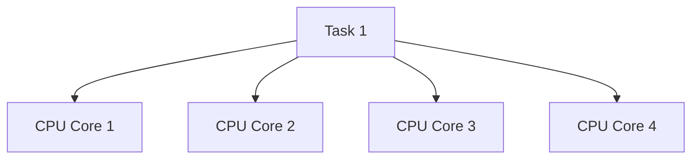
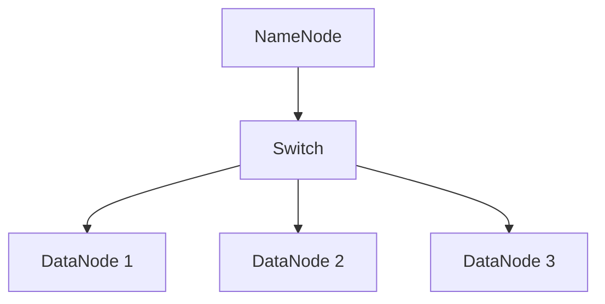

# Hadoop 硬件优化

Hadoop是一个分布式计算框架，广泛用于大数据处理。为了充分发挥Hadoop的性能，硬件优化是一个关键步骤。本文将详细介绍如何通过硬件优化来提升Hadoop集群的性能。

## 介绍

Hadoop的性能不仅取决于软件配置，还受到硬件资源的直接影响。通过优化硬件配置，可以显著提高Hadoop集群的处理能力和效率。硬件优化主要包括以下几个方面：

1. **存储优化**
2. **计算资源优化**
3. **网络优化**

## 存储优化

### 1. 使用高性能存储设备

Hadoop的性能瓶颈之一通常是磁盘I/O。使用高性能的存储设备，如SSD（固态硬盘），可以显著提高数据读写速度。

:::tip
**建议**：在NameNode和DataNode上使用SSD，以提高元数据和数据的访问速度。
:::

### 2. 增加磁盘数量

Hadoop的HDFS（分布式文件系统）设计为将大文件分割成多个块，并分布在多个磁盘上。增加磁盘数量可以提高并行读写能力。

```bash
# 示例：在DataNode上挂载多个磁盘
/dev/sdb1 /data1 ext4 defaults 0 0
/dev/sdc1 /data2 ext4 defaults 0 0
/dev/sdd1 /data3 ext4 defaults 0 0
```

### 3. 使用RAID配置

RAID（冗余阵列）可以提高数据的可靠性和性能。RAID 0通过条带化提高读写速度，而RAID 1通过镜像提高数据可靠性。

:::caution
**注意**：RAID 0不提供数据冗余，因此在生产环境中应谨慎使用。
:::

## 计算资源优化

### 1. 增加CPU核心数

Hadoop的任务调度器（如YARN）会根据可用CPU核心数来分配任务。增加CPU核心数可以提高并行处理能力。



### 2. 增加内存容量

Hadoop的MapReduce任务和HDFS缓存都需要大量内存。增加内存容量可以减少磁盘I/O，提高任务执行速度。

:::note
**建议**：为每个DataNode配置至少64GB内存，以支持大规模数据处理。
:::

## 网络优化

### 1. 使用高速网络

Hadoop集群中的节点需要频繁通信，使用高速网络（如10GbE）可以减少网络延迟，提高数据传输速度。

### 2. 优化网络拓扑

合理的网络拓扑设计可以减少数据传输的跳数，提高网络效率。例如，将NameNode和DataNode部署在同一交换机下，可以减少跨交换机的数据传输。



## 实际案例

### 案例1：电商网站日志分析

某电商网站使用Hadoop进行日志分析，最初集群性能较差。通过以下硬件优化措施，性能提升了50%：

1. 将DataNode的磁盘从HDD升级为SSD。
2. 增加每个DataNode的内存至128GB。
3. 使用10GbE网络连接所有节点。

### 案例2：金融数据仓库

某金融机构使用Hadoop构建数据仓库，最初数据处理速度较慢。通过以下优化措施，数据处理速度提升了30%：

1. 增加每个DataNode的CPU核心数至16核。
2. 使用RAID 10配置提高数据可靠性和读写速度。
3. 优化网络拓扑，减少数据传输跳数。

## 总结

通过硬件优化，可以显著提升Hadoop集群的性能。存储、计算资源和网络的优化是三个关键方面。在实际应用中，应根据具体需求选择合适的硬件配置。

## 附加资源

- [Hadoop官方文档](https://hadoop.apache.org/docs/current/)
- [Hadoop性能调优指南](https://hadoop.apache.org/docs/current/hadoop-project-dist/hadoop-common/ClusterSetup.html)

## 练习

1. 在你的Hadoop集群中，尝试将DataNode的磁盘从HDD升级为SSD，并记录性能变化。
2. 增加每个DataNode的内存容量，观察MapReduce任务的执行时间是否减少。
3. 优化网络拓扑，减少数据传输跳数，并测试网络延迟是否降低。
