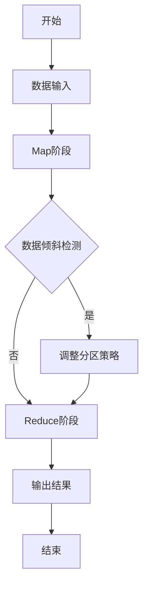

# Hadoop 数据倾斜处理

## 介绍

在Hadoop中，数据倾斜（Data Skew）是指在分布式计算过程中，某些节点处理的数据量远大于其他节点，导致这些节点成为性能瓶颈。数据倾斜会显著影响作业的执行效率，甚至可能导致任务失败。本文将详细介绍数据倾斜的原因、影响以及如何通过优化技术解决这一问题。

## 数据倾斜的原因

数据倾斜通常由以下原因引起：

1. **数据分布不均**：输入数据本身分布不均，某些键（key）的出现频率远高于其他键。
2. **分区策略不合理**：默认的分区策略（如HashPartitioner）可能导致某些分区数据量过大。
3. **业务逻辑问题**：某些业务逻辑可能导致数据倾斜，例如某些键的聚合操作特别频繁。

## 数据倾斜的影响

数据倾斜会导致以下问题：

1. **任务执行时间过长**：某些节点需要处理的数据量过大，导致任务执行时间显著增加。
2. **资源浪费**：其他节点可能很快完成任务，但需要等待倾斜节点完成，导致资源浪费。
3. **任务失败**：如果某个节点处理的数据量过大，可能导致内存溢出或任务失败。

## 数据倾斜的解决方法

### 1. 数据预处理

在数据进入Hadoop之前，可以通过预处理来减少数据倾斜。例如，可以对数据进行采样，分析键的分布情况，然后对高频键进行拆分或合并。

```java
// 示例：对高频键进行拆分
public class DataPreprocessor {
    public static void main(String[] args) {
        // 假设我们有一个高频键 "hotKey"
        String hotKey = "hotKey";
        // 将 "hotKey" 拆分为多个子键
        for (int i = 0; i < 10; i++) {
            String newKey = hotKey + "_" + i;
            // 处理 newKey
        }
    }
}
```

### 2. 自定义分区器

Hadoop允许用户自定义分区器（Partitioner），通过合理设计分区策略，可以避免数据倾斜。

```java
// 示例：自定义分区器
public class CustomPartitioner extends Partitioner<Text, IntWritable> {
    @Override
    public int getPartition(Text key, IntWritable value, int numPartitions) {
        // 假设我们有一个高频键 "hotKey"
        if (key.toString().equals("hotKey")) {
            return 0; // 将 "hotKey" 分配到第一个分区
        } else {
            return (key.hashCode() & Integer.MAX_VALUE) % numPartitions;
        }
    }
}
```

### 3. 使用Combiner

Combiner可以在Map阶段对数据进行局部聚合，减少传输到Reduce阶段的数据量，从而减轻数据倾斜的影响。

```java
// 示例：使用Combiner
public class WordCountCombiner extends Reducer<Text, IntWritable, Text, IntWritable> {
    @Override
    protected void reduce(Text key, Iterable<IntWritable> values, Context context) throws IOException, InterruptedException {
        int sum = 0;
        for (IntWritable value : values) {
            sum += value.get();
        }
        context.write(key, new IntWritable(sum));
    }
}
```

### 4. 数据倾斜检测与处理

可以通过监控任务的执行情况，检测数据倾斜。如果发现某些节点的任务执行时间过长，可以采取相应的措施，如动态调整分区策略或增加资源。



## 实际案例

假设我们有一个电商网站的日志数据，记录了用户的购买行为。某些用户（如VIP用户）的购买频率远高于普通用户，导致在统计用户购买次数时出现数据倾斜。

### 案例解决方案

1. **数据预处理**：将VIP用户的购买记录拆分为多个子记录，例如将用户ID与时间戳结合生成新的键。
2. **自定义分区器**：将VIP用户的记录分配到特定的分区，避免与其他用户的记录混在一起。
3. **使用Combiner**：在Map阶段对用户的购买记录进行局部聚合，减少传输到Reduce阶段的数据量。

```java
// 示例：处理电商日志数据
public class EcommerceLogProcessor {
    public static void main(String[] args) {
        // 假设我们有一个VIP用户的购买记录
        String vipUser = "vipUser";
        // 将VIP用户的购买记录拆分为多个子记录
        for (int i = 0; i < 10; i++) {
            String newKey = vipUser + "_" + System.currentTimeMillis();
            // 处理 newKey
        }
    }
}
```

## 总结

数据倾斜是Hadoop中常见的问题，但通过合理的预处理、自定义分区器、使用Combiner以及动态调整策略，可以有效缓解数据倾斜带来的影响。理解数据倾斜的原因和解决方法，对于优化Hadoop作业的性能至关重要。

## 附加资源与练习

- **练习**：尝试在一个小型Hadoop集群上模拟数据倾斜，并使用本文介绍的方法进行优化。
- **资源**：阅读Hadoop官方文档，了解更多关于分区器和Combiner的详细信息。

:::tip
提示：在实际生产环境中，数据倾斜问题可能更加复杂，建议结合具体业务场景进行分析和优化。
:::