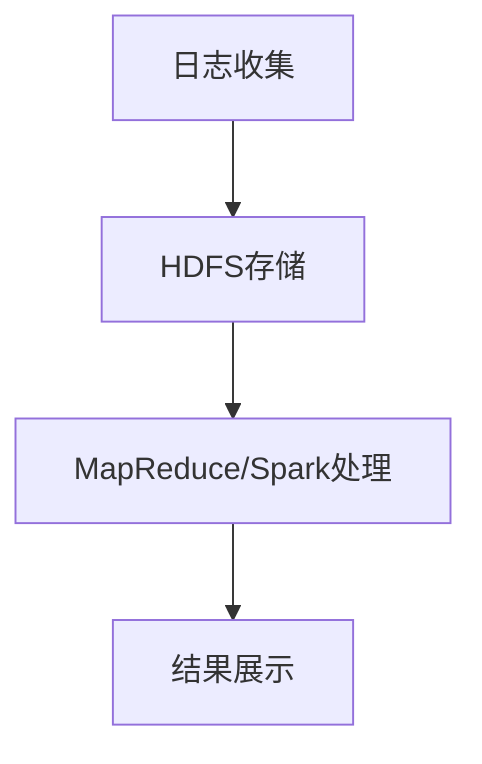

# Hadoop 日志分析系统

在大数据时代，日志数据是企业运营和系统监控的重要信息来源。Hadoop作为一个分布式计算框架，能够高效地处理海量日志数据。本文将介绍如何使用Hadoop构建一个日志分析系统，帮助初学者理解Hadoop的实际应用。

## 什么是Hadoop日志分析系统？

Hadoop日志分析系统是一个基于Hadoop生态系统的工具集，用于收集、存储、处理和分析日志数据。通过Hadoop的分布式存储（HDFS）和分布式计算（MapReduce或Spark），我们可以高效地处理大规模的日志数据，并从中提取有价值的信息。

## 系统架构

一个典型的Hadoop日志分析系统通常包括以下几个组件：

1. **日志收集**：使用工具如Flume或Logstash收集日志数据。
2. **日志存储**：将收集到的日志数据存储在HDFS中。
3. **日志处理**：使用MapReduce或Spark进行日志数据的处理和分析。
4. **结果展示**：将分析结果可视化，通常使用工具如Elasticsearch和Kibana。



## 日志收集

日志收集是日志分析系统的第一步。我们可以使用Flume来收集日志数据并将其传输到HDFS中。以下是一个简单的Flume配置文件示例：

```xml
agent.sources = logSource
agent.sinks = hdfsSink
agent.channels = memoryChannel

agent.sources.logSource.type = exec
agent.sources.logSource.command = tail -F /var/log/syslog
agent.sources.logSource.channels = memoryChannel

agent.sinks.hdfsSink.type = hdfs
agent.sinks.hdfsSink.hdfs.path = hdfs://namenode:8020/logs/%Y-%m-%d/%H%M
agent.sinks.hdfsSink.hdfs.filePrefix = logs-
agent.sinks.hdfsSink.hdfs.fileType = DataStream
agent.sinks.hdfsSink.hdfs.writeFormat = Text
agent.sinks.hdfsSink.channels = memoryChannel

agent.channels.memoryChannel.type = memory
agent.channels.memoryChannel.capacity = 1000
agent.channels.memoryChannel.transactionCapacity = 100
```

:::note
Flume的配置文件定义了数据源、数据通道和数据目的地。在这个例子中，我们从系统日志文件中读取数据，并将其写入HDFS。
:::

## 日志存储

收集到的日志数据将被存储在HDFS中。HDFS是Hadoop的分布式文件系统，能够存储海量数据并提供高吞吐量的数据访问。

```bash
hdfs dfs -ls /logs
```

:::tip
使用`hdfs dfs`命令可以查看HDFS中的文件列表。确保日志数据已经成功存储在HDFS中。
:::

## 日志处理

日志处理是日志分析系统的核心部分。我们可以使用MapReduce或Spark来处理日志数据。以下是一个简单的MapReduce程序示例，用于统计日志中不同日志级别的出现次数。

```java
import java.io.IOException;
import org.apache.hadoop.conf.Configuration;
import org.apache.hadoop.fs.Path;
import org.apache.hadoop.io.IntWritable;
import org.apache.hadoop.io.Text;
import org.apache.hadoop.mapreduce.Job;
import org.apache.hadoop.mapreduce.Mapper;
import org.apache.hadoop.mapreduce.Reducer;
import org.apache.hadoop.mapreduce.lib.input.FileInputFormat;
import org.apache.hadoop.mapreduce.lib.output.FileOutputFormat;

public class LogLevelCounter {

    public static class TokenizerMapper extends Mapper<Object, Text, Text, IntWritable> {

        private final static IntWritable one = new IntWritable(1);
        private Text word = new Text();

        public void map(Object key, Text value, Context context) throws IOException, InterruptedException {
            String[] parts = value.toString().split(" ");
            if (parts.length > 0) {
                word.set(parts[0]);
                context.write(word, one);
            }
        }
    }

    public static class IntSumReducer extends Reducer<Text, IntWritable, Text, IntWritable> {
        private IntWritable result = new IntWritable();

        public void reduce(Text key, Iterable<IntWritable> values, Context context) throws IOException, InterruptedException {
            int sum = 0;
            for (IntWritable val : values) {
                sum += val.get();
            }
            result.set(sum);
            context.write(key, result);
        }
    }

    public static void main(String[] args) throws Exception {
        Configuration conf = new Configuration();
        Job job = Job.getInstance(conf, "log level count");
        job.setJarByClass(LogLevelCounter.class);
        job.setMapperClass(TokenizerMapper.class);
        job.setCombinerClass(IntSumReducer.class);
        job.setReducerClass(IntSumReducer.class);
        job.setOutputKeyClass(Text.class);
        job.setOutputValueClass(IntWritable.class);
        FileInputFormat.addInputPath(job, new Path(args[0]));
        FileOutputFormat.setOutputPath(job, new Path(args[1]));
        System.exit(job.waitForCompletion(true) ? 0 : 1);
    }
}
```

:::caution
在运行MapReduce程序之前，确保Hadoop集群已经正确配置并启动。
:::

## 结果展示

处理完日志数据后，我们可以将结果存储在Elasticsearch中，并使用Kibana进行可视化展示。以下是一个简单的Kibana仪表板示例：

```json
{
  "title": "Log Level Statistics",
  "type": "bar",
  "params": {
    "type": "histogram",
    "grid": {
      "categoryLines": false
    }
  },
  "aggs": [
    {
      "id": "1",
      "type": "count",
      "schema": "metric"
    },
    {
      "id": "2",
      "type": "terms",
      "schema": "segment",
      "params": {
        "field": "log_level.keyword",
        "size": 5
      }
    }
  ]
}
```

:::warning
确保Elasticsearch和Kibana已经正确安装并配置，以便能够正确展示分析结果。
:::

## 实际案例

假设我们有一个电商网站，每天产生大量的访问日志。我们可以使用Hadoop日志分析系统来分析这些日志，找出访问量最高的页面、最常见的错误类型等信息。通过这些分析，我们可以优化网站性能，提升用户体验。

## 总结

Hadoop日志分析系统是一个强大的工具，能够帮助我们处理和分析海量日志数据。通过本文的介绍，你应该已经了解了如何构建一个基本的Hadoop日志分析系统。希望你能通过实践进一步掌握这些知识。

## 附加资源

- [Hadoop官方文档](https://hadoop.apache.org/docs/current/)
- [Flume用户指南](https://flume.apache.org/FlumeUserGuide.html)
- [Elasticsearch官方文档](https://www.elastic.co/guide/en/elasticsearch/reference/current/index.html)
- [Kibana用户指南](https://www.elastic.co/guide/en/kibana/current/index.html)

## 练习

1. 尝试使用Flume收集你自己的系统日志，并将其存储在HDFS中。
2. 编写一个MapReduce程序，统计日志中不同IP地址的访问次数。
3. 使用Kibana创建一个仪表板，展示日志分析结果。

通过完成这些练习，你将更深入地理解Hadoop日志分析系统的实际应用。