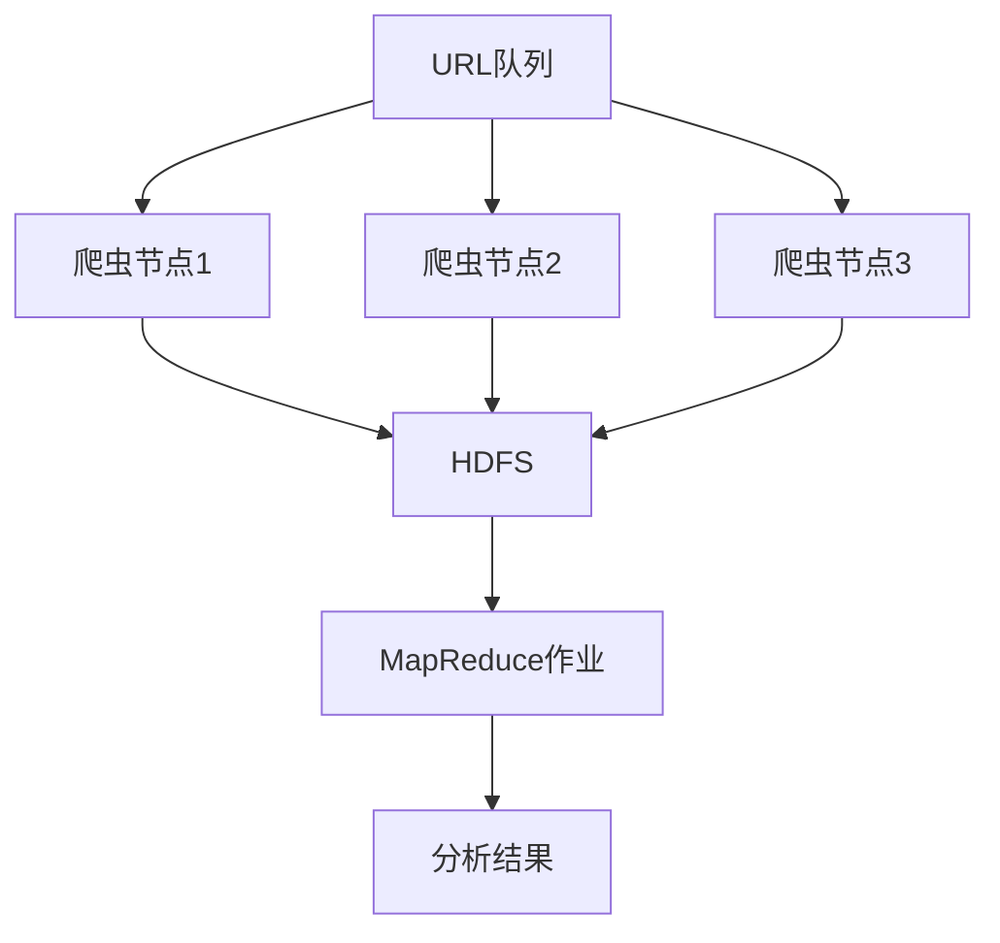

# Hadoop 网络爬虫系统

## 介绍

网络爬虫是一种自动化程序，用于从互联网上抓取数据。随着数据量的增加，单机爬虫可能无法满足需求。Hadoop作为一个分布式计算框架，可以帮助我们构建一个分布式的网络爬虫系统，从而高效地处理大规模数据抓取任务。

在本教程中，我们将逐步介绍如何使用Hadoop构建一个分布式网络爬虫系统，并通过实际案例展示其应用场景。

## 1. Hadoop与网络爬虫的结合

Hadoop的核心组件包括HDFS（分布式文件系统）和MapReduce（分布式计算框架）。网络爬虫系统可以利用HDFS存储抓取的数据，并利用MapReduce进行数据处理和分析。

### 1.1 HDFS存储抓取数据

HDFS是一个分布式文件系统，适合存储大规模数据。我们可以将抓取的网页数据存储在HDFS中，以便后续处理。

### 1.2 MapReduce处理数据

MapReduce是一个分布式计算框架，适合处理大规模数据。我们可以使用MapReduce对抓取的网页数据进行解析、过滤和分析。

## 2. 构建Hadoop网络爬虫系统的步骤

### 2.1 设计爬虫架构

首先，我们需要设计一个分布式爬虫系统的架构。以下是一个简单的架构图：



在这个架构中，URL队列存储待抓取的URL，多个爬虫节点并行抓取网页数据，并将抓取的数据存储在HDFS中。然后，MapReduce作业对抓取的数据进行处理和分析。

### 2.2 实现爬虫节点

每个爬虫节点负责从URL队列中获取URL，抓取网页数据，并将数据存储在HDFS中。以下是一个简单的Python爬虫示例：

```python
import requests
from hdfs import InsecureClient

def fetch_url(url):
    response = requests.get(url)
    return response.text

def save_to_hdfs(content, hdfs_path):
    client = InsecureClient('http://localhost:50070', user='hadoop')
    with client.write(hdfs_path) as writer:
        writer.write(content)

url = 'http://example.com'
content = fetch_url(url)
save_to_hdfs(content, '/data/example.html')
```

### 2.3 实现MapReduce作业

MapReduce作业负责对抓取的网页数据进行处理。以下是一个简单的MapReduce作业示例，用于统计网页中的单词频率：

```java
import java.io.IOException;
import java.util.StringTokenizer;
import org.apache.hadoop.conf.Configuration;
import org.apache.hadoop.fs.Path;
import org.apache.hadoop.io.IntWritable;
import org.apache.hadoop.io.Text;
import org.apache.hadoop.mapreduce.Job;
import org.apache.hadoop.mapreduce.Mapper;
import org.apache.hadoop.mapreduce.Reducer;
import org.apache.hadoop.mapreduce.lib.input.FileInputFormat;
import org.apache.hadoop.mapreduce.lib.output.FileOutputFormat;

public class WordCount {

    public static class TokenizerMapper extends Mapper<Object, Text, Text, IntWritable> {
        private final static IntWritable one = new IntWritable(1);
        private Text word = new Text();

        public void map(Object key, Text value, Context context) throws IOException, InterruptedException {
            StringTokenizer itr = new StringTokenizer(value.toString());
            while (itr.hasMoreTokens()) {
                word.set(itr.nextToken());
                context.write(word, one);
            }
        }
    }

    public static class IntSumReducer extends Reducer<Text, IntWritable, Text, IntWritable> {
        private IntWritable result = new IntWritable();

        public void reduce(Text key, Iterable<IntWritable> values, Context context) throws IOException, InterruptedException {
            int sum = 0;
            for (IntWritable val : values) {
                sum += val.get();
            }
            result.set(sum);
            context.write(key, result);
        }
    }

    public static void main(String[] args) throws Exception {
        Configuration conf = new Configuration();
        Job job = Job.getInstance(conf, "word count");
        job.setJarByClass(WordCount.class);
        job.setMapperClass(TokenizerMapper.class);
        job.setCombinerClass(IntSumReducer.class);
        job.setReducerClass(IntSumReducer.class);
        job.setOutputKeyClass(Text.class);
        job.setOutputValueClass(IntWritable.class);
        FileInputFormat.addInputPath(job, new Path(args[0]));
        FileOutputFormat.setOutputPath(job, new Path(args[1]));
        System.exit(job.waitForCompletion(true) ? 0 : 1);
    }
}
```

### 2.4 运行系统

将爬虫节点部署在多台机器上，并启动MapReduce作业。爬虫节点将抓取的数据存储在HDFS中，MapReduce作业将对数据进行处理和分析。

## 3. 实际案例

假设我们需要抓取某个新闻网站的所有新闻文章，并统计每篇文章中的单词频率。我们可以使用上述系统来完成这个任务。

1. **抓取数据**：爬虫节点从新闻网站的URL队列中获取URL，抓取新闻文章，并将文章内容存储在HDFS中。
2. **处理数据**：MapReduce作业对抓取的新闻文章进行单词频率统计。
3. **分析结果**：最终结果将显示每篇文章中的单词频率，帮助我们了解新闻文章的内容分布。

## 4. 总结

通过本教程，我们学习了如何使用Hadoop构建一个分布式网络爬虫系统。我们介绍了HDFS和MapReduce的基本概念，并通过实际案例展示了系统的应用场景。

:::tip
**提示**：在实际应用中，可能需要考虑反爬虫机制、数据去重、分布式调度等问题。建议进一步学习相关技术以优化系统。
:::

## 5. 附加资源与练习

- **资源**：
  - [Hadoop官方文档](https://hadoop.apache.org/docs/current/)
  - [MapReduce编程指南](https://hadoop.apache.org/docs/current/hadoop-mapreduce-client/hadoop-mapreduce-client-core/MapReduceTutorial.html)
  - [HDFS使用指南](https://hadoop.apache.org/docs/current/hadoop-project-dist/hadoop-hdfs/HdfsUserGuide.html)

- **练习**：
  1. 尝试扩展爬虫节点，使其支持抓取动态网页（如JavaScript渲染的内容）。
  2. 修改MapReduce作业，使其能够统计每个URL的抓取频率。
  3. 研究如何优化HDFS存储结构，以提高数据读取效率。

通过以上练习，你将更深入地理解Hadoop网络爬虫系统的构建与优化。