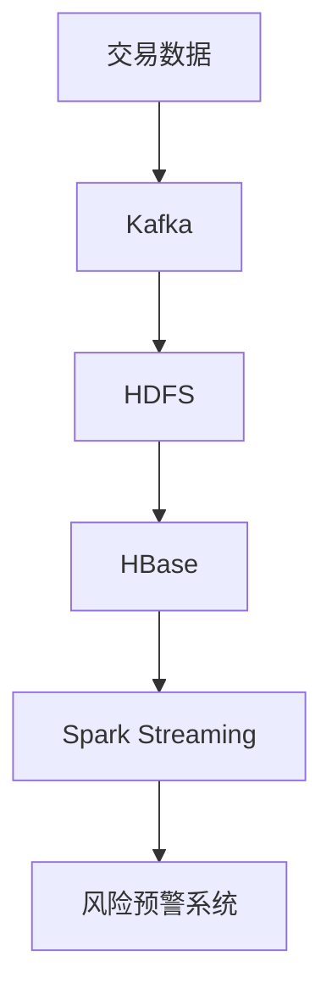

## 介绍

Hadoop是一个开源的分布式计算框架，专为处理大规模数据集而设计。它通过分布式存储（HDFS）和分布式计算（MapReduce）实现了高效的数据处理能力。在企业中，Hadoop被广泛应用于大数据分析、日志处理、推荐系统等场景。本文将介绍Hadoop在企业中的实际应用案例，帮助初学者理解其实际价值。

## Hadoop 的核心组件

在深入案例之前，我们先回顾一下Hadoop的核心组件：

1. **HDFS（Hadoop Distributed File System）**：分布式文件系统，用于存储大规模数据集。
2. **MapReduce**：分布式计算框架，用于处理和分析存储在HDFS中的数据。
3. **YARN（Yet Another Resource Negotiator）**：资源管理框架，负责集群资源的管理和调度。

## 企业实施案例

### 案例1：电商平台的用户行为分析

#### 背景
一家大型电商平台需要分析用户的浏览、点击和购买行为，以优化推荐系统和广告投放策略。每天产生的用户行为日志数据量高达数百GB。

#### 解决方案
该平台使用Hadoop来处理和分析这些日志数据。具体步骤如下：

1. **数据收集**：用户行为日志通过Flume收集并存储到HDFS中。
2. **数据清洗**：使用MapReduce作业清洗日志数据，去除无效记录。
3. **数据分析**：编写MapReduce程序分析用户行为，生成用户画像和购买偏好。
4. **结果存储**：分析结果存储到HDFS中，供推荐系统和广告系统使用。

#### 代码示例
以下是一个简单的MapReduce程序，用于统计用户点击次数：

```java
public class ClickCount {
    public static class TokenizerMapper extends Mapper<Object, Text, Text, IntWritable> {
        private final static IntWritable one = new IntWritable(1);
        private Text word = new Text();

        public void map(Object key, Text value, Context context) throws IOException, InterruptedException {
            String[] logs = value.toString().split(",");
            String userId = logs[0];
            word.set(userId);
            context.write(word, one);
        }
    }

    public static class IntSumReducer extends Reducer<Text, IntWritable, Text, IntWritable> {
        private IntWritable result = new IntWritable();

        public void reduce(Text key, Iterable<IntWritable> values, Context context) throws IOException, InterruptedException {
            int sum = 0;
            for (IntWritable val : values) {
                sum += val.get();
            }
            result.set(sum);
            context.write(key, result);
        }
    }

    public static void main(String[] args) throws Exception {
        Configuration conf = new Configuration();
        Job job = Job.getInstance(conf, "click count");
        job.setJarByClass(ClickCount.class);
        job.setMapperClass(TokenizerMapper.class);
        job.setCombinerClass(IntSumReducer.class);
        job.setReducerClass(IntSumReducer.class);
        job.setOutputKeyClass(Text.class);
        job.setOutputValueClass(IntWritable.class);
        FileInputFormat.addInputPath(job, new Path(args[0]));
        FileOutputFormat.setOutputPath(job, new Path(args[1]));
        System.exit(job.waitForCompletion(true) ? 0 : 1);
    }
}
```

#### 输入示例
```
user1,click,productA
user2,click,productB
user1,click,productC
```

#### 输出示例
```
user1 2
user2 1
```

### 案例2：金融机构的风险管理

#### 背景
一家金融机构需要实时监控交易数据，以识别潜在的欺诈行为。每天产生的交易数据量高达TB级别。

#### 解决方案
该机构使用Hadoop和HBase构建了一个实时风险管理系统。具体步骤如下：

1. **数据收集**：交易数据通过Kafka实时传输到HDFS中。
2. **数据存储**：交易数据存储到HBase中，以便快速查询和分析。
3. **实时分析**：使用Spark Streaming实时分析交易数据，识别异常模式。
4. **风险预警**：当检测到异常交易时，系统自动发出预警。

#### 架构图


### 案例3：社交媒体的情感分析

#### 背景
一家社交媒体公司需要分析用户发布的文本内容，以了解用户对某些话题的情感倾向。每天产生的文本数据量高达数百GB。

#### 解决方案
该公司使用Hadoop和自然语言处理（NLP）技术进行情感分析。具体步骤如下：

1. **数据收集**：用户发布的文本内容通过Flume收集并存储到HDFS中。
2. **数据预处理**：使用MapReduce作业清洗和预处理文本数据。
3. **情感分析**：使用Mahout库进行情感分析，识别文本中的情感倾向。
4. **结果存储**：分析结果存储到HDFS中，供后续分析和可视化使用。

#### 代码示例
以下是一个简单的MapReduce程序，用于统计情感词汇的出现次数：

```java
public class SentimentAnalysis {
    public static class TokenizerMapper extends Mapper<Object, Text, Text, IntWritable> {
        private final static IntWritable one = new IntWritable(1);
        private Text word = new Text();

        public void map(Object key, Text value, Context context) throws IOException, InterruptedException {
            String[] words = value.toString().split(" ");
            for (String w : words) {
                if (isSentimentWord(w)) {
                    word.set(w);
                    context.write(word, one);
                }
            }
        }

        private boolean isSentimentWord(String word) {
            // 假设这是一个情感词汇列表
            String[] sentimentWords = {"happy", "sad", "angry", "joyful"};
            for (String s : sentimentWords) {
                if (s.equals(word)) {
                    return true;
                }
            }
            return false;
        }
    }

    public static class IntSumReducer extends Reducer<Text, IntWritable, Text, IntWritable> {
        private IntWritable result = new IntWritable();

        public void reduce(Text key, Iterable<IntWritable> values, Context context) throws IOException, InterruptedException {
            int sum = 0;
            for (IntWritable val : values) {
                sum += val.get();
            }
            result.set(sum);
            context.write(key, result);
        }
    }

    public static void main(String[] args) throws Exception {
        Configuration conf = new Configuration();
        Job job = Job.getInstance(conf, "sentiment analysis");
        job.setJarByClass(SentimentAnalysis.class);
        job.setMapperClass(TokenizerMapper.class);
        job.setCombinerClass(IntSumReducer.class);
        job.setReducerClass(IntSumReducer.class);
        job.setOutputKeyClass(Text.class);
        job.setOutputValueClass(IntWritable.class);
        FileInputFormat.addInputPath(job, new Path(args[0]));
        FileOutputFormat.setOutputPath(job, new Path(args[1]));
        System.exit(job.waitForCompletion(true) ? 0 : 1);
    }
}
```

#### 输入示例
```
I am happy today
He is sad because of the weather
```

#### 输出示例
```
happy 1
sad 1
```

## 总结

通过以上案例，我们可以看到Hadoop在企业中的广泛应用。无论是电商平台的用户行为分析、金融机构的风险管理，还是社交媒体的情感分析，Hadoop都展现出了强大的数据处理能力。对于初学者来说，理解这些实际应用场景有助于更好地掌握Hadoop的核心概念和技术。

## 附加资源

- [Hadoop官方文档](https://hadoop.apache.org/docs/current/)
- [MapReduce编程指南](https://hadoop.apache.org/docs/current/hadoop-mapreduce-client/hadoop-mapreduce-client-core/MapReduceTutorial.html)
- [HBase官方文档](https://hbase.apache.org/book.html)
- [Spark Streaming编程指南](https://spark.apache.org/docs/latest/streaming-programming-guide.html)

## 练习

1. 尝试编写一个MapReduce程序，统计一段文本中每个单词的出现次数。
2. 使用HBase存储和查询交易数据，模拟一个简单的风险管理系统。
3. 使用Mahout库进行情感分析，分析一段文本中的情感倾向。

:::tip
在完成练习时，可以参考Hadoop官方文档和相关教程，逐步掌握Hadoop的使用技巧。
:::