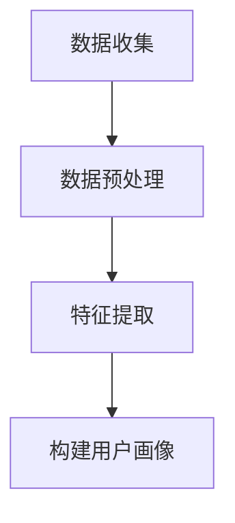

# Hadoop 用户画像

## 介绍

用户画像（User Profile）是通过收集和分析用户的行为数据，构建出用户的特征模型。它广泛应用于推荐系统、广告投放、个性化服务等领域。Hadoop作为一个分布式计算框架，能够高效处理海量数据，是构建用户画像的理想工具。

在本教程中，我们将逐步讲解如何使用Hadoop构建用户画像，并通过实际案例展示其应用场景。

## 用户画像的基本概念

用户画像通常包括以下几个方面的信息：

1. **基本信息**：如年龄、性别、地域等。
2. **行为信息**：如浏览记录、购买记录、点击行为等。
3. **兴趣偏好**：如喜欢的商品类别、常访问的网站等。
4. **社交关系**：如好友列表、互动频率等。

通过分析这些信息，我们可以为用户打上各种标签，从而构建出详细的用户画像。

## Hadoop 用户画像的实现步骤

### 1. 数据收集

首先，我们需要收集用户的行为数据。这些数据可以来自日志文件、数据库、传感器等。常见的数据格式包括JSON、CSV等。

```json
{
  "user_id": "12345",
  "timestamp": "2023-10-01T12:34:56Z",
  "action": "click",
  "item_id": "67890"
}
```

### 2. 数据预处理

在Hadoop中，我们可以使用MapReduce或Hive进行数据预处理。预处理的目的是清洗数据、去除噪声、填充缺失值等。

```java
// MapReduce示例：过滤无效数据
public class DataFilterMapper extends Mapper<LongWritable, Text, Text, Text> {
    @Override
    protected void map(LongWritable key, Text value, Context context) throws IOException, InterruptedException {
        String[] fields = value.toString().split(",");
        if (fields.length == 4) {
            context.write(new Text(fields[0]), value);
        }
    }
}
```

### 3. 特征提取

接下来，我们需要从预处理后的数据中提取出有用的特征。例如，我们可以统计用户的点击次数、购买次数等。

```java
// MapReduce示例：统计用户点击次数
public class ClickCountReducer extends Reducer<Text, Text, Text, IntWritable> {
    @Override
    protected void reduce(Text key, Iterable<Text> values, Context context) throws IOException, InterruptedException {
        int count = 0;
        for (Text value : values) {
            count++;
        }
        context.write(key, new IntWritable(count));
    }
}
```

### 4. 构建用户画像

最后，我们将提取的特征整合起来，构建用户画像。可以使用Hive或Spark SQL进行数据聚合和标签生成。

```sql
-- Hive示例：生成用户标签
SELECT user_id, 
       COUNT(*) AS total_clicks,
       SUM(CASE WHEN action = 'purchase' THEN 1 ELSE 0 END) AS total_purchases
FROM user_actions
GROUP BY user_id;
```

## 实际案例

### 电商网站的用户画像

假设我们有一个电商网站，希望通过用户画像来提高推荐系统的准确性。我们可以通过以下步骤实现：

1. **数据收集**：收集用户的浏览记录、购买记录、评价等数据。
2. **数据预处理**：清洗数据，去除无效记录。
3. **特征提取**：统计用户的点击次数、购买次数、评价分数等。
4. **构建用户画像**：根据提取的特征，为用户打上“高频购买者”、“高评价用户”等标签。



## 总结

通过本教程，我们了解了如何使用Hadoop构建用户画像。用户画像在推荐系统、广告投放等领域有着广泛的应用。掌握这一技能，可以帮助我们更好地理解用户需求，提供更个性化的服务。

## 附加资源

- [Hadoop官方文档](https://hadoop.apache.org/docs/current/)
- [MapReduce编程指南](https://hadoop.apache.org/docs/current/hadoop-mapreduce-client/hadoop-mapreduce-client-core/MapReduceTutorial.html)
- [Hive编程指南](https://cwiki.apache.org/confluence/display/Hive/Tutorial)

## 练习

1. 尝试使用Hadoop处理你自己的数据集，构建用户画像。
2. 探索如何使用Spark替代MapReduce进行用户画像的构建。
3. 思考如何将用户画像应用于实际的业务场景中，例如个性化推荐或精准营销。
