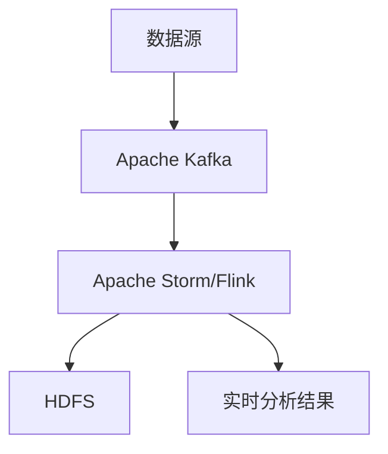

# Hadoop 实时计算平台

## 介绍

Hadoop是一个广泛使用的分布式计算框架，最初设计用于处理大规模数据的批处理任务。然而，随着数据处理的实时性需求增加，Hadoop生态系统也扩展到了实时计算领域。Hadoop实时计算平台结合了Hadoop的分布式存储和计算能力，能够处理实时数据流，并提供低延迟的分析结果。

实时计算平台的核心目标是在数据生成的同时进行处理和分析，以便快速响应业务需求。常见的实时计算场景包括实时监控、实时推荐系统、实时欺诈检测等。

## Hadoop 实时计算平台的架构

Hadoop实时计算平台通常由以下几个组件组成：

1. **HDFS（Hadoop分布式文件系统）**：用于存储大规模数据。
2. **YARN（Yet Another Resource Negotiator）**：用于资源管理和任务调度。
3. **Apache Kafka**：用于实时数据流的收集和分发。
4. **Apache Storm 或 Apache Flink**：用于实时数据处理和分析。



:::note
**注意**：Apache Storm 和 Apache Flink 都是流行的实时计算框架，但它们的设计理念和使用场景有所不同。Storm 更适合处理低延迟的流数据，而 Flink 则提供了更强大的状态管理和批流一体化的能力。
:::

## 实时计算平台的工作流程

1. **数据收集**：数据源（如传感器、日志系统等）生成实时数据流，并通过Apache Kafka进行收集和分发。
2. **数据处理**：实时计算框架（如Storm或Flink）从Kafka中消费数据，并进行处理和分析。
3. **结果存储**：处理结果可以存储到HDFS中，供后续分析使用，或者直接输出到实时分析系统中。

## 代码示例

以下是一个简单的Apache Flink实时计算示例，用于统计实时数据流中的单词出现次数。

```java
import org.apache.flink.streaming.api.environment.StreamExecutionEnvironment;
import org.apache.flink.streaming.api.datastream.DataStream;
import org.apache.flink.streaming.api.windowing.time.Time;

public class WordCount {
    public static void main(String[] args) throws Exception {
        // 创建执行环境
        final StreamExecutionEnvironment env = StreamExecutionEnvironment.getExecutionEnvironment();

        // 从Socket中读取实时数据流
        DataStream<String> text = env.socketTextStream("localhost", 9999);

        // 对数据流进行处理
        DataStream<WordWithCount> wordCounts = text
            .flatMap((String line, Collector<WordWithCount> out) -> {
                for (String word : line.split(" ")) {
                    out.collect(new WordWithCount(word, 1L));
                }
            })
            .keyBy("word")
            .timeWindow(Time.seconds(5))
            .sum("count");

        // 打印结果
        wordCounts.print();

        // 启动任务
        env.execute("WordCount");
    }

    public static class WordWithCount {
        public String word;
        public long count;

        public WordWithCount() {}

        public WordWithCount(String word, long count) {
            this.word = word;
            this.count = count;
        }

        @Override
        public String toString() {
            return word + " : " + count;
        }
    }
}
```

### 输入示例

假设从Socket中输入的实时数据流如下：

```
hello world
hello flink
flink is awesome
```

### 输出示例

程序将输出每个单词在5秒窗口内的出现次数：

```
hello : 2
world : 1
flink : 2
is : 1
awesome : 1
```

## 实际应用案例

### 实时监控系统

在实时监控系统中，Hadoop实时计算平台可以用于处理来自各种传感器和设备的实时数据流。例如，监控工厂中的设备状态，实时检测异常情况并触发警报。

### 实时推荐系统

在电商平台中，实时计算平台可以用于分析用户的实时行为数据（如点击、浏览、购买等），并根据这些数据实时调整推荐内容，提高用户体验和转化率。

### 实时欺诈检测

在金融领域，实时计算平台可以用于分析交易数据流，实时检测异常交易行为，防止欺诈行为的发生。

## 总结

Hadoop实时计算平台结合了Hadoop的分布式存储和计算能力，能够处理实时数据流并提供低延迟的分析结果。通过使用Apache Kafka、Apache Storm或Apache Flink等工具，开发者可以构建强大的实时计算应用，满足各种实时数据处理需求。

## 附加资源与练习

- **资源**：
  - [Apache Flink官方文档](https://flink.apache.org/)
  - [Apache Storm官方文档](https://storm.apache.org/)
  - [Apache Kafka官方文档](https://kafka.apache.org/)

- **练习**：
  1. 尝试修改上述Flink代码，使其能够处理来自Kafka的实时数据流。
  2. 构建一个简单的实时监控系统，模拟传感器数据流并进行实时分析。
  3. 研究Apache Storm和Apache Flink的区别，并尝试在两者之间进行切换，比较它们的性能和易用性。
