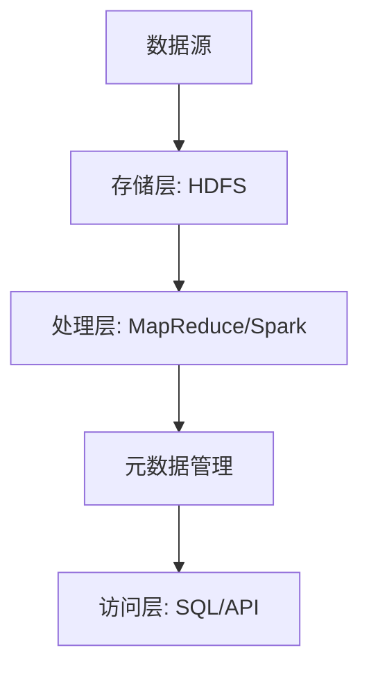

# Hadoop 数据湖构建

## 介绍

数据湖（Data Lake）是一种存储大量原始数据的系统，支持结构化、半结构化和非结构化数据的存储。与数据仓库不同，数据湖不需要预先定义数据的结构，这使得它非常适合处理多样化的数据源。Hadoop作为一个分布式计算框架，是构建数据湖的理想选择，因为它能够处理大规模数据并提供高容错性。

在本教程中，我们将逐步讲解如何使用Hadoop构建数据湖，并通过实际案例展示其应用场景。

---

## 数据湖的核心概念

### 1. 数据湖的架构

数据湖的架构通常包括以下几个关键组件：

- **存储层**：用于存储原始数据，通常使用HDFS（Hadoop分布式文件系统）。
- **处理层**：用于处理和分析数据，可以使用MapReduce、Spark等工具。
- **元数据管理**：用于管理数据的元信息，例如数据的来源、格式和结构。
- **访问层**：提供数据访问接口，支持SQL查询、API调用等。



### 2. 数据湖的优势

- **灵活性**：支持多种数据格式，无需预先定义数据结构。
- **可扩展性**：能够处理PB级甚至EB级的数据。
- **成本效益**：使用廉价的硬件和开源软件，降低存储和计算成本。

---

## 构建Hadoop数据湖的步骤

### 1. 设置Hadoop集群

首先，您需要设置一个Hadoop集群。以下是一个简单的HDFS配置示例：

```xml
<configuration>
    <property>
        <name>dfs.replication</name>
        <value>3</value>
    </property>
    <property>
        <name>dfs.namenode.name.dir</name>
        <value>/hadoop/hdfs/namenode</value>
    </property>
    <property>
        <name>dfs.datanode.data.dir</name>
        <value>/hadoop/hdfs/datanode</value>
    </property>
</configuration>
```

### 2. 数据摄取

将数据从不同来源（如数据库、日志文件、传感器数据等）摄取到HDFS中。以下是一个使用`hdfs dfs`命令将本地文件上传到HDFS的示例：

```bash
hdfs dfs -put /local/path/to/data /hdfs/path/to/destination
```

### 3. 数据处理

使用MapReduce或Spark对数据进行处理。以下是一个简单的MapReduce WordCount示例：

```java
public class WordCount {
    public static class TokenizerMapper extends Mapper<Object, Text, Text, IntWritable> {
        private final static IntWritable one = new IntWritable(1);
        private Text word = new Text();

        public void map(Object key, Text value, Context context) throws IOException, InterruptedException {
            StringTokenizer itr = new StringTokenizer(value.toString());
            while (itr.hasMoreTokens()) {
                word.set(itr.nextToken());
                context.write(word, one);
            }
        }
    }

    public static class IntSumReducer extends Reducer<Text, IntWritable, Text, IntWritable> {
        private IntWritable result = new IntWritable();

        public void reduce(Text key, Iterable<IntWritable> values, Context context) throws IOException, InterruptedException {
            int sum = 0;
            for (IntWritable val : values) {
                sum += val.get();
            }
            result.set(sum);
            context.write(key, result);
        }
    }

    public static void main(String[] args) throws Exception {
        Configuration conf = new Configuration();
        Job job = Job.getInstance(conf, "word count");
        job.setJarByClass(WordCount.class);
        job.setMapperClass(TokenizerMapper.class);
        job.setCombinerClass(IntSumReducer.class);
        job.setReducerClass(IntSumReducer.class);
        job.setOutputKeyClass(Text.class);
        job.setOutputValueClass(IntWritable.class);
        FileInputFormat.addInputPath(job, new Path(args[0]));
        FileOutputFormat.setOutputPath(job, new Path(args[1]));
        System.exit(job.waitForCompletion(true) ? 0 : 1);
    }
}
```

### 4. 元数据管理

使用Apache Atlas或Apache Hive管理元数据。以下是一个使用Hive创建表的示例：

```sql
CREATE EXTERNAL TABLE IF NOT EXISTS logs (
    timestamp STRING,
    level STRING,
    message STRING
)
STORED AS PARQUET
LOCATION '/hdfs/path/to/logs';
```

---

## 实际案例：构建电商数据湖

假设我们正在为一家电商公司构建数据湖，以下是具体步骤：

1. **数据摄取**：将用户行为日志、交易数据和产品信息上传到HDFS。
2. **数据处理**：使用Spark分析用户行为，生成推荐模型。
3. **元数据管理**：使用Hive管理所有数据的元信息。
4. **数据访问**：通过Presto或Hive提供SQL查询接口，供业务团队使用。

---

## 总结

通过本教程，您已经了解了如何使用Hadoop构建数据湖，并掌握了数据湖的核心概念、架构设计以及实际应用场景。数据湖为企业提供了灵活、可扩展且成本效益高的数据存储和处理方案，是现代数据架构的重要组成部分。

---

## 附加资源与练习

- **资源**：
  - [Hadoop官方文档](https://hadoop.apache.org/docs/current/)
  - [Apache Spark官方文档](https://spark.apache.org/docs/latest/)
  - [Apache Hive官方文档](https://hive.apache.org/)

- **练习**：
  1. 尝试在本地搭建一个Hadoop集群，并将一些日志文件上传到HDFS。
  2. 使用MapReduce或Spark编写一个简单的数据处理程序。
  3. 使用Hive创建一个外部表，并查询其中的数据。

:::tip
如果您在实践过程中遇到问题，可以参考Hadoop社区论坛或相关文档，获取更多帮助。
:::