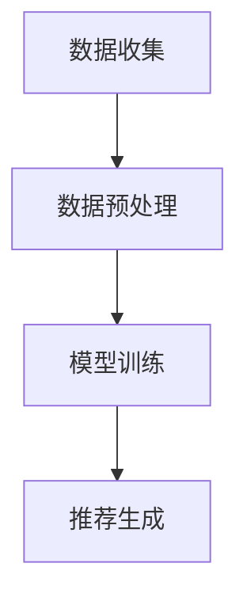

## 介绍

Hadoop 是一个开源的分布式计算框架，主要用于处理大规模数据集。而机器学习（Machine Learning, ML）是一种通过数据训练模型以实现预测或决策的技术。随着数据量的爆炸式增长，Hadoop 与机器学习的融合成为了一种趋势，能够帮助企业在海量数据中挖掘出有价值的信息。

本文将介绍 Hadoop 与机器学习融合的基本概念、实现方式以及实际应用场景，帮助初学者理解如何利用 Hadoop 的强大数据处理能力来支持机器学习任务。

## Hadoop 与机器学习融合的基础

### Hadoop 的核心组件

Hadoop 主要由以下两个核心组件组成：

1. **HDFS（Hadoop Distributed File System）**：分布式文件系统，用于存储大规模数据集。
2. **MapReduce**：分布式计算框架，用于处理存储在 HDFS 上的数据。

### 机器学习的基本流程

机器学习通常包括以下步骤：

1. **数据收集**：从各种来源收集数据。
2. **数据预处理**：清洗、转换和标准化数据。
3. **模型训练**：使用算法训练模型。
4. **模型评估**：评估模型的性能。
5. **模型部署**：将模型应用于实际场景。

### Hadoop 如何支持机器学习

Hadoop 通过其分布式存储和计算能力，能够高效地处理机器学习任务中的大规模数据。以下是 Hadoop 支持机器学习的主要方式：

1. **数据存储**：HDFS 可以存储海量的训练数据。
2. **数据预处理**：MapReduce 或 Spark 可以用于数据清洗和转换。
3. **分布式训练**：通过分布式计算框架（如 Spark MLlib）进行模型训练。

## 代码示例：使用 Hadoop 进行数据预处理

以下是一个简单的示例，展示如何使用 Hadoop MapReduce 进行数据预处理。假设我们有一个包含用户行为数据的文件，需要计算每个用户的点击次数。

### 输入数据示例

```plaintext
user1,click
user2,view
user1,click
user3,click
user2,click
```

### MapReduce 代码

```java
// Mapper
public class ClickMapper extends Mapper<LongWritable, Text, Text, IntWritable> {
    private final static IntWritable one = new IntWritable(1);
    private Text word = new Text();

    public void map(LongWritable key, Text value, Context context) throws IOException, InterruptedException {
        String[] parts = value.toString().split(",");
        if (parts[1].equals("click")) {
            word.set(parts[0]);
            context.write(word, one);
        }
    }
}

// Reducer
public class ClickReducer extends Reducer<Text, IntWritable, Text, IntWritable> {
    private IntWritable result = new IntWritable();

    public void reduce(Text key, Iterable<IntWritable> values, Context context) throws IOException, InterruptedException {
        int sum = 0;
        for (IntWritable val : values) {
            sum += val.get();
        }
        result.set(sum);
        context.write(key, result);
    }
}
```

### 输出结果

```plaintext
user1 2
user2 1
user3 1
```

:::tip
在实际应用中，数据预处理可能涉及更复杂的操作，如数据清洗、特征提取等。Hadoop 的分布式计算能力可以显著加速这些任务。
:::

## 实际案例：推荐系统

推荐系统是 Hadoop 与机器学习融合的一个典型应用场景。以下是一个简化的推荐系统流程：

1. **数据收集**：从用户行为日志中收集数据。
2. **数据预处理**：使用 Hadoop 清洗和转换数据。
3. **模型训练**：使用 Spark MLlib 训练协同过滤模型。
4. **推荐生成**：根据模型预测用户可能喜欢的物品。



:::note
推荐系统通常需要处理大规模的用户行为数据，Hadoop 的分布式存储和计算能力使其成为理想的选择。
:::

## 总结

Hadoop 与机器学习的融合为企业提供了一种高效处理和分析大规模数据的方式。通过 Hadoop 的分布式存储和计算能力，机器学习任务可以更快速、更高效地完成。本文介绍了 Hadoop 与机器学习融合的基础概念、代码示例以及实际应用场景，希望能够帮助初学者理解这一技术趋势。

## 附加资源与练习

- **资源**：
  - [Hadoop 官方文档](https://hadoop.apache.org/docs/current/)
  - [Spark MLlib 官方文档](https://spark.apache.org/docs/latest/ml-guide.html)
- **练习**：
  1. 尝试使用 Hadoop MapReduce 处理一个更大的数据集。
  2. 使用 Spark MLlib 实现一个简单的分类模型。

:::caution
在实际应用中，Hadoop 集群的配置和优化可能会影响性能，建议深入学习相关配置和调优技术。
:::