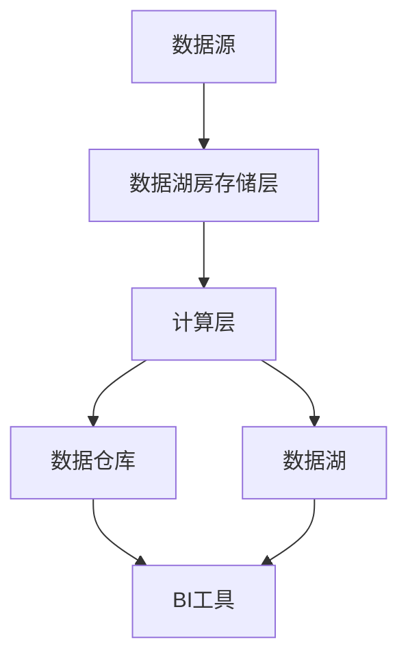

# Hadoop 数据湖房技术

## 介绍

Hadoop数据湖房技术（Data Lakehouse）是一种结合了数据湖和数据仓库优势的新型架构。它旨在解决传统数据湖和数据仓库的局限性，提供高效的数据存储、管理和分析能力。数据湖房技术通过统一的存储层和计算层，支持结构化、半结构化和非结构化数据的处理，同时提供高性能的查询和分析功能。

## 数据湖房的核心概念

### 1. 数据湖与数据仓库的结合

数据湖房技术将数据湖的灵活性与数据仓库的高效性结合起来。数据湖用于存储原始数据，而数据仓库用于存储经过处理和优化的数据。数据湖房通过统一的元数据管理和数据治理，实现了数据的无缝集成和高效查询。

### 2. 统一的存储层

数据湖房使用统一的存储层来存储所有类型的数据。这个存储层通常基于分布式文件系统（如HDFS）或云存储（如S3）。通过统一的存储层，数据湖房可以支持多种数据格式（如Parquet、ORC、JSON等），并提供高效的数据访问和查询能力。

### 3. 计算层与存储层的分离

数据湖房将计算层与存储层分离，使得计算资源可以根据需求动态分配。这种架构不仅提高了系统的灵活性，还降低了成本。计算层可以使用多种计算引擎（如Spark、Presto、Hive等）来处理和分析数据。

## 数据湖房的架构



### 1. 数据源

数据源可以是各种类型的数据，包括结构化数据（如关系数据库）、半结构化数据（如JSON、XML）和非结构化数据（如日志文件、图像、视频等）。

### 2. 数据湖房存储层

数据湖房存储层用于存储原始数据和经过处理的数据。它支持多种数据格式，并提供高效的数据访问和查询能力。

### 3. 计算层

计算层用于处理和分析数据。它可以使用多种计算引擎，如Spark、Presto、Hive等。计算层与存储层分离，使得计算资源可以根据需求动态分配。

### 4. 数据仓库与数据湖

数据仓库用于存储经过处理和优化的数据，支持高性能的查询和分析。数据湖用于存储原始数据，支持灵活的数据探索和分析。

### 5. BI工具

BI工具（如Tableau、Power BI等）用于可视化数据和分析结果，帮助用户更好地理解数据。

## 实际案例

### 案例1：电商平台的数据分析

某电商平台使用Hadoop数据湖房技术来存储和分析用户行为数据、交易数据和商品数据。通过数据湖房，平台可以快速处理和分析海量数据，提供实时的用户行为分析和商品推荐。

### 案例2：金融行业的风控分析

某金融机构使用Hadoop数据湖房技术来存储和分析交易数据、客户数据和市场数据。通过数据湖房，机构可以快速识别潜在的风险，并提供实时的风控分析。

## 代码示例

以下是一个使用Spark读取数据湖房中的数据的简单示例：

```python
from pyspark.sql import SparkSession

# 创建SparkSession
spark = SparkSession.builder \
    .appName("DataLakehouseExample") \
    .getOrCreate()

# 读取数据湖房中的数据
df = spark.read.format("parquet").load("s3a://my-data-lakehouse/sales-data")

# 显示数据
df.show()
```

### 输入

假设数据湖房中存储了一个Parquet格式的销售数据文件，路径为 `s3a://my-data-lakehouse/sales-data`。

### 输出

```plaintext
+---------+---------+-------+
|  date   | product | sales |
+---------+---------+-------+
| 2023-01 |   A     |  100  |
| 2023-01 |   B     |  200  |
| 2023-02 |   A     |  150  |
| 2023-02 |   B     |  250  |
+---------+---------+-------+
```

## 总结

Hadoop数据湖房技术通过结合数据湖和数据仓库的优势，提供了一种高效、灵活的数据存储和分析解决方案。它适用于各种大数据应用场景，如电商、金融、医疗等。通过统一的存储层和计算层，数据湖房技术可以支持多种数据格式和计算引擎，提供高性能的查询和分析能力。

## 附加资源

- [Apache Spark官方文档](https://spark.apache.org/docs/latest/)
- [Hadoop官方文档](https://hadoop.apache.org/docs/current/)
- [数据湖房技术白皮书](https://databricks.com/resources/whitepapers/data-lakehouse)

## 练习

1. 使用Spark读取数据湖房中的JSON格式数据，并进行简单的数据分析。
2. 尝试在数据湖房中存储和处理非结构化数据（如图像、视频等），并分析其性能。
3. 探索如何在数据湖房中实现数据治理和元数据管理。

:::tip
提示：在实际应用中，数据湖房技术需要结合具体业务需求进行优化和调整。建议在实际项目中逐步探索和应用。
:::