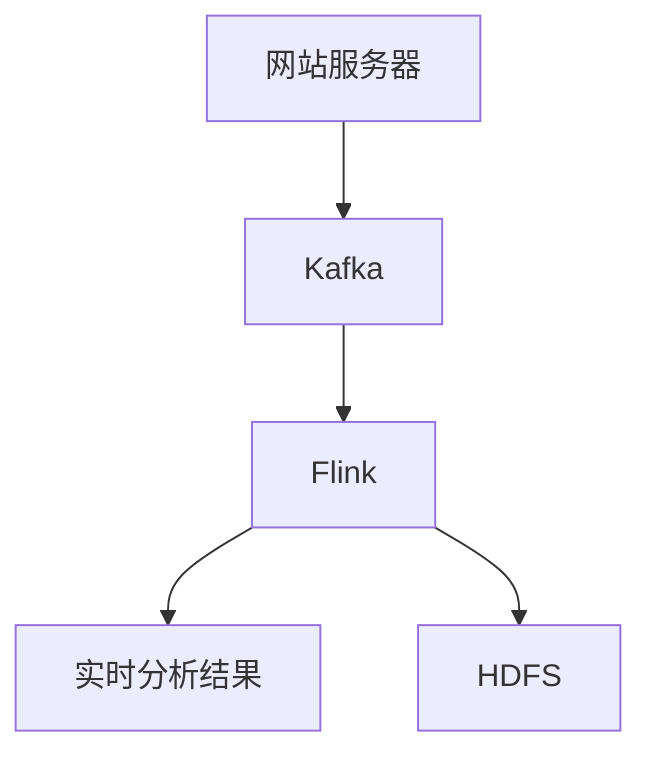
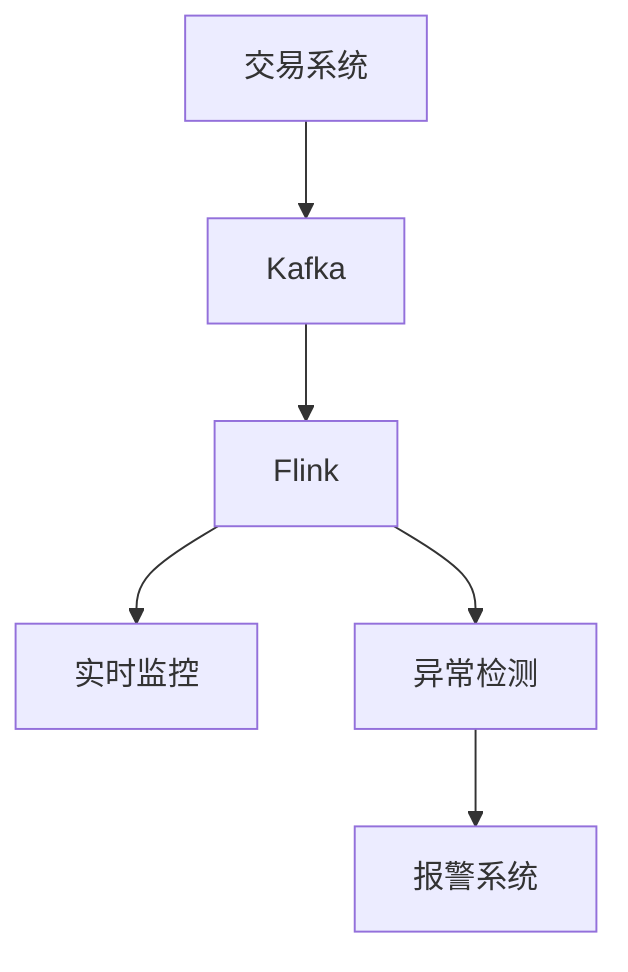

# Hadoop 与流计算

## 介绍

在大数据领域，Hadoop 是一个广泛使用的分布式计算框架，主要用于处理大规模数据集。然而，随着实时数据处理需求的增加，流计算（Stream Processing）逐渐成为大数据生态系统中不可或缺的一部分。流计算允许我们对实时生成的数据进行即时处理和分析，而无需等待数据存储后再进行批处理。

Hadoop 与流计算的结合，使得我们能够同时处理历史数据和实时数据，从而构建更强大的数据处理系统。本文将介绍 Hadoop 与流计算的基本概念、工作原理以及如何在实际应用中使用它们。

## 什么是流计算？

流计算是一种数据处理模式，它允许我们对连续生成的数据流进行实时处理和分析。与传统的批处理不同，流计算不需要等待所有数据都到达后再进行处理，而是可以在数据到达时立即进行处理。

流计算通常用于以下场景：
- 实时监控和报警
- 实时推荐系统
- 实时日志分析
- 实时金融交易处理

## Hadoop 与流计算的结合

Hadoop 生态系统中的一些工具可以与流计算结合使用，例如 Apache Kafka、Apache Flink 和 Apache Storm。这些工具可以与 Hadoop 的分布式存储系统（如 HDFS）和批处理框架（如 MapReduce）无缝集成，从而实现实时数据处理和历史数据分析的结合。

### 使用 Apache Kafka 进行流计算

Apache Kafka 是一个分布式流处理平台，广泛用于构建实时数据管道和流应用程序。Kafka 可以与 Hadoop 集成，将实时数据流存储到 HDFS 中，或者直接与流处理框架（如 Flink 或 Storm）集成进行实时处理。

以下是一个简单的 Kafka 生产者示例，它将消息发送到 Kafka 主题中：

```java
import org.apache.kafka.clients.producer.KafkaProducer;
import org.apache.kafka.clients.producer.ProducerRecord;

import java.util.Properties;

public class KafkaProducerExample {
    public static void main(String[] args) {
        Properties props = new Properties();
        props.put("bootstrap.servers", "localhost:9092");
        props.put("key.serializer", "org.apache.kafka.common.serialization.StringSerializer");
        props.put("value.serializer", "org.apache.kafka.common.serialization.StringSerializer");

        KafkaProducer<String, String> producer = new KafkaProducer<>(props);

        for (int i = 0; i < 10; i++) {
            producer.send(new ProducerRecord<>("my-topic", Integer.toString(i), "Message " + i));
        }

        producer.close();
    }
}
```

### 使用 Apache Flink 进行流处理

Apache Flink 是一个强大的流处理框架，支持高吞吐量和低延迟的实时数据处理。Flink 可以直接从 Kafka 读取数据流，并进行实时处理。

以下是一个简单的 Flink 流处理示例，它从 Kafka 读取数据并打印到控制台：

```java
import org.apache.flink.streaming.api.environment.StreamExecutionEnvironment;
import org.apache.flink.streaming.connectors.kafka.FlinkKafkaConsumer;
import org.apache.flink.streaming.util.serialization.SimpleStringSchema;

import java.util.Properties;

public class FlinkKafkaExample {
    public static void main(String[] args) throws Exception {
        StreamExecutionEnvironment env = StreamExecutionEnvironment.getExecutionEnvironment();

        Properties properties = new Properties();
        properties.setProperty("bootstrap.servers", "localhost:9092");
        properties.setProperty("group.id", "test");

        FlinkKafkaConsumer<String> consumer = new FlinkKafkaConsumer<>("my-topic", new SimpleStringSchema(), properties);

        env.addSource(consumer).print();

        env.execute("Flink Kafka Example");
    }
}
```

## 实际应用案例

### 实时日志分析

假设我们有一个大型网站，每天生成大量的访问日志。我们可以使用 Kafka 将这些日志实时传输到 Flink 中进行处理，实时分析用户行为、检测异常流量等。



在这个案例中，Flink 从 Kafka 读取日志数据流，实时分析用户行为，并将结果存储到 HDFS 中以供后续批处理使用。

### 实时金融交易处理

在金融领域，实时交易数据的处理至关重要。我们可以使用 Kafka 和 Flink 构建一个实时交易处理系统，实时监控交易数据，检测异常交易并触发报警。



## 总结

Hadoop 与流计算的结合为大数据处理提供了强大的工具，使得我们能够同时处理历史数据和实时数据。通过使用 Kafka 和 Flink 等工具，我们可以构建高效的实时数据处理系统，满足各种实时分析需求。

## 附加资源与练习

- [Apache Kafka 官方文档](https://kafka.apache.org/documentation/)
- [Apache Flink 官方文档](https://flink.apache.org/docs/)
- [Hadoop 官方文档](https://hadoop.apache.org/docs/)

:::tip 练习
1. 尝试使用 Kafka 和 Flink 构建一个简单的实时日志分析系统。
2. 修改 Flink 示例代码，使其能够将处理结果存储到 HDFS 中。
:::