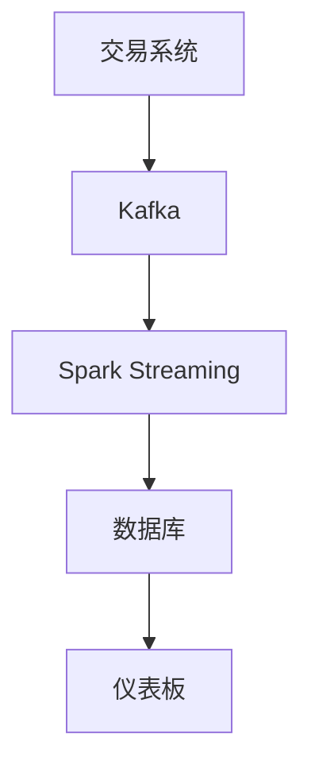

## 介绍

Hadoop是一个广泛用于大数据处理的开源框架，最初设计用于批处理任务。然而，随着数据量的增长和业务需求的多样化，实时数据处理变得越来越重要。Hadoop生态系统中的一些工具和技术已经被扩展或开发，以支持实时数据处理。本文将介绍Hadoop实时数据处理的基本概念、相关技术及其实际应用。

## 什么是Hadoop实时数据处理？

Hadoop实时数据处理是指在数据生成的同时或几乎同时对其进行处理和分析。与传统的批处理不同，实时数据处理要求系统能够在数据到达时立即处理并生成结果。这对于需要快速响应的应用场景（如实时监控、欺诈检测、推荐系统等）至关重要。

## Hadoop 生态系统中的实时数据处理工具

Hadoop生态系统中有多种工具可以用于实时数据处理，以下是其中一些主要的工具：

1. **Apache Kafka**：一个分布式流处理平台，用于构建实时数据管道和流应用。
2. **Apache Storm**：一个分布式实时计算系统，用于处理高速数据流。
3. **Apache Flink**：一个流处理框架，支持高吞吐量、低延迟的实时数据处理。
4. **Apache Spark Streaming**：Spark的一个扩展，用于处理实时数据流。

## 实时数据处理的基本流程

实时数据处理通常包括以下几个步骤：

1. **数据采集**：从各种数据源（如传感器、日志文件、社交媒体等）收集数据。
2. **数据传输**：将采集到的数据传输到处理系统（如Kafka）。
3. **数据处理**：使用流处理框架（如Storm、Flink、Spark Streaming）对数据进行实时处理。
4. **数据存储**：将处理后的数据存储到数据库或数据仓库中。
5. **数据可视化**：将处理结果可视化，以便用户能够实时查看和分析。

## 代码示例：使用Apache Kafka和Spark Streaming进行实时数据处理

以下是一个简单的示例，展示如何使用Apache Kafka和Spark Streaming进行实时数据处理。

### 1. 设置Kafka生产者

```python
from kafka import KafkaProducer

producer = KafkaProducer(bootstrap_servers='localhost:9092')

# 发送消息到Kafka主题
producer.send('test-topic', b'Hello, Kafka!')
producer.flush()
```

### 2. 使用Spark Streaming处理Kafka数据

```python
from pyspark import SparkContext
from pyspark.streaming import StreamingContext
from pyspark.streaming.kafka import KafkaUtils

# 初始化SparkContext和StreamingContext
sc = SparkContext("local[2]", "KafkaSparkStreaming")
ssc = StreamingContext(sc, 10)  # 10秒的批处理间隔

# 创建Kafka流
kafkaStream = KafkaUtils.createStream(ssc, 'localhost:2181', 'spark-streaming-consumer', {'test-topic': 1})

# 处理数据
lines = kafkaStream.map(lambda x: x[1])
lines.pprint()

# 启动流处理
ssc.start()
ssc.awaitTermination()
```

### 输入和输出

- **输入**：Kafka生产者发送的消息（如`Hello, Kafka!`）。
- **输出**：Spark Streaming每10秒打印一次接收到的消息。

## 实际案例：实时欺诈检测

在金融行业，实时欺诈检测是一个重要的应用场景。通过实时处理交易数据，系统可以立即识别出可疑的交易并触发警报。

### 流程

1. **数据采集**：从交易系统中收集交易数据。
2. **数据传输**：将交易数据发送到Kafka。
3. **数据处理**：使用Spark Streaming分析交易数据，识别异常模式。
4. **数据存储**：将可疑交易存储到数据库中。
5. **数据可视化**：在仪表板上实时显示可疑交易。



## 总结

Hadoop实时数据处理是大数据领域中的一个重要方向，它使得我们能够在数据生成的同时进行处理和分析。通过使用Hadoop生态系统中的工具（如Kafka、Storm、Flink、Spark Streaming），我们可以构建高效的实时数据处理系统。本文介绍了实时数据处理的基本概念、相关工具及其在实际场景中的应用。

## 附加资源

- [Apache Kafka官方文档](https://kafka.apache.org/documentation/)
- [Apache Spark Streaming官方文档](https://spark.apache.org/docs/latest/streaming-programming-guide.html)
- [Apache Flink官方文档](https://flink.apache.org/)
- [Apache Storm官方文档](https://storm.apache.org/)

## 练习

1. 使用Kafka和Spark Streaming构建一个简单的实时数据处理系统，处理来自传感器的数据。
2. 尝试使用Flink或Storm替换Spark Streaming，比较它们的性能和易用性。
3. 设计一个实时推荐系统，使用实时数据处理技术为用户提供个性化推荐。