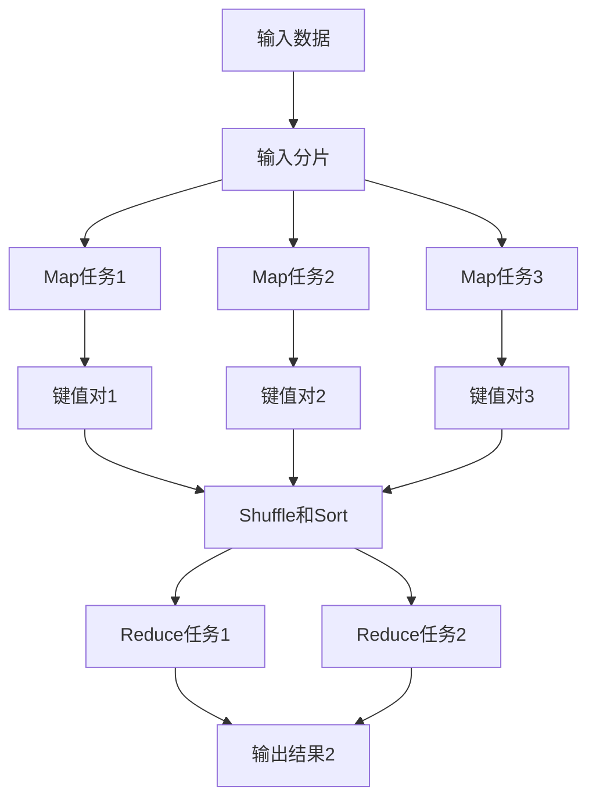

## 什么是MapReduce？

MapReduce是一种用于大规模数据处理的编程模型，最初由Google提出，用于简化分布式计算任务。它通过将复杂的计算任务分解为两个主要阶段——**Map**和**Reduce**，使得开发者可以轻松处理海量数据。

MapReduce的核心思想是“分而治之”。它将输入数据分割成多个小块，分配给多个节点并行处理，最后将结果汇总。这种模型非常适合处理需要分布式计算的场景，例如日志分析、搜索引擎索引构建等。

---

## MapReduce的工作流程

MapReduce的工作流程可以分为以下几个步骤：

1. **输入分片（Input Splitting）**：将输入数据分割成多个小块（称为分片），每个分片由一个Map任务处理。
2. **Map阶段**：每个Map任务处理一个分片，生成一组键值对（key-value pairs）。
3. **Shuffle和Sort阶段**：将Map阶段输出的键值对按照键进行排序和分组，以便Reduce任务可以处理相同键的所有值。
4. **Reduce阶段**：每个Reduce任务处理一组键值对，生成最终的输出结果。

下面是一个简单的流程图，展示了MapReduce的工作流程：



---

## Map和Reduce函数

MapReduce的核心是两个函数：**Map**和**Reduce**。

### Map函数

Map函数的作用是将输入数据转换为键值对。它的输入是一个键值对，输出是一组中间键值对。例如，假设我们需要统计一段文本中每个单词的出现次数，Map函数可以将每个单词映射为 `(单词, 1)` 的形式。

```python
def map_function(document):
    for word in document.split():
        yield (word, 1)
```

### Reduce函数

Reduce函数的作用是将Map函数输出的中间键值对进行汇总。它的输入是一个键和一组值，输出是一个或多个最终结果。例如，对于单词统计任务，Reduce函数可以将相同单词的值相加，得到该单词的总出现次数。

```python
def reduce_function(word, counts):
    yield (word, sum(counts))
```

---

## 实际案例：单词计数

让我们通过一个经典的例子——单词计数（Word Count）来理解MapReduce的工作原理。

### 输入数据

假设我们有以下输入数据：

```
hello world
hello mapreduce
world hello
```

### Map阶段

Map函数将每行文本拆分为单词，并生成键值对：

```
(hello, 1)
(world, 1)
(hello, 1)
(mapreduce, 1)
(world, 1)
(hello, 1)
```

### Shuffle和Sort阶段

将Map输出的键值对按照键进行排序和分组：

```
hello: [1, 1, 1]
world: [1, 1]
mapreduce: [1]
```

### Reduce阶段

Reduce函数对每个键的值进行汇总：

```
(hello, 3)
(world, 2)
(mapreduce, 1)
```

### 最终输出

```
hello 3
world 2
mapreduce 1
```

---

## MapReduce的实际应用场景

MapReduce广泛应用于以下场景：

1. **日志分析**：分析服务器日志，统计访问量、错误率等。
2. **搜索引擎**：构建倒排索引，用于快速检索网页。
3. **数据挖掘**：处理大规模数据集，提取有用信息。
4. **机器学习**：分布式训练模型，处理海量训练数据。

:::tip
MapReduce的分布式特性使其非常适合处理大规模数据，但它的性能依赖于集群的规模和任务的并行度。
:::

---

## 总结

MapReduce是一种强大的分布式计算模型，通过将任务分解为Map和Reduce两个阶段，简化了大规模数据处理的复杂性。它的核心思想是“分而治之”，适合处理需要并行计算的场景。

通过本文的学习，你应该已经掌握了MapReduce的基本原理、工作流程以及实际应用场景。接下来，你可以尝试编写自己的MapReduce程序，或者深入学习更高级的分布式计算框架，如Hadoop和Spark。

---

## 附加资源与练习

1. **练习**：尝试用Python实现一个简单的MapReduce程序，统计一段文本中每个单词的出现次数。
2. **扩展阅读**：学习Hadoop框架，了解如何在实际生产环境中使用MapReduce。
3. **挑战**：尝试用MapReduce解决一个更复杂的问题，例如计算网页的PageRank。

:::note
如果你在学习过程中遇到问题，可以参考官方文档或加入社区讨论，与其他开发者交流经验。
:::