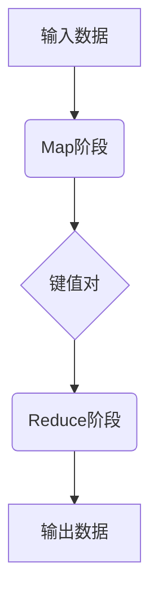

# MapReduce调优技巧

MapReduce是一种用于处理大规模数据集的编程模型，广泛应用于分布式计算环境中。虽然MapReduce的设计初衷是简化大规模数据处理，但在实际应用中，性能调优仍然是一个重要的课题。本文将介绍一些常见的MapReduce调优技巧，帮助你提升作业的执行效率。

## 1. 理解MapReduce的工作原理

在深入调优之前，首先需要理解MapReduce的基本工作原理。MapReduce作业通常分为两个阶段：

- **Map阶段**：将输入数据分割成独立的块，并由多个Map任务并行处理。每个Map任务生成一组键值对。
- **Reduce阶段**：将Map阶段生成的键值对进行分组和排序，然后由Reduce任务处理，生成最终的输出。



## 2. 调优技巧

### 2.1 调整Map和Reduce任务的数量

Map和Reduce任务的数量对作业的性能有直接影响。任务数量过多可能导致资源浪费，而任务数量过少则可能导致负载不均衡。

- **Map任务数量**：通常由输入数据的分片数量决定。可以通过调整`mapreduce.input.fileinputformat.split.maxsize`参数来控制分片大小。
- **Reduce任务数量**：可以通过设置`mapreduce.job.reduces`参数来调整。建议根据集群的资源和数据量来合理设置。

:::tip
**建议**：Reduce任务的数量应略小于集群的可用Reduce槽位，以避免资源争用。
:::

### 2.2 优化Combiner

Combiner是一种在Map阶段之后、Reduce阶段之前运行的本地Reduce任务，用于减少Map输出数据的传输量。合理使用Combiner可以显著减少网络传输和Reduce任务的负载。

```java
job.setCombinerClass(MyReducer.class);
```

:::note
**注意**：Combiner的输出类型必须与Reduce的输入类型一致。
:::

### 2.3 数据压缩

数据压缩可以减少磁盘I/O和网络传输的开销。MapReduce支持多种压缩格式，如Gzip、Snappy等。

- **Map输出压缩**：通过设置`mapreduce.map.output.compress`为`true`，并指定压缩格式（如`mapreduce.map.output.compress.codec`）。
- **最终输出压缩**：通过设置`mapreduce.output.fileoutputformat.compress`为`true`。

```java
conf.set("mapreduce.map.output.compress", "true");
conf.set("mapreduce.map.output.compress.codec", "org.apache.hadoop.io.compress.SnappyCodec");
```

### 2.4 调整内存和CPU资源

MapReduce任务的执行效率与分配的内存和CPU资源密切相关。可以通过以下参数进行调整：

- **Map任务内存**：`mapreduce.map.memory.mb`
- **Reduce任务内存**：`mapreduce.reduce.memory.mb`
- **Map任务CPU**：`mapreduce.map.cpu.vcores`
- **Reduce任务CPU**：`mapreduce.reduce.cpu.vcores`

:::caution
**警告**：过度分配资源可能导致集群资源浪费，甚至引发OOM（内存溢出）错误。
:::

### 2.5 数据倾斜处理

数据倾斜是指某些Reduce任务处理的数据量远大于其他任务，导致负载不均衡。可以通过以下方法缓解数据倾斜：

- **自定义分区器**：通过实现`Partitioner`接口，确保数据均匀分布到各个Reduce任务。
- **预处理数据**：在Map阶段对数据进行预处理，减少倾斜的可能性。

```java
public class CustomPartitioner extends Partitioner<Text, IntWritable> {
    @Override
    public int getPartition(Text key, IntWritable value, int numPartitions) {
        // 自定义分区逻辑
        return (key.hashCode() & Integer.MAX_VALUE) % numPartitions;
    }
}
```

## 3. 实际案例

假设我们有一个日志分析任务，需要统计每个用户的访问次数。原始数据如下：

```
user1,page1
user2,page2
user1,page3
user2,page4
user3,page5
```

通过MapReduce处理后，输出如下：

```
user1 2
user2 2
user3 1
```

在这个案例中，我们可以通过以下方式优化：

1. 使用Combiner减少Map输出数据量。
2. 调整Reduce任务数量，确保负载均衡。
3. 对Map输出进行压缩，减少网络传输开销。

## 4. 总结

MapReduce调优是一个复杂但至关重要的过程。通过合理调整任务数量、使用Combiner、数据压缩、优化资源分配以及处理数据倾斜，可以显著提升MapReduce作业的性能。希望本文提供的技巧能帮助你在实际应用中更好地优化MapReduce作业。

## 5. 附加资源与练习

- **练习**：尝试在一个小型数据集上运行MapReduce作业，并应用本文介绍的调优技巧，观察性能变化。
- **资源**：阅读Hadoop官方文档，了解更多关于MapReduce调优的细节。

:::warning
**提示**：调优是一个迭代过程，建议在每次调整后监控作业的执行情况，逐步优化。
:::