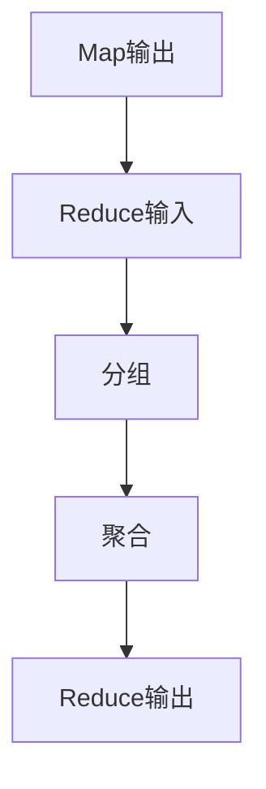

# Reduce函数详解

在MapReduce编程模型中，**Reduce函数**是数据处理流程中的关键步骤之一。它负责对Map阶段输出的中间结果进行汇总和整理，最终生成最终的输出结果。本文将详细介绍Reduce函数的工作原理、代码实现以及实际应用场景，帮助你更好地理解这一重要概念。

## 什么是Reduce函数？

Reduce函数是MapReduce模型中的一个核心组件，它的主要任务是对Map阶段生成的键值对进行聚合操作。具体来说，Reduce函数接收一组具有相同键的键值对，并将它们合并为一个或多个输出键值对。

:::note
**关键点**：Reduce函数的核心思想是“分组聚合”。它将具有相同键的值进行合并，从而生成最终的输出结果。
:::

## Reduce函数的工作原理

Reduce函数的工作流程可以分为以下几个步骤：

1. **输入**：Reduce函数接收来自Map阶段的中间结果，这些结果是以键值对的形式组织的。
2. **分组**：Reduce函数将具有相同键的键值对分组在一起。
3. **聚合**：对每个分组中的值进行聚合操作（如求和、求平均值等），生成最终的输出结果。
4. **输出**：Reduce函数将处理后的结果写入到输出文件中。

以下是一个简单的流程图，展示了Reduce函数的工作过程：



## Reduce函数的代码示例

为了更好地理解Reduce函数的工作原理，我们来看一个简单的代码示例。假设我们有一个文本文件，文件中包含多个单词，我们的目标是统计每个单词出现的次数。

### 输入数据

假设输入文件内容如下：

```
hello world
hello mapreduce
world hello
```

### Map阶段输出

Map阶段会将每个单词映射为键值对，其中键是单词，值是1。Map阶段的输出如下：

```
(hello, 1)
(world, 1)
(hello, 1)
(mapreduce, 1)
(world, 1)
(hello, 1)
```

### Reduce函数实现

Reduce函数将对具有相同键的值进行求和操作。以下是Python中的Reduce函数实现：

```python
def reduce_function(key, values):
    total = 0
    for value in values:
        total += value
    return (key, total)
```

### Reduce阶段输出

Reduce函数将处理后的结果输出如下：

```
(hello, 3)
(world, 2)
(mapreduce, 1)
```

## 实际应用场景

Reduce函数在大数据处理中有着广泛的应用。以下是一些常见的应用场景：

1. **词频统计**：如上面的示例所示，Reduce函数可以用于统计文本中每个单词的出现次数。
2. **数据聚合**：在数据分析中，Reduce函数可以用于对大量数据进行聚合操作，如求和、求平均值等。
3. **日志分析**：Reduce函数可以用于分析服务器日志，统计每个用户的访问次数或每个IP地址的请求次数。

:::tip
**提示**：在实际应用中，Reduce函数通常与Map函数配合使用，形成一个完整的数据处理流程。
:::

## 总结

Reduce函数是MapReduce编程模型中的重要组成部分，它负责对Map阶段生成的中间结果进行分组和聚合操作。通过本文的介绍，你应该已经对Reduce函数的工作原理、代码实现以及实际应用场景有了初步的了解。

## 附加资源与练习

为了进一步巩固你的知识，建议你尝试以下练习：

1. **实现一个简单的MapReduce程序**：使用你熟悉的编程语言，实现一个完整的MapReduce程序，统计一段文本中每个单词的出现次数。
2. **探索更多应用场景**：思考并尝试将Reduce函数应用到其他场景中，如日志分析、数据聚合等。

:::caution
**注意**：在实际应用中，Reduce函数的性能可能会受到数据量的影响。因此，在设计Reduce函数时，需要考虑如何优化其性能。
:::

希望本文对你理解Reduce函数有所帮助！如果你有任何问题或建议，欢迎在评论区留言。