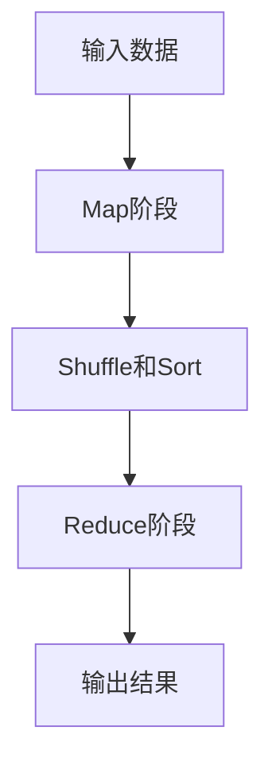

## 什么是MapReduce？

MapReduce是一种用于处理大规模数据集的编程模型，最初由Google提出。它将复杂的分布式计算任务分解为两个简单的阶段：**Map**和**Reduce**。Map阶段负责将输入数据分解为键值对，而Reduce阶段则将这些键值对进行汇总和计算。通过这种方式，MapReduce能够高效地处理海量数据，特别适合用于分布式系统。

## MapReduce的基本流程

MapReduce的工作流程可以分为以下几个步骤：

1. **输入分片**：将输入数据分割成多个小块，每个小块由一个Map任务处理。
2. **Map阶段**：每个Map任务处理一个数据块，生成一组中间键值对。
3. **Shuffle和Sort**：将Map阶段生成的中间键值对按照键进行排序和分组，以便Reduce任务处理。
4. **Reduce阶段**：每个Reduce任务处理一组具有相同键的中间键值对，生成最终的输出结果。



## 一个简单的MapReduce示例

为了更好地理解MapReduce的工作原理，我们来看一个简单的例子：**统计文本中每个单词的出现次数**。

### 输入数据

假设我们有以下文本作为输入：

```
hello world
hello mapreduce
world mapreduce
```

### Map阶段

在Map阶段，我们将每一行文本拆分为单词，并为每个单词生成一个键值对，其中键是单词本身，值是1。Map阶段的输出如下：

```
(hello, 1)
(world, 1)
(hello, 1)
(mapreduce, 1)
(world, 1)
(mapreduce, 1)
```

### Shuffle和Sort

在Shuffle和Sort阶段，系统会将具有相同键的键值对分组在一起。分组后的结果如下：

```
(hello, [1, 1])
(world, [1, 1])
(mapreduce, [1, 1])
```

### Reduce阶段

在Reduce阶段，我们将每个键对应的值列表进行求和，得到每个单词的总出现次数。Reduce阶段的输出如下：

```
(hello, 2)
(world, 2)
(mapreduce, 2)
```

### 代码示例

以下是一个使用Python实现的简单MapReduce示例：

```python
# Map函数
def map_function(line):
    words = line.split()
    for word in words:
        yield (word, 1)

# Reduce函数
def reduce_function(word, counts):
    yield (word, sum(counts))

# 输入数据
input_data = [
    "hello world",
    "hello mapreduce",
    "world mapreduce"
]

# Map阶段
mapped_data = []
for line in input_data:
    for word, count in map_function(line):
        mapped_data.append((word, count))

# Shuffle和Sort阶段
sorted_data = {}
for word, count in mapped_data:
    if word not in sorted_data:
        sorted_data[word] = []
    sorted_data[word].append(count)

# Reduce阶段
output_data = []
for word, counts in sorted_data.items():
    for result in reduce_function(word, counts):
        output_data.append(result)

# 输出结果
print(output_data)
```

### 输出结果

运行上述代码后，输出结果如下：

```
[('hello', 2), ('world', 2), ('mapreduce', 2)]
```

## 实际应用场景

MapReduce广泛应用于各种大数据处理任务中，以下是一些常见的应用场景：

1. **搜索引擎**：用于构建倒排索引，以便快速查找网页内容。
2. **日志分析**：用于分析服务器日志，统计访问量、错误率等。
3. **数据挖掘**：用于处理大规模数据集，提取有价值的信息。
4. **机器学习**：用于分布式训练模型，处理海量训练数据。

:::tip
在实际应用中，MapReduce通常运行在分布式系统（如Hadoop）上，能够处理PB级别的数据。
:::

## 总结

MapReduce是一种强大的编程模型，能够高效地处理大规模数据集。通过将复杂的计算任务分解为Map和Reduce两个阶段，MapReduce简化了分布式计算的复杂性。本文通过一个简单的单词计数示例，展示了MapReduce的基本工作原理，并提供了Python代码实现。希望本文能帮助你更好地理解MapReduce，并为你在实际项目中的应用提供参考。

## 附加资源与练习

- **练习1**：尝试修改上述代码，使其能够处理更大的文本文件，并统计每个单词的出现次数。
- **练习2**：研究Hadoop框架，了解如何在分布式环境中运行MapReduce任务。
- **资源**：阅读Google的MapReduce论文，深入了解其设计思想和优化技巧。

:::caution
在实际项目中，MapReduce的性能优化和错误处理是非常重要的，建议深入学习相关的高级主题。
:::