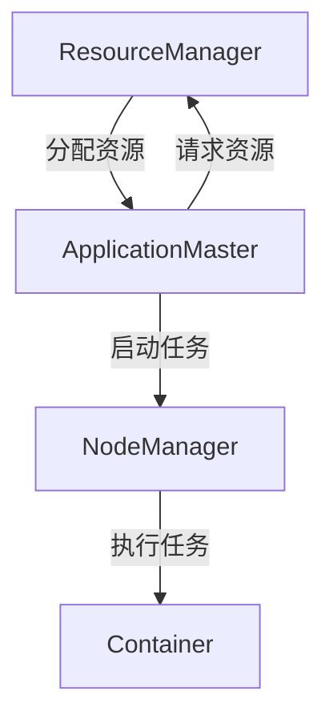

# YARN架构介绍

YARN（Yet Another Resource Negotiator）是Hadoop生态系统中的一个关键组件，负责集群资源的管理和任务调度。它的设计目标是提高Hadoop集群的资源利用率和扩展性，同时支持多种计算框架（如MapReduce、Spark等）。本文将详细介绍YARN的架构及其核心组件。

## YARN的基本概念

YARN的核心思想是将资源管理和任务调度分离。传统的Hadoop 1.x版本中，资源管理和任务调度都由JobTracker负责，这导致了单点瓶颈和扩展性问题。YARN通过引入ResourceManager和ApplicationMaster，将这两个功能解耦，从而提高了系统的灵活性和可扩展性。

## YARN的架构

YARN的架构主要由以下几个核心组件组成：

1. **ResourceManager (RM)**：负责整个集群的资源管理和调度。它有两个主要子组件：
   - **Scheduler**：负责分配资源给各个应用程序，但不监控应用程序的状态。
   - **ApplicationsManager**：负责接受应用程序提交，启动ApplicationMaster，并在应用程序失败时重新启动ApplicationMaster。

2. **NodeManager (NM)**：运行在每个集群节点上，负责管理单个节点的资源（如CPU、内存等），并执行ResourceManager分配的任务。

3. **ApplicationMaster (AM)**：每个应用程序都有一个ApplicationMaster，负责与ResourceManager协商资源，并与NodeManager协作执行任务。

4. **Container**：是YARN中的资源抽象，表示一组资源（如CPU、内存等）。ApplicationMaster通过Container来运行任务。

## YARN的工作流程

1. **应用程序提交**：用户提交一个应用程序到ResourceManager。
2. **启动ApplicationMaster**：ResourceManager为该应用程序分配一个Container，并启动ApplicationMaster。
3. **资源请求**：ApplicationMaster向ResourceManager请求资源。
4. **任务执行**：ResourceManager分配资源后，ApplicationMaster与NodeManager协作，启动任务并监控其执行。
5. **任务完成**：任务完成后，ApplicationMaster向ResourceManager报告，并释放资源。

## 实际案例

假设我们有一个MapReduce作业需要在一个YARN集群上运行。以下是该作业的执行流程：

1. **提交作业**：用户通过命令行或API提交MapReduce作业到ResourceManager。
2. **启动ApplicationMaster**：ResourceManager为该作业分配一个Container，并启动MapReduce ApplicationMaster。
3. **资源请求**：MapReduce ApplicationMaster向ResourceManager请求资源以运行Map和Reduce任务。
4. **任务执行**：ResourceManager分配资源后，MapReduce ApplicationMaster与NodeManager协作，启动Map和Reduce任务。
5. **任务完成**：所有任务完成后，MapReduce ApplicationMaster向ResourceManager报告作业完成，并释放资源。

## 总结

YARN通过将资源管理和任务调度分离，极大地提高了Hadoop集群的灵活性和可扩展性。它的核心组件包括ResourceManager、NodeManager和ApplicationMaster，它们共同协作，确保集群资源的高效利用和任务的顺利执行。

:::tip 提示
如果你想深入了解YARN的更多细节，可以参考Hadoop官方文档或尝试在本地集群上运行一个简单的MapReduce作业。
:::

## 附加资源

- [Hadoop官方文档](https://hadoop.apache.org/docs/current/hadoop-yarn/hadoop-yarn-site/YARN.html)
- [YARN架构详解](https://www.oreilly.com/library/view/hadoop-the-definitive/9781491901687/ch04.html)

## 练习

1. 在一个本地Hadoop集群上提交一个简单的MapReduce作业，并观察YARN的日志输出。
2. 尝试修改YARN的配置参数（如内存分配、调度策略等），并观察其对作业执行的影响。