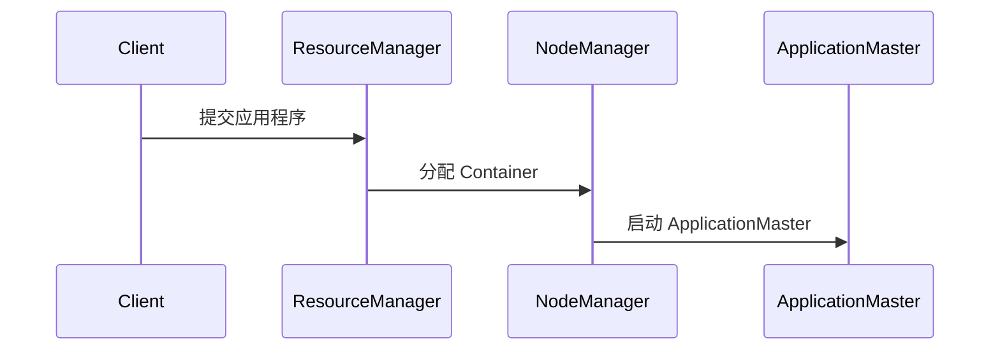
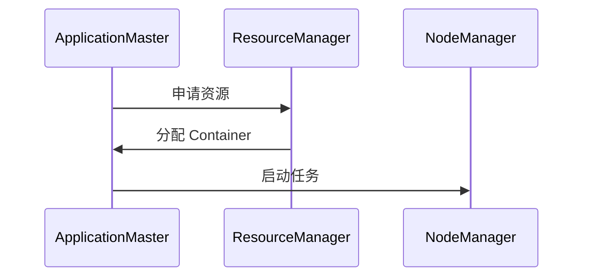
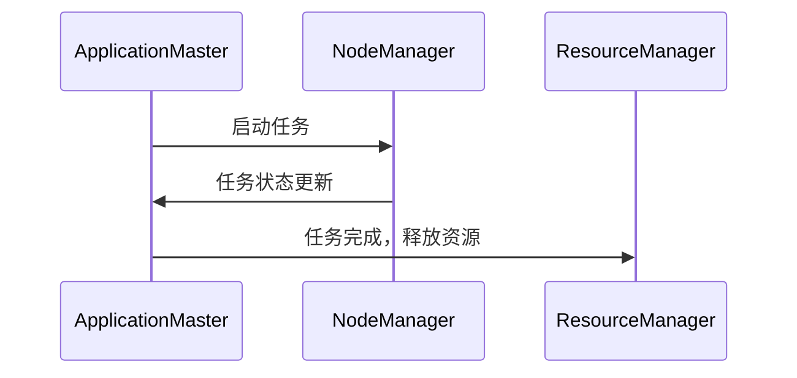

# YARN 工作流程

Apache Hadoop YARN（Yet Another Resource Negotiator）是 Hadoop 2.x 引入的资源管理系统，用于管理集群资源并调度任务。YARN 的核心目标是将资源管理和任务调度分离，从而提高集群的灵活性和可扩展性。本文将详细介绍 YARN 的工作流程，帮助初学者理解其运行机制。

## YARN 的核心组件

在深入了解 YARN 的工作流程之前，我们需要先了解其核心组件：

1. **ResourceManager (RM)**：负责整个集群的资源管理和调度。
2. **NodeManager (NM)**：运行在每个节点上，负责管理单个节点的资源。
3. **ApplicationMaster (AM)**：每个应用程序都有一个 AM，负责与 RM 协商资源，并与 NM 协作执行任务。
4. **Container**：YARN 中的资源抽象，包含 CPU、内存等资源。

## YARN 工作流程详解

YARN 的工作流程可以分为以下几个步骤：

### 1. 提交应用程序

当用户提交一个应用程序时，客户端会向 ResourceManager 发送一个请求。这个请求包含了应用程序的配置和资源需求。

```bash
hadoop jar my-app.jar com.example.MyApp
```

### 2. ResourceManager 分配 ApplicationMaster

ResourceManager 接收到请求后，会为该应用程序分配一个 Container，并在其中启动 ApplicationMaster。



### 3. ApplicationMaster 注册并申请资源

ApplicationMaster 启动后，会向 ResourceManager 注册自己，并申请所需的资源。

```java
// ApplicationMaster 注册代码示例
AMRMClient<ContainerRequest> rmClient = AMRMClient.createAMRMClient();
rmClient.init(conf);
rmClient.start();
rmClient.registerApplicationMaster("", 0, "");
```

### 4. ResourceManager 分配资源

ResourceManager 根据集群的资源情况和应用程序的需求，分配相应的 Container 给 ApplicationMaster。



### 5. ApplicationMaster 启动任务

ApplicationMaster 在分配的 Container 中启动任务，并与 NodeManager 协作执行任务。

```java
// 启动任务的代码示例
NMClient nmClient = NMClient.createNMClient();
nmClient.init(conf);
nmClient.start();
nmClient.startContainer(container, containerLaunchContext);
```

### 6. 任务执行与监控

任务在 NodeManager 上执行，ApplicationMaster 会监控任务的执行状态，并在任务完成后释放资源。



### 7. 应用程序完成

当所有任务完成后，ApplicationMaster 会向 ResourceManager 注销自己，并通知客户端应用程序已完成。

```java
// 注销 ApplicationMaster 的代码示例
rmClient.unregisterApplicationMaster(FinalApplicationStatus.SUCCEEDED, "", "");
```

## 实际案例

假设我们有一个简单的 MapReduce 应用程序，用于统计文本文件中单词的出现次数。以下是该应用程序在 YARN 上的工作流程：

1. 用户提交 MapReduce 作业。
2. ResourceManager 分配 ApplicationMaster。
3. ApplicationMaster 申请资源并启动 Map 和 Reduce 任务。
4. Map 任务读取输入文件并生成中间结果。
5. Reduce 任务处理中间结果并生成最终输出。
6. ApplicationMaster 监控任务状态，并在任务完成后释放资源。
7. 应用程序完成，输出结果存储在 HDFS 中。

## 总结

YARN 的工作流程涉及多个组件的协作，包括 ResourceManager、NodeManager 和 ApplicationMaster。通过将资源管理和任务调度分离，YARN 能够更高效地管理集群资源，并支持多种类型的应用程序。

## 附加资源

- [Apache Hadoop YARN 官方文档](https://hadoop.apache.org/docs/current/hadoop-yarn/hadoop-yarn-site/YARN.html)
- 《Hadoop: The Definitive Guide》 by Tom White

## 练习

1. 尝试在本地 Hadoop 集群上提交一个简单的 MapReduce 作业，并观察 YARN 的工作流程。
2. 修改 MapReduce 作业的资源需求，观察 ResourceManager 如何分配资源。
3. 编写一个简单的 ApplicationMaster，了解其与 ResourceManager 和 NodeManager 的交互过程。

:::tip
建议初学者在理解 YARN 工作流程后，动手实践以加深理解。
:::