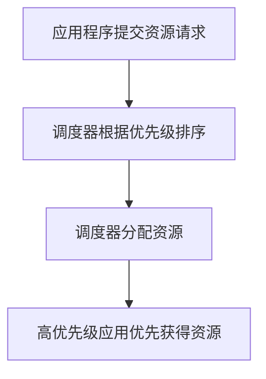

# YARN应用优先级

在YARN（Yet Another Resource Negotiator）中，应用程序优先级是一个关键概念，它决定了多个应用程序之间如何共享集群资源。通过为应用程序分配不同的优先级，管理员可以确保高优先级的任务能够更快地获得所需的资源，从而优化集群的整体性能。

## 什么是YARN应用优先级？

YARN应用优先级是一个整数值，范围通常从0到更高（具体取决于配置）。优先级越高，应用程序在资源分配时越容易被调度器选中。YARN的调度器会根据应用程序的优先级来决定哪些应用程序应该优先获得资源。

:::note
优先级仅在同一队列内的应用程序之间进行比较。不同队列之间的优先级比较需要结合队列的容量和权重。
:::

## 如何设置YARN应用优先级？

在YARN中，应用程序的优先级可以通过以下方式设置：

1. **通过命令行参数设置**：在使用`yarn`命令提交应用程序时，可以通过`-D`参数设置优先级。
2. **通过API设置**：在编写应用程序时，可以通过YARN的API来设置优先级。

### 通过命令行设置优先级

以下是一个通过命令行提交应用程序并设置优先级的示例：

```bash
yarn jar myapp.jar -D yarn.scheduler.capacity.<queue-path>.priority=5
```

在这个示例中，`myapp.jar`是你的应用程序JAR文件，`yarn.scheduler.capacity.<queue-path>.priority=5`将应用程序的优先级设置为5。

### 通过API设置优先级

如果你在编写Java应用程序，可以通过以下代码设置优先级：

```java
ApplicationSubmissionContext appContext = app.getApplicationSubmissionContext();
appContext.setPriority(Priority.newInstance(5));
```

在这个示例中，`Priority.newInstance(5)`将应用程序的优先级设置为5。

## 优先级调度的工作原理

YARN的调度器会根据应用程序的优先级来决定资源的分配顺序。以下是一个简单的优先级调度流程：

1. **资源请求**：应用程序向YARN提交资源请求。
2. **优先级排序**：调度器根据应用程序的优先级对请求进行排序。
3. **资源分配**：调度器按照优先级从高到低的顺序分配资源。



## 实际应用场景

假设你有一个集群，运行着多个应用程序，包括一个高优先级的实时数据处理任务和几个低优先级的批处理任务。通过为实时数据处理任务设置更高的优先级，你可以确保它在资源紧张时仍然能够快速获得所需的资源，从而保证数据的实时性。

:::tip
在实际生产环境中，建议为关键任务设置较高的优先级，以确保它们能够及时完成。
:::

## 总结

YARN应用优先级是一个强大的工具，可以帮助你优化集群资源的分配。通过为不同的应用程序设置适当的优先级，你可以确保关键任务能够优先获得资源，从而提高集群的整体效率。

## 附加资源

- [YARN官方文档](https://hadoop.apache.org/docs/current/hadoop-yarn/hadoop-yarn-site/YARN.html)
- [YARN调度器配置指南](https://hadoop.apache.org/docs/current/hadoop-yarn/hadoop-yarn-site/CapacityScheduler.html)

## 练习

1. 尝试通过命令行提交一个应用程序，并为其设置不同的优先级，观察资源分配的变化。
2. 编写一个简单的Java应用程序，通过API设置应用程序的优先级，并提交到YARN集群运行。

通过以上内容，你应该对YARN应用优先级有了全面的了解。希望这些知识能够帮助你在实际工作中更好地管理和优化集群资源。