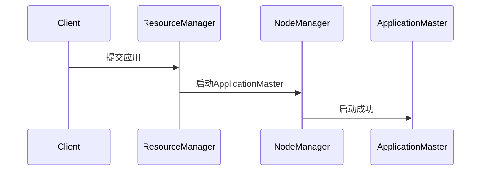
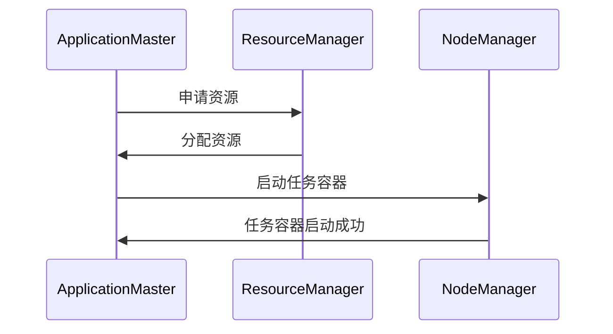
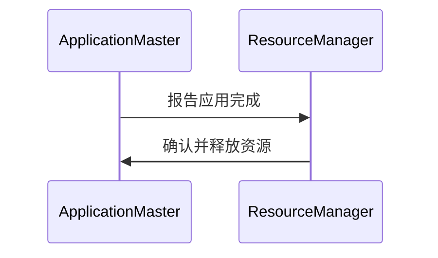

# YARN应用提交流程

YARN（Yet Another Resource Negotiator）是Hadoop生态系统中的资源管理框架，负责集群资源的分配和任务调度。理解YARN的应用提交流程对于掌握分布式计算至关重要。本文将详细介绍YARN应用提交流程的各个步骤，并通过实际案例帮助初学者更好地理解。

## 什么是YARN应用提交流程？

YARN应用提交流程是指用户将应用程序提交到YARN集群，并由YARN负责资源分配和任务调度的过程。这个过程涉及多个组件，包括客户端、ResourceManager、NodeManager和ApplicationMaster。每个组件在应用提交过程中扮演不同的角色。

## YARN应用提交流程的步骤

### 1. 客户端提交应用

用户通过客户端（如Hadoop命令行工具或编程API）提交应用程序。客户端会将应用的配置信息和资源需求打包，并发送给ResourceManager。

```bash
hadoop jar my-app.jar com.example.MyApp
```

### 2. ResourceManager接收请求

ResourceManager接收到客户端提交的请求后，会为该应用分配一个唯一的Application ID，并创建一个ApplicationMaster（AM）容器。ResourceManager负责管理集群资源，并决定在哪个NodeManager上启动AM。

### 3. 启动ApplicationMaster

ResourceManager选择一个NodeManager启动ApplicationMaster。AM负责与ResourceManager通信，申请资源，并管理应用的执行。



### 4. ApplicationMaster申请资源

ApplicationMaster启动后，会向ResourceManager申请资源（如CPU、内存等）。ResourceManager根据集群的资源情况，分配适当的资源给AM。

```java
// 示例代码：ApplicationMaster申请资源
ResourceRequest resourceRequest = ResourceRequest.newInstance(
    Priority.newInstance(1), 
    "*", 
    Resource.newInstance(1024, 1), 
    1);
```

### 5. 启动任务容器

ApplicationMaster根据ResourceManager分配的资源，在NodeManager上启动任务容器（Container）。每个容器负责执行应用的一个任务。



### 6. 任务执行与监控

任务容器启动后，开始执行应用的任务。ApplicationMaster负责监控任务的执行情况，并在任务完成后向ResourceManager报告。

```java
// 示例代码：任务执行与监控
ContainerLaunchContext ctx = Records.newRecord(ContainerLaunchContext.class);
ctx.setCommands(Collections.singletonList("my-task-command"));
```

### 7. 应用完成

当所有任务完成后，ApplicationMaster会向ResourceManager报告应用完成，并释放所有资源。ResourceManager会清理应用的相关信息。



## 实际案例

假设我们有一个简单的MapReduce任务，需要处理大量数据。以下是该任务在YARN上的提交流程：

1. 用户通过命令行提交MapReduce任务。
2. ResourceManager接收任务，并启动ApplicationMaster。
3. ApplicationMaster申请资源，并在NodeManager上启动Map和Reduce任务容器。
4. Map和Reduce任务执行完成后，ApplicationMaster向ResourceManager报告任务完成。
5. ResourceManager清理任务资源。

## 总结

YARN应用提交流程是分布式计算中的核心环节，涉及多个组件的协作。通过理解这一流程，初学者可以更好地掌握YARN的工作原理，并能够有效地提交和管理应用。

## 附加资源

- [YARN官方文档](https://hadoop.apache.org/docs/current/hadoop-yarn/hadoop-yarn-site/YARN.html)
- 《Hadoop权威指南》—— Tom White

## 练习

1. 尝试通过命令行提交一个简单的MapReduce任务，并观察YARN的日志输出。
2. 编写一个简单的ApplicationMaster，模拟资源申请和任务启动的过程。