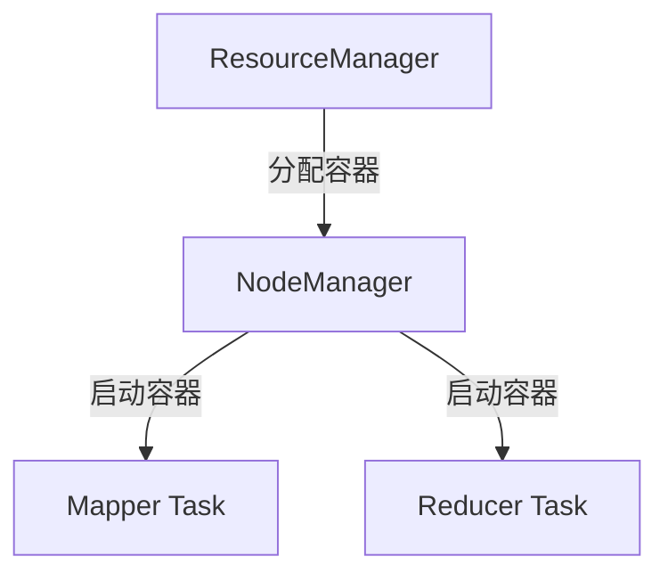
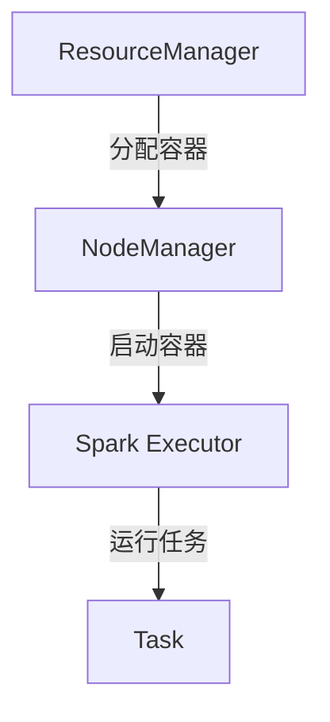

## 介绍

YARN（Yet Another Resource Negotiator）是 Hadoop 生态系统中的资源管理框架，负责集群资源的分配和调度。在 YARN 中，**容器（Container）** 是资源分配的基本单位。容器管理是 YARN 的核心功能之一，它决定了如何分配、启动和监控容器，以支持分布式应用程序的运行。

本文将详细介绍 YARN 容器管理的概念、工作原理以及实际应用场景，帮助初学者全面理解这一重要主题。

---

## 什么是 YARN 容器？

在 YARN 中，**容器** 是一个抽象的资源单元，代表了一定数量的计算资源（如 CPU 和内存）。每个容器可以运行一个任务（例如 MapReduce 的 Mapper 或 Reducer），并且由 YARN 的 ResourceManager 分配和管理。

容器的主要特点包括：
- **资源隔离**：每个容器分配的资源是独立的，不会与其他容器冲突。
- **动态分配**：容器可以根据应用程序的需求动态创建和销毁。
- **生命周期管理**：YARN 负责容器的启动、监控和终止。

---

## YARN 容器管理的工作原理

YARN 容器管理涉及以下几个关键步骤：

### 1. 资源请求
应用程序（如 MapReduce 或 Spark）向 YARN 的 ResourceManager 提交资源请求，指定所需的资源量（如内存和 CPU）。

```java
Resource capability = Resource.newInstance(1024, 1); // 请求 1GB 内存和 1 个 CPU 核心
```

### 2. 资源分配
ResourceManager 根据集群的可用资源和调度策略，为应用程序分配容器。

```java
Container container = Container.newInstance(...);
```

### 3. 容器启动
NodeManager 在分配的节点上启动容器，并运行应用程序的任务。

```bash
# 在容器中启动任务
yarn container -launch <container_id> <command>
```

### 4. 容器监控
YARN 监控容器的运行状态，确保其按预期执行。如果容器失败，YARN 会尝试重新分配资源。

---

## 实际应用场景

### 案例 1：MapReduce 作业
在 MapReduce 作业中，每个 Mapper 和 Reducer 任务都运行在一个独立的容器中。YARN 负责为这些任务分配资源，并确保它们高效运行。



### 案例 2：Spark 应用
在 Spark 应用中，YARN 为每个 Executor 分配容器。Executor 是 Spark 的执行单元，负责运行任务和处理数据。



---

## 总结

YARN 容器管理是分布式计算的核心机制之一。通过容器，YARN 能够高效地分配和管理集群资源，支持多种分布式应用程序的运行。理解容器管理的工作原理，对于掌握 YARN 和 Hadoop 生态系统至关重要。

:::tip 提示
如果你希望深入学习 YARN 容器管理，可以尝试以下练习：
1. 在本地 Hadoop 集群上运行一个 MapReduce 作业，观察容器的分配和启动过程。
2. 使用 YARN 命令行工具（如 `yarn container`）查看容器的状态和日志。
:::

---

## 附加资源

- [Apache Hadoop 官方文档](https://hadoop.apache.org/docs/current/)
- 《Hadoop 权威指南》—— Tom White
- YARN 容器管理相关的开源项目（如 Apache Tez 和 Apache Spark）