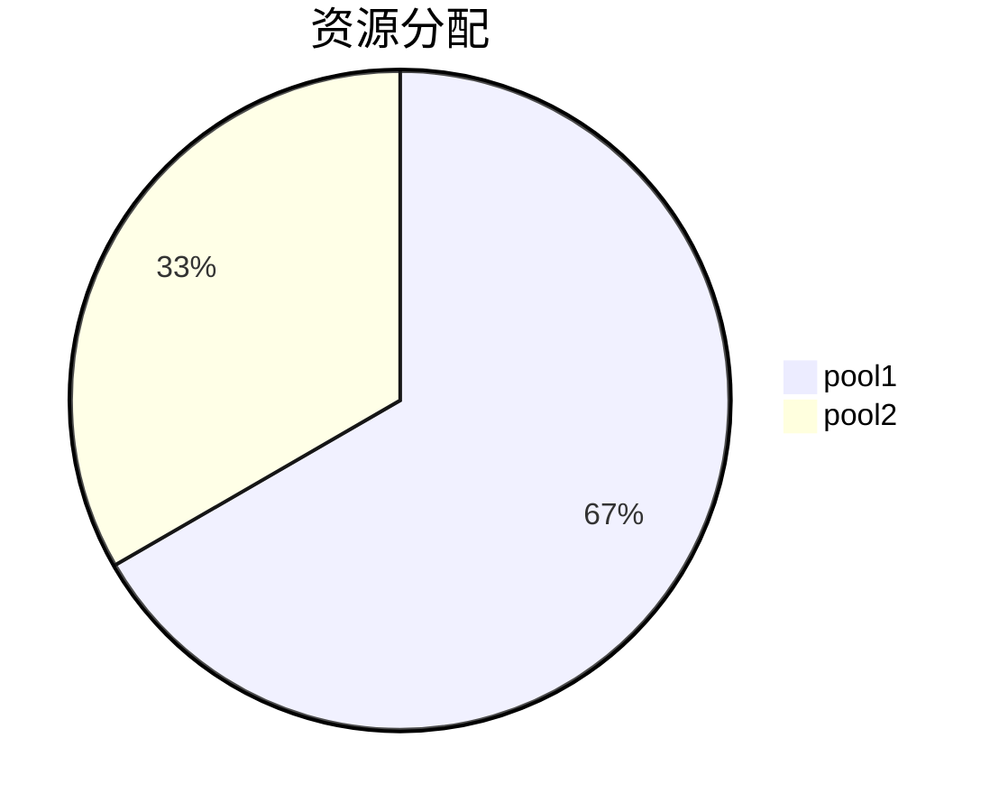

# YARN公平调度器

YARN（Yet Another Resource Negotiator）是Hadoop生态系统中的资源管理框架，负责集群资源的分配和任务调度。YARN公平调度器（Fair Scheduler）是YARN中的一种调度策略，旨在公平地分配集群资源，确保所有用户和应用程序都能获得合理的资源份额。

## 什么是YARN公平调度器？

YARN公平调度器是一种动态资源分配策略，旨在确保所有用户和应用程序在集群中公平地共享资源。与容量调度器（Capacity Scheduler）不同，公平调度器会根据当前集群的资源使用情况动态调整资源分配，避免某些用户或应用程序独占资源。

公平调度器的核心思想是：**当集群资源紧张时，所有正在运行的应用程序都能获得大致相等的资源份额；当资源充足时，应用程序可以按需获取更多资源**。

## 公平调度器的工作原理

公平调度器通过以下机制实现资源分配的公平性：

1. **资源池（Pool）**：公平调度器将集群资源划分为多个资源池，每个资源池可以分配给不同的用户或应用程序组。资源池可以嵌套，形成层次结构。

2. **权重（Weight）**：每个资源池可以设置权重，权重决定了资源池在资源分配中的优先级。权重越高，资源池获得的资源份额越大。

3. **最小共享（Minimum Share）**：资源池可以设置最小资源份额，确保即使在资源紧张的情况下，资源池也能获得一定量的资源。

4. **抢占（Preemption）**：当某个资源池的资源使用超过其公平份额时，公平调度器可以抢占其他资源池的资源，以确保公平性。

## 配置公平调度器

要启用公平调度器，需要在YARN的配置文件 `yarn-site.xml` 中进行如下配置：

```xml
<property>
  <name>yarn.resourcemanager.scheduler.class</name>
  <value>org.apache.hadoop.yarn.server.resourcemanager.scheduler.fair.FairScheduler</value>
</property>
```

此外，还需要配置公平调度器的资源池和权重。资源池的配置文件通常为 `fair-scheduler.xml`，示例如下：

```xml
<allocations>
  <pool name="pool1">
    <minResources>10000 mb, 10vcores</minResources>
    <weight>2.0</weight>
  </pool>
  <pool name="pool2">
    <minResources>5000 mb, 5vcores</minResources>
    <weight>1.0</weight>
  </pool>
</allocations>
```

在这个配置中，`pool1` 的资源权重是 `pool2` 的两倍，因此 `pool1` 将获得更多的资源份额。

## 实际案例

假设我们有一个YARN集群，总资源为 20000 MB 内存和 20 个虚拟核心。我们配置了两个资源池：`pool1` 和 `pool2`，权重分别为 2.0 和 1.0。

- 当集群资源充足时，`pool1` 和 `pool2` 可以分别获得 13333 MB 和 6667 MB 的内存资源。
- 当集群资源紧张时，`pool1` 和 `pool2` 将分别获得 10000 MB 和 5000 MB 的内存资源，以满足其最小资源份额。



## 总结

YARN公平调度器通过动态资源分配和抢占机制，确保集群资源的公平共享。它适用于多用户、多应用程序的环境，能够有效避免资源浪费和资源独占问题。

:::tip
在实际使用中，建议根据业务需求合理配置资源池和权重，以确保资源分配的公平性和高效性。
:::

## 附加资源

- [YARN官方文档](https://hadoop.apache.org/docs/current/hadoop-yarn/hadoop-yarn-site/FairScheduler.html)
- [Hadoop权威指南](https://www.oreilly.com/library/view/hadoop-the-definitive/9781491901687/)

## 练习

1. 在本地Hadoop集群中配置公平调度器，并创建两个资源池，观察资源分配情况。
2. 修改资源池的权重，观察资源分配的变化。
3. 尝试配置最小资源份额，验证其在资源紧张时的作用。
