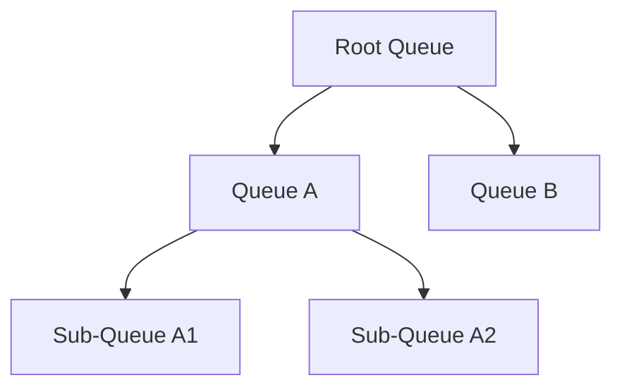

# YARN容量调度器

YARN（Yet Another Resource Negotiator）是Hadoop生态系统中的资源管理框架，负责集群资源的分配和调度。YARN容量调度器（Capacity Scheduler）是YARN的一种调度策略，旨在为多租户环境提供资源分配的灵活性和公平性。本文将详细介绍YARN容量调度器的概念、配置方法以及实际应用场景。

## 什么是YARN容量调度器？

YARN容量调度器是一种基于队列的资源调度策略，允许集群资源按比例分配给不同的队列。每个队列可以配置一定的资源容量（如CPU、内存），并且可以设置最大资源限制。容量调度器的主要目标是确保每个队列都能获得其配置的资源份额，同时允许空闲资源被其他队列临时借用。

:::note
容量调度器适用于多租户环境，例如多个团队或项目共享同一个集群时，可以通过队列分配资源，避免资源争用。
:::

## 容量调度器的核心概念

### 1. 队列（Queue）
队列是容量调度器的基本单位，每个队列代表一组资源。队列可以嵌套，形成层次结构。例如：



- **Root Queue**：根队列，所有其他队列的父队列。
- **子队列**：根队列下的子队列，可以进一步划分资源。

### 2. 容量（Capacity）
每个队列可以配置一个容量百分比，表示该队列可以使用的集群资源比例。例如，Queue A配置了50%的容量，意味着它可以占用集群50%的资源。

### 3. 最大容量（Maximum Capacity）
最大容量是队列可以使用的资源上限。即使集群有空闲资源，队列也不能超过其最大容量。例如，Queue A的最大容量为70%，即使集群有90%的资源空闲，Queue A也只能使用70%。

### 4. 弹性资源（Elastic Resources）
当某个队列的资源使用率低于其容量时，其他队列可以借用这些空闲资源。这种机制称为弹性资源分配。

## 配置容量调度器

YARN容量调度器的配置文件通常是`capacity-scheduler.xml`，位于Hadoop配置目录中。以下是一个简单的配置示例：

```xml
<configuration>
    <property>
        <name>yarn.scheduler.capacity.root.queues</name>
        <value>queueA,queueB</value>
    </property>
    <property>
        <name>yarn.scheduler.capacity.root.queueA.capacity</name>
        <value>50</value>
    </property>
    <property>
        <name>yarn.scheduler.capacity.root.queueB.capacity</name>
        <value>50</value>
    </property>
    <property>
        <name>yarn.scheduler.capacity.root.queueA.maximum-capacity</name>
        <value>70</value>
    </property>
</configuration>
```

### 配置说明
- `yarn.scheduler.capacity.root.queues`：定义根队列下的子队列。
- `yarn.scheduler.capacity.root.queueA.capacity`：设置Queue A的容量为50%。
- `yarn.scheduler.capacity.root.queueA.maximum-capacity`：设置Queue A的最大容量为70%。

:::tip
修改配置文件后，需要重启YARN ResourceManager以使配置生效。
:::

## 实际应用场景

### 场景1：多团队共享集群
假设一个公司有两个团队（Team A和Team B）共享一个Hadoop集群。为了公平分配资源，可以配置两个队列：

- **Queue A**：Team A使用，容量为60%。
- **Queue B**：Team B使用，容量为40%。

如果Team A的任务较少，Queue A的资源使用率低于60%，则Queue B可以借用Queue A的空闲资源。

### 场景2：优先级任务处理
在某些情况下，可能需要优先处理某些任务。可以通过设置队列的最大容量和优先级来实现。例如：

- **Queue HighPriority**：高优先级任务，容量为30%，最大容量为50%。
- **Queue LowPriority**：低优先级任务，容量为70%，最大容量为100%。

当高优先级任务提交时，即使低优先级任务正在运行，高优先级任务也可以抢占部分资源。

## 总结

YARN容量调度器是管理多租户集群资源的强大工具。通过合理配置队列、容量和最大容量，可以确保资源的公平分配和高效利用。本文介绍了容量调度器的核心概念、配置方法以及实际应用场景，帮助初学者快速上手。

## 附加资源与练习

### 资源
- [Apache Hadoop官方文档](https://hadoop.apache.org/docs/current/hadoop-yarn/hadoop-yarn-site/CapacityScheduler.html)
- 《Hadoop权威指南》——Tom White

### 练习
1. 在本地Hadoop集群中配置一个包含两个队列的容量调度器，并提交任务测试资源分配。
2. 尝试嵌套队列结构，观察资源分配的变化。
3. 修改队列的最大容量，测试弹性资源分配的效果。

希望本文能帮助你更好地理解YARN容量调度器！如果有任何问题，欢迎在评论区留言讨论。