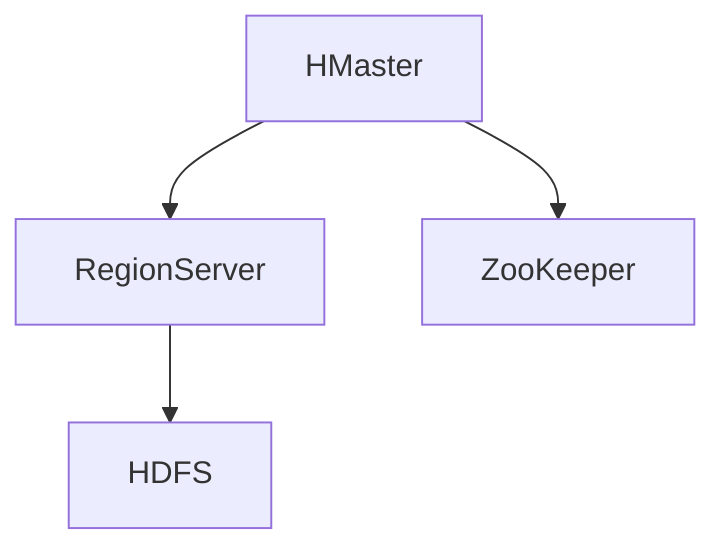
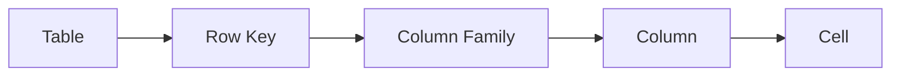

## 介绍

HBase是一个分布式的、面向列的NoSQL数据库，设计用于处理大规模数据集。它是基于Google的Bigtable论文开发的，运行在Hadoop分布式文件系统（HDFS）之上。HBase提供了高可靠性、高性能和可扩展性，适用于需要快速读写大量数据的场景。

## HBase架构概述

HBase的架构主要由以下几个核心组件组成：

1. **HMaster**：负责管理表的元数据、Region的分配和负载均衡。
2. **RegionServer**：负责存储和管理实际的数据，处理客户端的读写请求。
3. **ZooKeeper**：用于协调分布式系统中的各个节点，确保系统的一致性和可靠性。
4. **HDFS**：HBase的数据存储层，提供高可靠性和高吞吐量的数据存储。



## 核心组件详解

### HMaster

HMaster是HBase的主节点，负责管理表的元数据、Region的分配和负载均衡。它不直接处理客户端的读写请求，而是通过协调RegionServer来完成这些任务。

:::note
HMaster的高可用性可以通过配置多个HMaster来实现，其中一个作为主节点，其他作为备用节点。
:::

### RegionServer

RegionServer是HBase的工作节点，负责存储和管理实际的数据。每个RegionServer管理多个Region，每个Region对应表中的一个数据分区。RegionServer处理客户端的读写请求，并将数据存储在HDFS上。

:::tip
RegionServer的性能直接影响HBase的整体性能，因此需要根据数据量和访问模式合理配置RegionServer的数量和资源。
:::

### ZooKeeper

ZooKeeper是HBase的协调服务，用于管理集群中的各个节点。它负责维护HMaster和RegionServer的状态信息，确保系统的一致性和可靠性。

:::caution
ZooKeeper的性能和稳定性对整个HBase集群至关重要，因此需要确保ZooKeeper集群的高可用性和高性能。
:::

### HDFS

HDFS是HBase的数据存储层，提供高可靠性和高吞吐量的数据存储。HBase将数据存储在HDFS上，利用HDFS的分布式特性来实现数据的高可用性和容错性。

:::warning
HDFS的配置和性能直接影响HBase的数据存储和访问性能，因此需要根据数据量和访问模式合理配置HDFS集群。
:::

## 数据存储方式

HBase的数据存储方式是基于列族（Column Family）的，每个表可以包含多个列族，每个列族包含多个列。数据按行键（Row Key）进行排序和存储，行键是唯一的，用于标识每一行数据。



:::note
列族是HBase中数据存储的基本单位，合理设计列族可以提高数据的访问效率。
:::

## 实际应用场景

### 日志存储与分析

HBase适用于存储和分析大量的日志数据。例如，一个电商网站可以将用户的访问日志存储在HBase中，然后通过HBase的高效查询功能来分析用户的访问行为。

```java
// 示例代码：将日志数据写入HBase
Configuration config = HBaseConfiguration.create();
Connection connection = ConnectionFactory.createConnection(config);
Table table = connection.getTable(TableName.valueOf("logs"));

Put put = new Put(Bytes.toBytes("row1"));
put.addColumn(Bytes.toBytes("cf"), Bytes.toBytes("timestamp"), Bytes.toBytes("2023-10-01T12:00:00Z"));
put.addColumn(Bytes.toBytes("cf"), Bytes.toBytes("user"), Bytes.toBytes("user1"));
put.addColumn(Bytes.toBytes("cf"), Bytes.toBytes("action"), Bytes.toBytes("click"));

table.put(put);
table.close();
connection.close();
```

### 实时数据存储

HBase也适用于存储实时数据，例如传感器数据、交易数据等。通过HBase的高性能读写能力，可以实现对实时数据的快速存储和查询。

```java
// 示例代码：从HBase中读取实时数据
Configuration config = HBaseConfiguration.create();
Connection connection = ConnectionFactory.createConnection(config);
Table table = connection.getTable(TableName.valueOf("sensor_data"));

Get get = new Get(Bytes.toBytes("row1"));
Result result = table.get(get);
byte[] value = result.getValue(Bytes.toBytes("cf"), Bytes.toBytes("temperature"));
System.out.println("Temperature: " + Bytes.toString(value));

table.close();
connection.close();
```

## 总结

HBase是一个强大的分布式数据库，适用于处理大规模数据集。通过理解HBase的架构和核心组件，初学者可以更好地掌握HBase的工作原理和应用场景。希望本文能帮助你快速入门HBase，并在实际项目中应用这些知识。

## 附加资源与练习

- **官方文档**：阅读HBase的官方文档，深入了解其高级特性和配置选项。
- **实践练习**：尝试在本地或云环境中搭建一个HBase集群，并进行数据的读写操作。
- **社区论坛**：加入HBase的社区论坛，与其他开发者交流经验和解决问题。

:::tip
通过实践和不断学习，你将能够更好地掌握HBase的使用技巧，并在实际项目中发挥其强大的功能。
:::