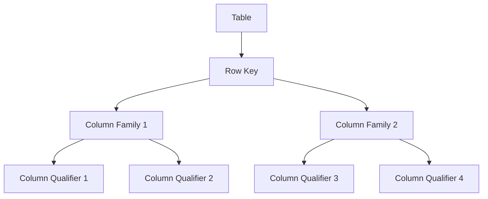

# HBase 数据模型

HBase 是一个分布式的、面向列的数据库，设计用于处理大规模数据集。它的数据模型与传统的关系型数据库有很大不同，理解其数据模型是掌握 HBase 的关键。本文将详细介绍 HBase 数据模型的核心概念，并通过示例帮助你更好地理解。

## 1. HBase 数据模型简介

HBase 的数据模型可以看作是一个多维的、稀疏的、分布式的、持久化的映射表。它由行键（Row Key）、列族（Column Family）、列限定符（Column Qualifier）和时间戳（Timestamp）组成。这些组件共同定义了 HBase 中数据的存储和访问方式。

### 核心概念

- **行键（Row Key）**：每行数据的唯一标识符，类似于关系型数据库中的主键。行键是按字典顺序排序的，因此设计行键时需要特别注意。
- **列族（Column Family）**：一组列的集合，列族是物理存储的基本单位。每个列族在存储时是分开的，因此列族的设计会影响性能。
- **列限定符（Column Qualifier）**：列族中的具体列，用于标识列族中的某一列。
- **时间戳（Timestamp）**：每个单元格（Cell）可以有多个版本，时间戳用于区分不同版本的数据。

## 2. HBase 数据模型的组件

### 2.1 行键（Row Key）

行键是 HBase 中最重要的部分，它决定了数据的存储位置和访问方式。行键的设计需要根据具体的业务需求进行优化。

:::tip
行键的设计应尽量避免热点问题，即避免所有数据都集中在某个区域。
:::

### 2.2 列族（Column Family）

列族是 HBase 中数据的逻辑分组，每个列族在物理存储上是分开的。列族的设计会影响数据的存储和查询性能。



### 2.3 列限定符（Column Qualifier）

列限定符是列族中的具体列，用于标识列族中的某一列。列限定符可以是任意字符串，通常用于存储具体的属性值。

### 2.4 时间戳（Timestamp）

HBase 支持多版本数据存储，每个单元格（Cell）可以有多个版本，时间戳用于区分不同版本的数据。默认情况下，HBase 会保留最新的版本。

## 3. HBase 数据模型示例

假设我们有一个存储用户信息的表 `user_info`，表结构如下：

- 行键：用户 ID
- 列族：`info`
- 列限定符：`name`, `age`, `email`

### 3.1 插入数据

我们可以使用 HBase Shell 插入数据：

```bash
put 'user_info', 'user1', 'info:name', 'Alice'
put 'user_info', 'user1', 'info:age', '25'
put 'user_info', 'user1', 'info:email', 'alice@example.com'
```

### 3.2 查询数据

查询 `user1` 的所有信息：

```bash
get 'user_info', 'user1'
```

输出结果：

```bash
COLUMN                CELL
 info:age            timestamp=1633072800000, value=25
 info:email          timestamp=1633072800000, value=alice@example.com
 info:name           timestamp=1633072800000, value=Alice
```

## 4. 实际应用场景

HBase 的数据模型非常适合存储大规模、稀疏的数据集。以下是一些常见的应用场景：

- **日志存储**：HBase 可以高效地存储和查询大量的日志数据。
- **时间序列数据**：HBase 的多版本特性使其非常适合存储时间序列数据，如传感器数据、股票价格等。
- **用户画像**：HBase 可以存储用户的各种属性，并通过行键快速查询用户信息。

## 5. 总结

HBase 的数据模型与传统的关系型数据库有很大不同，它通过行键、列族、列限定符和时间戳来组织数据。理解这些核心概念是掌握 HBase 的关键。通过合理设计行键和列族，可以显著提高 HBase 的性能。

## 6. 附加资源与练习

- **练习**：尝试在 HBase 中创建一个表，并插入一些数据，然后查询这些数据。
- **资源**：
  - [HBase 官方文档](https://hbase.apache.org/book.html)
  - 《HBase 权威指南》

:::note
如果你在练习中遇到问题，可以参考 HBase 的官方文档或社区论坛。
:::