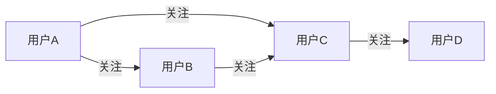

# Spark简介与特性

Apache Spark 是一个开源的分布式计算框架，专为大规模数据处理而设计。它提供了高效的数据处理能力，支持批处理、流处理、机器学习和图计算等多种计算模式。Spark 的核心优势在于其内存计算能力，能够显著提升数据处理速度。

## 什么是 Spark？

Spark 最初由加州大学伯克利分校的 AMPLab 开发，并于 2014 年成为 Apache 顶级项目。它旨在解决 Hadoop MapReduce 的性能瓶颈问题，通过内存计算和优化的执行引擎，Spark 能够比传统的 MapReduce 快 100 倍。

Spark 的核心抽象是 **弹性分布式数据集（RDD, Resilient Distributed Dataset）**，它是一个不可变的分布式对象集合，可以在集群中并行处理。RDD 支持两种操作：
- **转换（Transformations）**：如 `map`、`filter` 等，生成新的 RDD。
- **动作（Actions）**：如 `count`、`collect` 等，触发计算并返回结果。

## Spark 的核心特性

### 1. 快速计算
Spark 通过内存计算和优化的执行引擎，显著提升了数据处理速度。与 Hadoop MapReduce 相比，Spark 在迭代算法和交互式查询中表现尤为出色。

### 2. 易用性
Spark 提供了多种编程语言的支持，包括 Scala、Java、Python 和 R。此外，Spark 还提供了丰富的 API，如 Spark SQL、Spark Streaming、MLlib 和 GraphX，方便用户进行各种数据处理任务。

### 3. 通用性
Spark 不仅支持批处理，还支持流处理、机器学习和图计算。这使得 Spark 成为一个通用的数据处理平台，能够满足多种应用场景的需求。

### 4. 容错性
Spark 的 RDD 具有容错性，能够在节点故障时自动恢复数据。这是通过 RDD 的血统（Lineage）信息实现的，Spark 记录了 RDD 的生成过程，从而可以在需要时重新计算丢失的数据。

### 5. 可扩展性
Spark 可以在 Hadoop YARN、Apache Mesos 或 Kubernetes 等集群管理器上运行，也可以独立运行。它支持从单机到数千台节点的集群规模。

## Spark 的实际应用场景

### 1. 批处理
Spark 可以高效处理大规模数据集，适用于日志分析、ETL（Extract, Transform, Load）等批处理任务。

```python
# 示例：使用 Spark 进行单词计数
from pyspark import SparkContext

sc = SparkContext("local", "WordCountApp")
text_file = sc.textFile("hdfs://path/to/input.txt")
word_counts = text_file.flatMap(lambda line: line.split(" ")) \
                      .map(lambda word: (word, 1)) \
                      .reduceByKey(lambda a, b: a + b)
word_counts.saveAsTextFile("hdfs://path/to/output")
```

### 2. 流处理
Spark Streaming 支持实时数据处理，适用于实时监控、实时推荐等场景。

```python
# 示例：使用 Spark Streaming 进行实时单词计数
from pyspark.streaming import StreamingContext

ssc = StreamingContext(sc, 1)  # 1秒的批处理间隔
lines = ssc.socketTextStream("localhost", 9999)
word_counts = lines.flatMap(lambda line: line.split(" ")) \
                   .map(lambda word: (word, 1)) \
                   .reduceByKey(lambda a, b: a + b)
word_counts.pprint()
ssc.start()
ssc.awaitTermination()
```

### 3. 机器学习
Spark 的 MLlib 库提供了丰富的机器学习算法，适用于分类、回归、聚类等任务。

```python
# 示例：使用 MLlib 进行线性回归
from pyspark.ml.regression import LinearRegression
from pyspark.ml.linalg import Vectors
from pyspark.sql import SparkSession

spark = SparkSession.builder.appName("LinearRegressionExample").getOrCreate()
data = [(Vectors.dense([1.0, 2.0]), 3.0),
        (Vectors.dense([2.0, 3.0]), 5.0)]
df = spark.createDataFrame(data, ["features", "label"])
lr = LinearRegression(maxIter=10, regParam=0.3, elasticNetParam=0.8)
model = lr.fit(df)
print("Coefficients: " + str(model.coefficients))
```

### 4. 图计算
Spark 的 GraphX 库支持图计算，适用于社交网络分析、推荐系统等场景。



## 总结

Apache Spark 是一个功能强大且灵活的分布式计算框架，适用于多种数据处理场景。它的核心特性包括快速计算、易用性、通用性、容错性和可扩展性。通过本文的介绍，你应该对 Spark 的基本概念和特性有了初步了解。

:::tip 提示
如果你想深入学习 Spark，可以参考以下资源：
- [Apache Spark 官方文档](https://spark.apache.org/docs/latest/)
- 《Learning Spark》书籍
- Spark 社区论坛和博客
:::

:::note 练习
1. 尝试在本地安装 Spark 并运行一个简单的单词计数程序。
2. 使用 Spark Streaming 处理实时数据流，并输出结果。
3. 使用 MLlib 实现一个简单的机器学习模型，如线性回归或分类。
:::