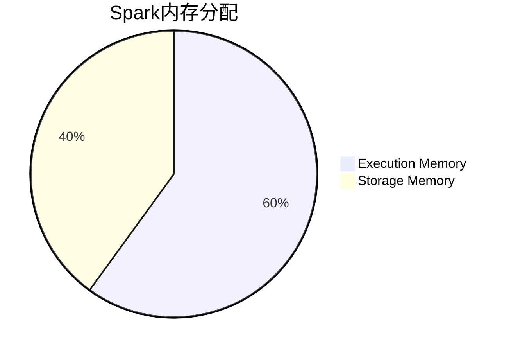

# Spark内存管理

Apache Spark是一个强大的分布式计算框架，广泛用于大数据处理。为了高效处理大规模数据集，Spark需要有效地管理内存。本文将详细介绍Spark的内存管理机制，帮助初学者理解其工作原理，并通过实际案例展示如何优化内存使用。

## 什么是Spark内存管理？

Spark内存管理是指Spark框架如何分配和使用内存资源来执行任务。Spark的内存管理机制直接影响其性能和稳定性。Spark的内存主要分为两类：

1. **执行内存（Execution Memory）**：用于存储任务执行过程中产生的中间数据，如Shuffle、Join、Sort等操作的结果。
2. **存储内存（Storage Memory）**：用于缓存RDD（Resilient Distributed Dataset）数据，以便在后续任务中快速访问。

## Spark内存模型

Spark的内存模型可以通过以下图表来理解：



:::note
**注意**：执行内存和存储内存的比例可以通过配置参数 `spark.memory.fraction` 进行调整，默认值为0.6，即60%的内存用于执行内存，40%用于存储内存。
:::

## 内存管理机制

### 1. 内存分配

Spark的内存分配是基于JVM的堆内存。Spark将堆内存分为两部分：

- **堆内内存（On-Heap Memory）**：由JVM管理的内存，受垃圾回收机制的影响。
- **堆外内存（Off-Heap Memory）**：直接由操作系统管理的内存，不受JVM垃圾回收机制的影响。

### 2. 内存回收

当内存不足时，Spark会根据LRU（Least Recently Used）策略回收存储内存中的缓存数据。如果执行内存不足，Spark会尝试从存储内存中借用内存，反之亦然。

### 3. 内存溢出

当内存不足以存储所有数据时，Spark会将部分数据溢出到磁盘。这会影响性能，因此应尽量避免内存溢出。

## 实际案例

假设我们有一个大数据集，需要对其进行多次操作。为了提高性能，我们可以将数据集缓存到内存中。

```scala
val data = spark.read.csv("large_dataset.csv")
data.cache() // 将数据集缓存到内存中
data.count() // 触发缓存操作
```

在上述代码中，`data.cache()` 将数据集缓存到存储内存中，以便在后续操作中快速访问。

## 优化内存使用

### 1. 调整内存比例

根据应用场景调整执行内存和存储内存的比例。例如，如果应用需要频繁进行Shuffle操作，可以增加执行内存的比例。

```bash
spark-submit --conf spark.memory.fraction=0.7 --conf spark.memory.storageFraction=0.5
```

### 2. 使用堆外内存

对于需要处理大量数据的应用，可以使用堆外内存来减少垃圾回收的开销。

```bash
spark-submit --conf spark.memory.offHeap.enabled=true --conf spark.memory.offHeap.size=2g
```

### 3. 避免内存溢出

通过合理设置分区数和调整数据倾斜，可以避免内存溢出。

```scala
val data = spark.read.csv("large_dataset.csv").repartition(100) // 增加分区数
```

## 总结

Spark内存管理是优化Spark应用性能的关键。通过理解内存分配、回收和溢出机制，并根据实际应用场景调整内存配置，可以显著提高Spark应用的执行效率。

## 附加资源

- [Spark官方文档](https://spark.apache.org/docs/latest/tuning.html)
- 《Learning Spark》书籍
- [Spark内存管理视频教程](https://www.youtube.com/watch?v=xyz)

## 练习

1. 尝试调整 `spark.memory.fraction` 参数，观察应用性能的变化。
2. 使用堆外内存运行一个Spark应用，比较其与堆内内存的性能差异。
3. 分析一个内存溢出的案例，并提出优化方案。

通过以上内容，你应该对Spark内存管理有了全面的了解。继续实践和探索，你将能够更好地优化Spark应用的性能。