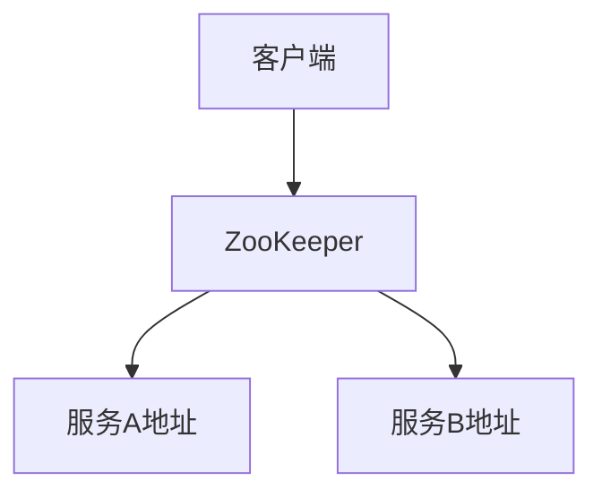
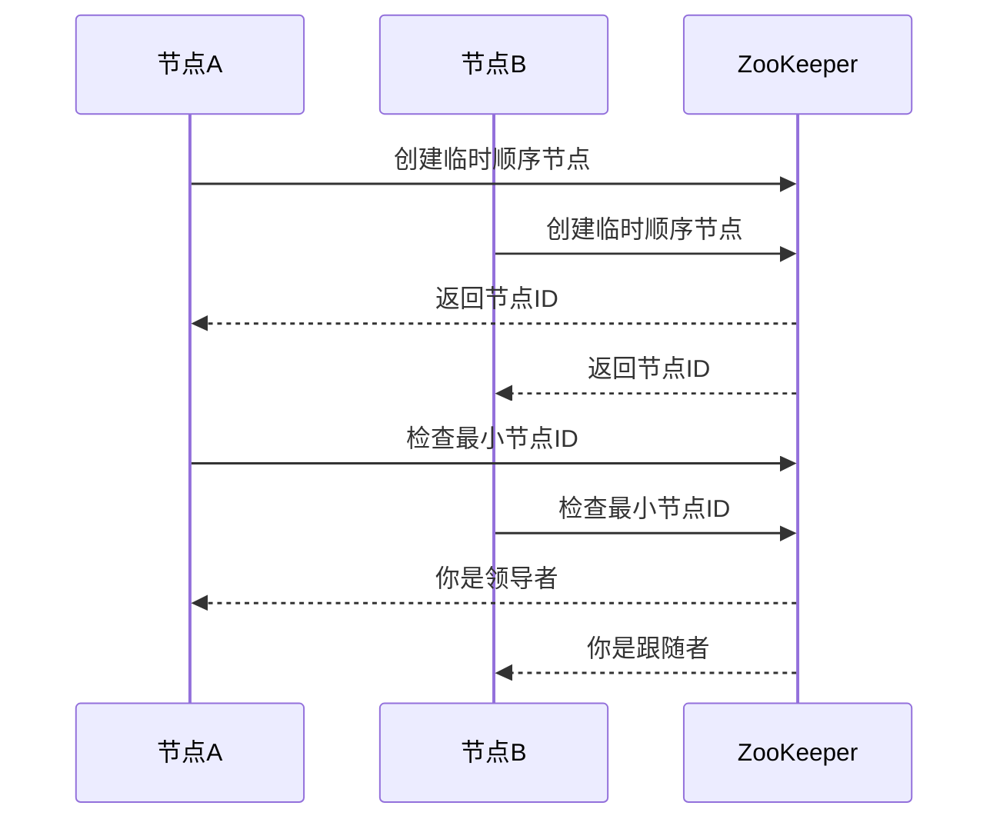

# ZooKeeper概述与功能

## 什么是ZooKeeper？

ZooKeeper是一个开源的分布式协调服务，由Apache软件基金会开发和维护。它主要用于解决分布式系统中的一致性问题，例如配置管理、命名服务、分布式同步和组服务等。ZooKeeper通过提供简单且高效的API，帮助开发者在分布式环境中实现复杂的协调任务。

ZooKeeper的核心设计目标是**高可用性**和**强一致性**。它通过一个分布式的、层次化的文件系统（类似于文件目录树）来存储数据，并通过ZAB（ZooKeeper Atomic Broadcast）协议保证数据的一致性。

## ZooKeeper的核心功能

ZooKeeper提供了以下核心功能：

### 1. 配置管理
在分布式系统中，配置信息通常需要集中管理，并且能够动态更新。ZooKeeper允许将配置信息存储在它的节点（ZNode）中，所有客户端都可以实时获取和监听这些配置的变化。

```java
// 示例：Java客户端监听ZooKeeper节点
Watcher watcher = new Watcher() {
    public void process(WatchedEvent event) {
        System.out.println("配置已更新: " + event.getPath());
    }
};
byte[] data = zooKeeper.getData("/config", watcher, null);
System.out.println("当前配置: " + new String(data));
```

### 2. 命名服务
ZooKeeper可以作为一个分布式的命名服务，用于存储和查找分布式系统中的资源名称。例如，可以将服务的地址信息存储在ZooKeeper中，客户端通过查询ZooKeeper来获取服务的地址。



### 3. 分布式锁
在分布式系统中，多个进程可能需要互斥访问共享资源。ZooKeeper通过临时顺序节点（Ephemeral Sequential Nodes）实现分布式锁。

```java
// 示例：Java客户端实现分布式锁
String lockPath = zooKeeper.create("/locks/lock-", null, ZooDefs.Ids.OPEN_ACL_UNSAFE, CreateMode.EPHEMERAL_SEQUENTIAL);
List<String> children = zooKeeper.getChildren("/locks", false);
Collections.sort(children);
if (lockPath.endsWith(children.get(0))) {
    System.out.println("获得锁");
} else {
    System.out.println("等待锁");
}
```

### 4. 领导者选举
在分布式系统中，通常需要选举一个领导者来协调任务。ZooKeeper通过临时节点和顺序节点的组合，可以轻松实现领导者选举。



### 5. 分布式队列
ZooKeeper还可以用于实现分布式队列，通过顺序节点和监听机制，确保任务的顺序执行。

```java
// 示例：Java客户端实现分布式队列
String taskPath = zooKeeper.create("/queue/task-", "taskData".getBytes(), ZooDefs.Ids.OPEN_ACL_UNSAFE, CreateMode.PERSISTENT_SEQUENTIAL);
List<String> tasks = zooKeeper.getChildren("/queue", false);
Collections.sort(tasks);
if (taskPath.endsWith(tasks.get(0))) {
    System.out.println("任务已出队");
}
```

## 实际应用场景

### 场景1：Kafka中的ZooKeeper
Apache Kafka是一个分布式流处理平台，它使用ZooKeeper来管理集群的元数据、领导者选举和配置信息。Kafka的每个Broker都会在ZooKeeper中注册自己，并通过ZooKeeper来协调分区和副本的分配。

### 场景2：Hadoop中的ZooKeeper
Apache Hadoop是一个分布式计算框架，它的高可用性（HA）实现依赖于ZooKeeper。例如，HDFS的NameNode高可用性通过ZooKeeper来实现故障切换。

## 总结

ZooKeeper是一个强大的分布式协调服务，广泛应用于各种分布式系统中。它的核心功能包括配置管理、命名服务、分布式锁、领导者选举和分布式队列等。通过ZooKeeper，开发者可以轻松解决分布式系统中的一致性和协调问题。

:::tip 提示
如果你对ZooKeeper的底层实现感兴趣，可以深入研究ZAB协议和ZooKeeper的源码。
:::

## 附加资源与练习

- **官方文档**: [ZooKeeper官方文档](https://zookeeper.apache.org/doc/current/)
- **练习**: 尝试使用ZooKeeper实现一个简单的分布式锁，并测试其在高并发场景下的表现。
- **推荐书籍**: 《ZooKeeper: Distributed Process Coordination》 by Flavio Junqueira and Benjamin Reed