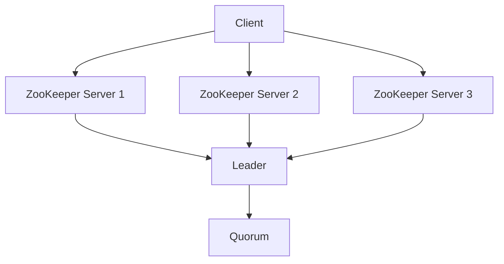

# ZooKeeper架构设计

ZooKeeper 是一个分布式的、开源的协调服务，广泛用于分布式系统中。它提供了一个简单的接口，用于管理配置信息、命名服务、分布式同步和组服务。ZooKeeper 的设计目标是高可用性和高性能，同时保持简单易用。

## 什么是ZooKeeper？

ZooKeeper 是一个分布式协调服务，它通过一个简单的文件系统树（类似于文件系统的目录结构）来存储数据。每个节点（称为 ZNode）可以存储少量数据，并且可以通过路径访问。ZooKeeper 的主要功能包括：

- **配置管理**：集中管理分布式系统的配置信息。
- **命名服务**：为分布式系统中的资源提供唯一的名称。
- **分布式锁**：实现分布式系统中的互斥访问。
- **领导者选举**：在分布式系统中选举一个领导者来协调任务。

## ZooKeeper 的核心组件

ZooKeeper 的架构设计主要由以下几个核心组件组成：

1. **ZNode**：ZooKeeper 中的数据节点，类似于文件系统中的文件或目录。每个 ZNode 可以存储数据，并且可以有子节点。
2. **Session**：客户端与 ZooKeeper 服务器之间的连接。客户端通过会话与 ZooKeeper 进行交互。
3. **Watcher**：客户端可以注册 Watcher 来监听 ZNode 的变化。当 ZNode 发生变化时，ZooKeeper 会通知客户端。
4. **Quorum**：ZooKeeper 集群中的大多数服务器（超过半数）必须达成一致才能进行写操作。

## ZooKeeper 的架构

ZooKeeper 的架构设计是一个典型的分布式系统架构，主要由以下几个部分组成：

1. **ZooKeeper 服务器集群**：ZooKeeper 通常以集群的形式部署，集群中的每个服务器都维护一个完整的数据副本。
2. **Leader 和 Follower**：在 ZooKeeper 集群中，有一个服务器被选举为 Leader，负责处理所有写请求。其他服务器作为 Follower，负责处理读请求并参与 Leader 选举。
3. **客户端**：客户端通过 TCP 连接到 ZooKeeper 集群中的任意一个服务器，发送请求并接收响应。



## ZooKeeper 的工作原理

ZooKeeper 的工作原理可以概括为以下几个步骤：

1. **客户端连接**：客户端连接到 ZooKeeper 集群中的任意一个服务器。
2. **请求处理**：客户端发送请求（如创建 ZNode、读取数据等）到服务器。
3. **Leader 选举**：如果请求是写操作，Follower 会将请求转发给 Leader，由 Leader 处理写操作。
4. **数据同步**：Leader 将写操作的结果广播给所有 Follower，确保数据一致性。
5. **响应客户端**：服务器将处理结果返回给客户端。

:::note
ZooKeeper 使用 ZAB（ZooKeeper Atomic Broadcast）协议来保证数据的一致性和顺序性。
:::

## 实际案例：分布式锁

ZooKeeper 可以用于实现分布式锁。以下是一个简单的分布式锁的实现示例：

```java
import org.apache.zookeeper.CreateMode;
import org.apache.zookeeper.ZooDefs;
import org.apache.zookeeper.ZooKeeper;

public class DistributedLock {
    private ZooKeeper zooKeeper;
    private String lockPath;

    public DistributedLock(ZooKeeper zooKeeper, String lockPath) {
        this.zooKeeper = zooKeeper;
        this.lockPath = lockPath;
    }

    public void acquireLock() throws Exception {
        zooKeeper.create(lockPath, new byte[0], ZooDefs.Ids.OPEN_ACL_UNSAFE, CreateMode.EPHEMERAL);
    }

    public void releaseLock() throws Exception {
        zooKeeper.delete(lockPath, -1);
    }
}
```

在这个示例中，我们使用 ZooKeeper 的 `create` 方法创建一个临时节点来获取锁，使用 `delete` 方法删除节点来释放锁。

:::tip
临时节点在客户端会话结束时会自动删除，这确保了即使客户端崩溃，锁也会被释放。
:::

## 总结

ZooKeeper 是一个强大的分布式协调服务，它的架构设计简单而高效，能够满足分布式系统中的多种需求。通过理解 ZooKeeper 的核心组件和工作原理，你可以更好地利用它来构建可靠的分布式系统。

## 附加资源

- [ZooKeeper 官方文档](https://zookeeper.apache.org/doc/current/)
- [ZooKeeper 源码](https://github.com/apache/zookeeper)
- [分布式系统设计与实践](https://www.oreilly.com/library/view/distributed-systems-principles/9780132143011/)

## 练习

1. 尝试在本地搭建一个 ZooKeeper 集群，并使用命令行工具 `zkCli.sh` 进行基本操作。
2. 实现一个简单的分布式锁，并在多个客户端之间测试其正确性。
3. 研究 ZAB 协议的工作原理，并解释其在 ZooKeeper 中的作用。

:::caution
在实际生产环境中使用 ZooKeeper 时，请确保集群的高可用性和数据备份，以防止单点故障。
:::