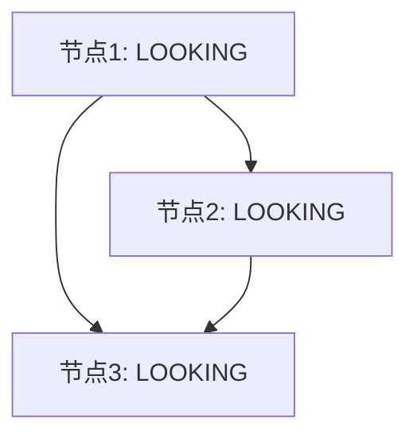
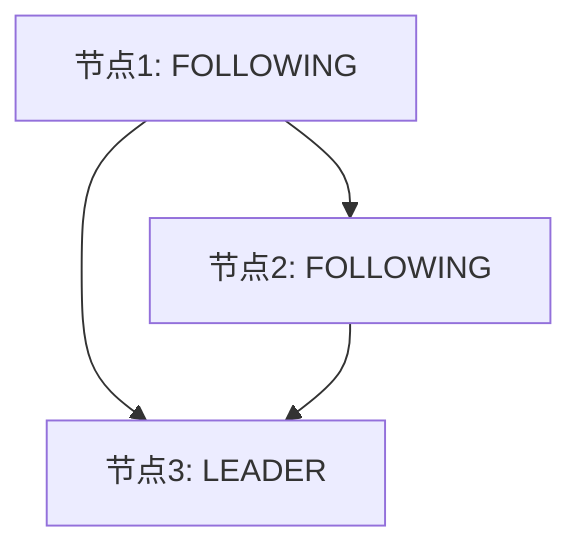

# ZooKeeper选举算法

ZooKeeper是一个分布式协调服务，广泛用于分布式系统中实现一致性、配置管理、命名服务等功能。在ZooKeeper集群中，选举算法是确保集群高可用性和一致性的核心机制之一。本文将详细介绍ZooKeeper的选举算法，帮助初学者理解其工作原理和应用场景。

## 什么是ZooKeeper选举算法？

在ZooKeeper集群中，多个服务器节点共同协作提供服务。为了确保集群的高可用性，ZooKeeper采用了**Leader选举**机制。选举算法的目的是从集群中选出一个**Leader**节点，负责协调其他节点（称为**Follower**）的工作。Leader节点负责处理所有写请求，而Follower节点则负责处理读请求。

ZooKeeper的选举算法基于**Zab协议**（ZooKeeper Atomic Broadcast），该协议确保集群中的所有节点能够就Leader选举达成一致，并在Leader失效时快速重新选举。

## ZooKeeper选举算法的工作原理

ZooKeeper的选举算法主要分为以下几个步骤：

1. **节点启动**：当ZooKeeper集群中的节点启动时，每个节点都会进入**LOOKING**状态，表示它正在寻找Leader。

2. **投票**：每个节点会向其他节点发送投票信息，投票信息包含节点的ID（`myid`）和当前的事务ID（`zxid`）。事务ID是ZooKeeper中用于标识事务顺序的唯一标识符。

3. **比较投票**：当一个节点收到其他节点的投票信息时，它会比较这些投票信息。比较的规则是：
   - 优先选择`zxid`较大的节点。
   - 如果`zxid`相同，则选择`myid`较大的节点。

4. **确定Leader**：当一个节点发现自己的投票被大多数节点接受时，它会宣布自己为Leader，并通知其他节点。其他节点收到通知后，会进入**FOLLOWING**状态，成为Follower。

5. **同步数据**：Leader节点会与Follower节点同步数据，确保所有节点的状态一致。

## 选举算法的实际案例

假设我们有一个由三个节点组成的ZooKeeper集群，节点的`myid`分别为1、2、3，初始状态如下：

1. **节点启动**：所有节点启动后，进入LOOKING状态，并开始发送投票信息。

2. **投票**：
   - 节点1发送投票信息：`myid=1, zxid=0`
   - 节点2发送投票信息：`myid=2, zxid=0`
   - 节点3发送投票信息：`myid=3, zxid=0`

3. **比较投票**：
   - 节点1收到节点2和节点3的投票信息，发现节点3的`myid`最大，因此节点1会投票给节点3。
   - 节点2和节点3也会进行类似的比较，最终所有节点都会投票给节点3。

4. **确定Leader**：节点3收到大多数节点的投票，宣布自己为Leader，并通知其他节点。

5. **同步数据**：节点3与节点1和节点2同步数据，确保所有节点的状态一致。

最终，集群状态如下：

## 总结

ZooKeeper的选举算法是确保分布式系统高可用性和一致性的关键机制。通过投票和比较`zxid`和`myid`，ZooKeeper能够快速选举出Leader节点，并在Leader失效时重新选举。理解这一算法对于设计和维护分布式系统至关重要。

## 附加资源

- [ZooKeeper官方文档](https://zookeeper.apache.org/doc/current/)
- [Zab协议论文](https://www.usenix.org/legacy/event/atc10/tech/full_papers/Hunt.pdf)
- [分布式系统设计与实现](https://www.amazon.com/Distributed-Systems-Concepts-Design-5th/dp/0132143011)

## 练习

1. 在一个由5个节点组成的ZooKeeper集群中，假设节点的`myid`分别为1、2、3、4、5，初始`zxid`均为0。请模拟选举过程，并确定最终的Leader节点。
2. 如果Leader节点失效，ZooKeeper集群如何重新选举Leader？请描述重新选举的过程。