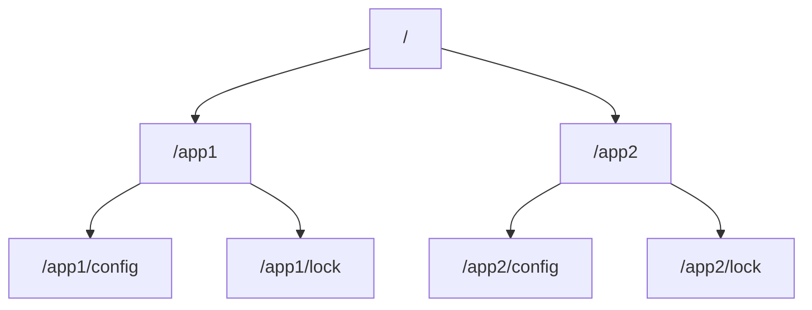

## 介绍

ZooKeeper是一个分布式协调服务，广泛用于管理分布式系统中的配置信息、命名服务、分布式锁和集群管理。ZooKeeper的核心是其数据模型，它决定了数据如何存储和组织。理解ZooKeeper的数据模型是掌握其工作原理的关键。

ZooKeeper的数据模型类似于文件系统的树形结构，称为**ZNode树**。每个节点（ZNode）可以存储数据，并且可以有子节点。与文件系统不同的是，ZooKeeper的节点可以存储少量数据，并且支持监听机制，允许客户端监听节点的变化。

## ZNode树结构

ZooKeeper的数据模型是一个层次化的命名空间，类似于文件系统的目录树。每个节点称为ZNode，它可以存储数据，并且可以有子节点。ZNode树的根节点是`/`，所有其他节点都是其子节点。



在上面的示例中，`/`是根节点，`/app1`和`/app2`是其子节点。`/app1`和`/app2`又分别有子节点`/app1/config`、`/app1/lock`和`/app2/config`、`/app2/lock`。

## ZNode的类型

ZooKeeper中的ZNode有两种类型：

1. **持久节点（Persistent Node）**：持久节点在创建后会一直存在，直到显式删除。即使创建该节点的客户端断开连接，节点仍然存在。

2. **临时节点（Ephemeral Node）**：临时节点的生命周期与客户端会话绑定。当客户端会话结束时，临时节点会自动删除。

此外，ZNode还可以是**顺序节点（Sequential Node）**。顺序节点会在节点名称后附加一个单调递增的数字，确保节点名称的唯一性。

:::tip
临时节点非常适合用于实现分布式锁和集群管理中的临时状态存储。
:::

## ZNode的数据

每个ZNode可以存储少量数据（通常不超过1MB）。数据以字节数组的形式存储，ZooKeeper本身不关心数据的格式，客户端可以自行决定数据的编码方式（如JSON、XML等）。

## 监听机制

ZooKeeper的一个重要特性是**监听机制**。客户端可以在ZNode上设置监听器，当ZNode的数据或子节点发生变化时，ZooKeeper会通知客户端。这使得ZooKeeper非常适合用于实现分布式系统中的配置管理和状态同步。

## 实际案例

假设我们有一个分布式系统，需要管理多个服务的配置信息。我们可以使用ZooKeeper来存储这些配置信息，并在配置发生变化时通知所有相关服务。

1. **创建配置节点**：首先，我们在ZooKeeper中创建一个持久节点`/services/config`，并存储配置信息。

    ```bash
    create /services/config '{"service1": {"host": "192.168.1.1", "port": 8080}}'
    ```

2. **监听配置变化**：每个服务在启动时都会监听`/services/config`节点的变化。

    ```java
    ZooKeeper zk = new ZooKeeper("localhost:2181", 3000, null);
    zk.getData("/services/config", true, null);
    ```

3. **更新配置**：当管理员更新配置时，ZooKeeper会通知所有监听该节点的服务。

    ```bash
    set /services/config '{"service1": {"host": "192.168.1.2", "port": 8080}}'
    ```

4. **服务响应**：每个服务在收到通知后，会重新读取配置并应用新的配置。

## 总结

ZooKeeper的数据模型是其核心功能的基础。通过理解ZNode树结构、ZNode类型、数据存储和监听机制，你可以更好地利用ZooKeeper来管理分布式系统中的配置和状态。

:::note
ZooKeeper的数据模型虽然简单，但其强大的监听机制和分布式一致性保证使其成为分布式系统中不可或缺的工具。
:::

## 附加资源

- [ZooKeeper官方文档](https://zookeeper.apache.org/doc/current/)
- 《从Paxos到ZooKeeper：分布式一致性原理与实践》——倪超

## 练习

1. 使用ZooKeeper命令行工具创建一个持久节点和一个临时节点，并观察它们的行为。
2. 编写一个简单的Java程序，使用ZooKeeper API监听一个节点的变化，并在节点数据更新时打印新数据。
