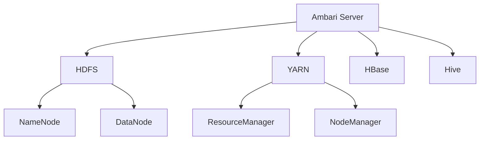

# Ambari集群管理工具

Apache Ambari 是一个开源工具，旨在简化 Hadoop 集群的部署、监控和管理。它提供了一个直观的 Web 界面，帮助用户轻松管理 Hadoop 生态系统中的各种组件，如 HDFS、YARN、Hive、HBase 等。对于初学者来说，Ambari 是一个强大的工具，能够显著降低学习和操作 Hadoop 集群的复杂性。

## 什么是 Ambari？

Ambari 是由 Apache 基金会开发的一个集群管理工具，主要用于 Hadoop 生态系统。它的主要功能包括：

- **集群部署**：自动化 Hadoop 集群的安装和配置。
- **集群监控**：实时监控集群的健康状态和性能。
- **集群管理**：管理集群中的服务、节点和配置。
- **报警和通知**：在集群出现问题时，及时通知管理员。

Ambari 的核心优势在于其用户友好的 Web 界面，使得即使是没有深厚技术背景的用户也能轻松上手。

## Ambari 的主要功能

### 1. 集群部署

Ambari 提供了一个向导式的界面，帮助用户快速部署 Hadoop 集群。用户只需按照提示输入必要的配置信息，Ambari 就会自动完成集群的安装和配置。

```bash
# 示例：使用 Ambari 部署 Hadoop 集群
ambari-server setup
ambari-server start
```

### 2. 集群监控

Ambari 提供了丰富的监控功能，用户可以实时查看集群的健康状态、资源使用情况以及各个服务的运行状态。



### 3. 集群管理

通过 Ambari，用户可以轻松管理集群中的服务和节点。例如，启动、停止、重启服务，添加或删除节点等。

```bash
# 示例：启动 HDFS 服务
ambari-server start hdfs
```

### 4. 报警和通知

Ambari 支持配置报警规则，当集群出现问题时，Ambari 会通过邮件或其他方式通知管理员。

```bash
# 示例：配置报警规则
ambari-server alert add --name "High CPU Usage" --description "Alert when CPU usage is above 90%" --expression "cpu_usage > 90"
```

## 实际案例

假设你是一家初创公司的数据工程师，负责管理一个 Hadoop 集群。你需要快速部署一个集群，并确保其稳定运行。使用 Ambari，你可以轻松完成以下任务：

1. **部署集群**：通过 Ambari 的向导界面，快速部署一个包含 HDFS、YARN、Hive 和 HBase 的 Hadoop 集群。
2. **监控集群**：通过 Ambari 的监控界面，实时查看集群的健康状态和资源使用情况。
3. **管理集群**：通过 Ambari 的管理界面，轻松管理集群中的服务和节点。
4. **配置报警**：通过 Ambari 的报警功能，及时收到集群问题的通知。

## 总结

Apache Ambari 是一个强大的工具，能够显著简化 Hadoop 集群的部署、监控和管理。对于初学者来说，Ambari 提供了一个直观的界面和丰富的功能，使得学习和操作 Hadoop 集群变得更加容易。

## 附加资源

- [Apache Ambari 官方文档](https://ambari.apache.org/)
- [Hadoop 生态系统介绍](https://hadoop.apache.org/)
- [Ambari 使用教程视频](https://www.youtube.com/results?search_query=ambari+tutorial)

## 练习

1. 使用 Ambari 部署一个包含 HDFS 和 YARN 的 Hadoop 集群。
2. 配置 Ambari 的报警规则，当集群的 CPU 使用率超过 80% 时发送邮件通知。
3. 通过 Ambari 的监控界面，查看集群的健康状态和资源使用情况。

通过以上练习，你将更深入地理解 Ambari 的功能和使用方法。