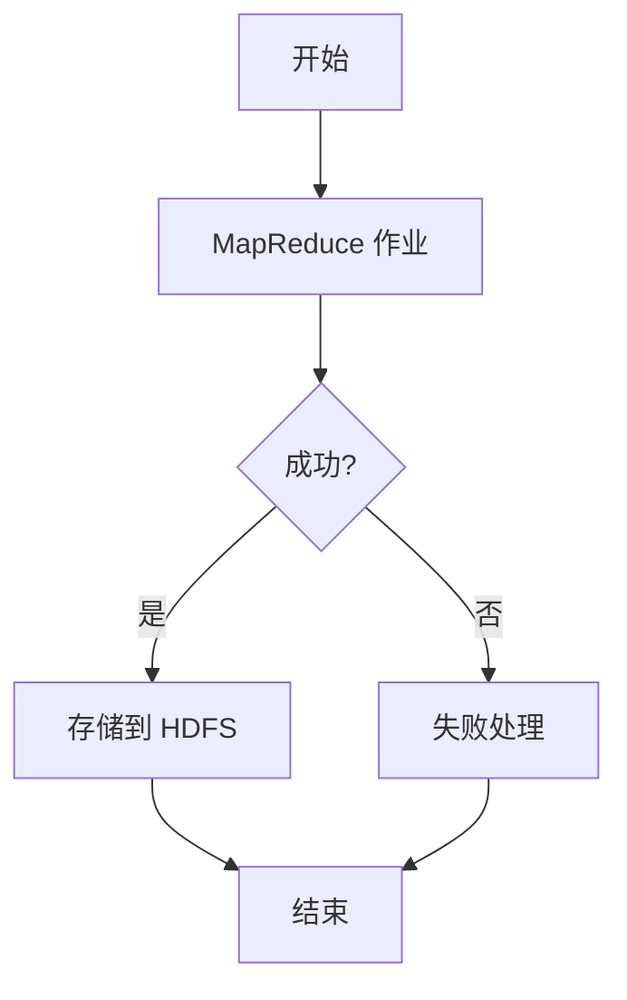

## 什么是Oozie工作流调度？

Apache Oozie 是一个用于调度和管理 Hadoop 作业的工作流调度系统。它允许用户将多个 Hadoop 作业（如 MapReduce、Pig、Hive 等）组合成一个工作流，并按照预定的时间或条件自动执行。Oozie 特别适合处理复杂的、多步骤的数据处理任务。

Oozie 的核心概念包括：

- **工作流（Workflow）**：定义了一系列动作（actions）及其依赖关系。
- **协调器（Coordinator）**：用于调度工作流，支持基于时间或数据的触发条件。
- **Bundle**：用于管理多个协调器作业的集合。

## Oozie 工作流的基本结构

一个 Oozie 工作流通常由一个 XML 文件定义，其中包含多个动作节点（action nodes）和控制节点（control nodes）。以下是一个简单的工作流示例：

```xml
<workflow-app name="example_workflow" xmlns="uri:oozie:workflow:0.5">
    <start to="first_action"/>

    <action name="first_action">
        <map-reduce>
            <job-tracker>${jobTracker}</job-tracker>
            <name-node>${nameNode}</name-node>
            <configuration>
                <property>
                    <name>mapred.mapper.class</name>
                    <value>org.apache.hadoop.example.ExampleMapper</value>
                </property>
                <property>
                    <name>mapred.reducer.class</name>
                    <value>org.apache.hadoop.example.ExampleReducer</value>
                </property>
            </configuration>
        </map-reduce>
        <ok to="end"/>
        <error to="fail"/>
    </action>

    <kill name="fail">
        <message>Workflow failed, error message[${wf:errorMessage(wf:lastErrorNode())}]</message>
    </kill>

    <end name="end"/>
</workflow-app>
```

在这个示例中，工作流定义了一个 MapReduce 作业，如果作业成功完成，工作流将结束；如果失败，工作流将进入 `fail` 节点并输出错误信息。

## Oozie 协调器

Oozie 协调器用于调度工作流。它可以根据时间或数据可用性触发工作流的执行。以下是一个简单的协调器示例：

```xml
<coordinator-app name="example_coordinator" frequency="${coord:days(1)}" start="2023-10-01T00:00Z" end="2023-10-31T23:59Z" timezone="UTC" xmlns="uri:oozie:coordinator:0.4">
    <action>
        <workflow>
            <app-path>${workflowAppUri}</app-path>
            <configuration>
                <property>
                    <name>jobTracker</name>
                    <value>${jobTracker}</value>
                </property>
                <property>
                    <name>nameNode</name>
                    <value>${nameNode}</value>
                </property>
            </configuration>
        </workflow>
    </action>
</coordinator-app>
```

这个协调器每天执行一次工作流，从 2023 年 10 月 1 日开始，到 2023 年 10 月 31 日结束。

## 实际案例：日志处理工作流

假设我们有一个需求：每天处理服务器日志文件，并将结果存储到 HDFS 中。我们可以使用 Oozie 来调度这个任务。

1. **工作流定义**：定义一个工作流，包含以下步骤：
   - 使用 MapReduce 作业处理日志文件。
   - 将处理后的数据存储到 HDFS。

2. **协调器定义**：定义一个协调器，每天凌晨 2 点触发工作流。

3. **执行**：Oozie 会根据协调器的定义，每天自动执行工作流。



## 总结

Oozie 是一个强大的工具，用于在 Hadoop 生态系统中调度和管理复杂的工作流。通过定义工作流和协调器，用户可以自动化数据处理任务，提高工作效率。本文介绍了 Oozie 的基本概念、工作流和协调器的定义方法，并通过一个实际案例展示了 Oozie 的应用场景。

## 附加资源

- [Oozie 官方文档](https://oozie.apache.org/docs/)
- [Hadoop 生态系统入门指南](#)
- [Oozie 工作流设计最佳实践](#)

## 练习

1. 尝试编写一个简单的 Oozie 工作流，包含两个 MapReduce 作业，第二个作业依赖于第一个作业的输出。
2. 创建一个协调器，每周五晚上 10 点触发工作流。
3. 研究如何在 Oozie 中使用 Hive 或 Pig 作业，并将其集成到工作流中。

:::tip
在编写 Oozie 工作流时，建议使用 Oozie 提供的命令行工具 `oozie job` 来测试和提交工作流。
:::