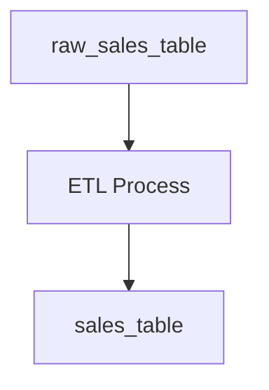

## 介绍

Apache Atlas 是一个用于Hadoop生态系统的元数据管理工具。它提供了数据治理、数据分类、数据血缘追踪等功能，帮助组织更好地管理和理解其数据资产。对于初学者来说，Atlas 是一个强大的工具，可以帮助你了解数据的来源、用途和关系。

## Atlas的核心概念

### 1. 元数据（Metadata）
元数据是描述数据的数据。例如，数据的创建时间、创建者、数据类型等都是元数据。Atlas 通过管理元数据，帮助用户更好地理解和使用数据。

### 2. 实体（Entity）
在Atlas中，实体是元数据的基本单位。一个实体可以是一个表、一个列、一个数据库等。每个实体都有唯一的标识符和一组属性。

### 3. 类型（Type）
类型定义了实体的结构和属性。例如，一个表类型可能包含表名、列名等属性。Atlas 提供了一些预定义的类型，也允许用户自定义类型。

### 4. 血缘（Lineage）
血缘追踪数据的来源和去向。通过血缘，你可以了解数据是如何从一个表流向另一个表的。

## 安装与配置

### 安装Atlas
Atlas 可以通过以下步骤安装：

1. 下载Atlas的二进制包。
2. 解压并配置Atlas的环境变量。
3. 启动Atlas服务。

```bash
# 下载Atlas
wget https://downloads.apache.org/atlas/2.2.0/apache-atlas-2.2.0-bin.tar.gz

# 解压
tar -xzf apache-atlas-2.2.0-bin.tar.gz

# 配置环境变量
export ATLAS_HOME=/path/to/atlas
export PATH=$PATH:$ATLAS_HOME/bin

# 启动Atlas
atlas_start.py
```

### 配置Atlas
Atlas 的配置文件位于 `$ATLAS_HOME/conf/atlas-application.properties`。你可以根据需要修改配置文件，例如配置数据库连接、Hadoop集群信息等。

## 使用Atlas

### 创建实体
以下是一个创建实体的示例代码：

```bash
# 创建一个表实体
curl -X POST -u admin:admin -H "Content-Type: application/json" -d '{
  "entity": {
    "typeName": "hive_table",
    "attributes": {
      "name": "sales_table",
      "db": "sales_db",
      "owner": "admin"
    }
  }
}' http://localhost:21000/api/atlas/v2/entity
```

### 查询实体
你可以通过以下命令查询实体：

```bash
curl -X GET -u admin:admin http://localhost:21000/api/atlas/v2/entity/guid/{guid}
```

### 血缘追踪
Atlas 提供了血缘追踪功能，你可以通过以下命令查看数据的血缘关系：

```bash
curl -X GET -u admin:admin http://localhost:21000/api/atlas/v2/lineage/{guid}
```

## 实际案例

### 案例：数据血缘追踪
假设你有一个数据仓库，其中包含多个表。通过Atlas，你可以追踪数据从一个表流向另一个表的过程。例如，你可以查看 `sales_table` 的数据是如何从 `raw_sales_table` 转换而来的。



## 总结

Apache Atlas 是一个强大的元数据管理工具，适用于Hadoop生态系统。通过Atlas，你可以更好地管理和理解你的数据资产。本文介绍了Atlas的核心概念、安装与配置、基本使用以及实际案例，帮助你快速上手Atlas。

## 附加资源

- [Apache Atlas 官方文档](https://atlas.apache.org/)
- [Atlas GitHub 仓库](https://github.com/apache/atlas)

## 练习

1. 安装并配置Atlas。
2. 创建一个表实体，并查询该实体。
3. 使用Atlas追踪一个简单的数据血缘关系。

:::tip
如果你在安装或使用Atlas时遇到问题，可以参考官方文档或社区论坛获取帮助。
:::