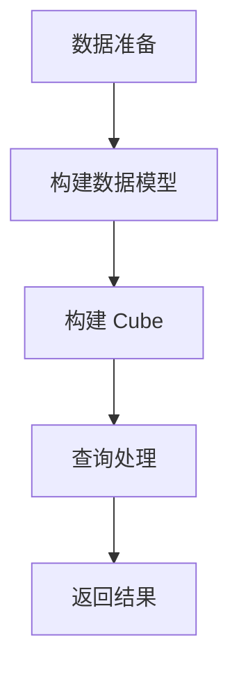

## 什么是 Kylin OLAP 引擎？

Apache Kylin 是一个开源的分布式分析引擎，专为大数据场景下的 OLAP（在线分析处理）查询优化而设计。它能够在 Hadoop 和 Spark 上运行，通过预计算技术将复杂的多维分析查询转换为高效的查询操作。Kylin 的目标是让用户在海量数据上实现亚秒级的查询响应时间。

Kylin 的核心思想是“预计算”，即提前计算并存储查询结果，从而在查询时直接返回结果，而不是实时计算。这种方式特别适合需要快速响应的 OLAP 场景。

:::note
OLAP（Online Analytical Processing）是一种用于快速分析多维数据的计算技术，常用于商业智能和数据仓库场景。
:::

## Kylin 的核心概念

### 1. 数据模型
Kylin 使用星型模型（Star Schema）或雪花模型（Snowflake Schema）来组织数据。这些模型由事实表（Fact Table）和维度表（Dimension Table）组成。

- **事实表**：存储业务度量数据，例如销售金额、订单数量等。
- **维度表**：存储描述性数据，例如时间、地点、产品等。

### 2. Cube
Cube 是 Kylin 的核心数据结构，它是一个多维数据集，包含了所有可能的维度组合及其预计算结果。Cube 的构建过程称为“构建 Cube”，Kylin 会提前计算并存储这些结果，以便在查询时快速返回。

### 3. 预计算
Kylin 通过预计算技术将复杂的查询结果提前计算并存储。当用户发起查询时，Kylin 直接从预计算结果中返回数据，而不是实时计算。

### 4. 查询引擎
Kylin 的查询引擎支持 SQL 查询，用户可以通过标准的 SQL 语句查询 Cube 中的数据。Kylin 会将 SQL 查询转换为对 Cube 的查询操作。

## Kylin 的工作原理

Kylin 的工作流程可以分为以下几个步骤：

1. **数据准备**：将原始数据加载到 Hadoop 或 Spark 中，并构建数据模型。
2. **Cube 构建**：根据数据模型，Kylin 会预计算所有可能的维度组合，并将结果存储在 Cube 中。
3. **查询处理**：当用户发起查询时，Kylin 会直接从 Cube 中返回预计算结果，从而实现亚秒级的查询响应。



## 实际案例：使用 Kylin 进行销售数据分析

假设我们有一个电商平台的销售数据，包含以下表：

- **事实表**：`sales_fact`，包含 `order_id`, `product_id`, `sales_amount`, `order_date` 等字段。
- **维度表**：`product_dim`，包含 `product_id`, `product_name`, `category` 等字段。

我们的目标是分析每个产品类别的销售总额。

### 步骤 1：构建数据模型

首先，我们需要在 Kylin 中定义数据模型。以下是一个简单的数据模型定义：

```sql
CREATE TABLE sales_fact (
    order_id INT,
    product_id INT,
    sales_amount DECIMAL(10, 2),
    order_date DATE
);

CREATE TABLE product_dim (
    product_id INT,
    product_name STRING,
    category STRING
);
```

### 步骤 2：构建 Cube

接下来，我们需要在 Kylin 中构建 Cube。以下是一个简单的 Cube 定义：

```sql
CREATE CUBE sales_cube
DIMENSIONS (
    product_dim.category,
    sales_fact.order_date
)
MEASURES (
    SUM(sales_fact.sales_amount) AS total_sales
);
```

### 步骤 3：查询数据

构建完成后，我们可以通过 SQL 查询 Cube 中的数据：

```sql
SELECT 
    product_dim.category, 
    SUM(sales_fact.sales_amount) AS total_sales
FROM 
    sales_fact
JOIN 
    product_dim 
ON 
    sales_fact.product_id = product_dim.product_id
GROUP BY 
    product_dim.category;
```

### 查询结果

| category   | total_sales |
|------------|-------------|
| Electronics| 15000.00    |
| Clothing   | 8000.00     |
| Home       | 12000.00    |

:::tip
Kylin 的预计算技术使得这类查询能够在亚秒级内返回结果，即使数据量非常大。
:::

## 总结

Apache Kylin 是一个强大的 OLAP 引擎，特别适合需要快速响应的大数据分析场景。通过预计算技术，Kylin 能够在海量数据上实现亚秒级的查询响应时间。它的核心概念包括数据模型、Cube 和预计算，用户可以通过 SQL 查询 Cube 中的数据。

## 附加资源

- [Apache Kylin 官方文档](https://kylin.apache.org/docs/)
- [Kylin GitHub 仓库](https://github.com/apache/kylin)
- [Kylin 教程视频](https://www.youtube.com/results?search_query=apache+kylin)

## 练习

1. 尝试在 Kylin 中构建一个包含多个维度的 Cube，并查询不同维度的聚合结果。
2. 使用 Kylin 分析一个真实的数据集，例如电商平台的销售数据或用户行为数据。