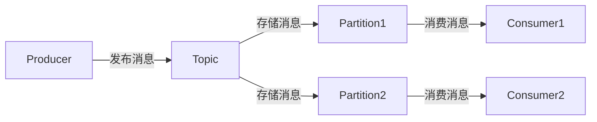

# Kafka消息系统

Kafka是一个分布式流处理平台，最初由LinkedIn开发，后来成为Apache基金会的顶级项目。它被设计用于处理高吞吐量、低延迟的数据流，广泛应用于日志收集、实时分析、事件驱动架构等场景。本文将带你了解Kafka的基本概念、工作原理以及实际应用。

## 什么是Kafka？

Kafka是一个分布式发布-订阅消息系统，能够处理大量的实时数据流。它的核心设计目标是高吞吐量、低延迟和高可用性。Kafka的主要特点包括：

- **分布式架构**：Kafka集群由多个服务器（称为Broker）组成，数据分布在多个节点上，确保高可用性和容错性。
- **持久化存储**：Kafka将消息持久化存储在磁盘上，确保数据不会丢失。
- **高吞吐量**：Kafka能够处理每秒数百万条消息，适用于大数据场景。
- **低延迟**：Kafka的设计使得消息的传递延迟非常低，通常在毫秒级别。

## Kafka的核心概念

### 1. Topic（主题）

Topic是Kafka中消息的分类单位。生产者将消息发布到特定的Topic，消费者从Topic中订阅并消费消息。一个Topic可以被分为多个分区（Partition），以实现并行处理。

### 2. Partition（分区）

Partition是Topic的物理分区，每个Partition是一个有序的、不可变的消息序列。Partition允许Kafka在多个Broker上分布数据，从而实现水平扩展。

### 3. Producer（生产者）

Producer是向Kafka Topic发布消息的客户端。生产者将消息发送到指定的Topic，Kafka会根据配置的分区策略将消息分配到不同的Partition。

### 4. Consumer（消费者）

Consumer是从Kafka Topic订阅并消费消息的客户端。消费者可以以组（Consumer Group）的形式工作，组内的消费者共同消费一个Topic的消息，每个Partition只能被组内的一个消费者消费。

### 5. Broker（代理）

Broker是Kafka集群中的单个服务器，负责存储和转发消息。一个Kafka集群通常由多个Broker组成，以确保高可用性和容错性。

### 6. Offset（偏移量）

Offset是消息在Partition中的唯一标识符。消费者通过维护Offset来跟踪已经消费的消息位置，从而确保不会重复消费或遗漏消息。

## Kafka的工作原理

Kafka的工作流程可以简单描述为：

1. **生产者发布消息**：生产者将消息发布到指定的Topic。
2. **消息存储**：Kafka将消息存储在Partition中，并根据配置的副本因子（Replication Factor）将消息复制到多个Broker上。
3. **消费者订阅消息**：消费者从指定的Topic订阅消息，并从Partition中拉取消息进行消费。
4. **消息消费**：消费者根据Offset消费消息，并在消费完成后更新Offset。



## 实际案例：日志收集系统

假设我们有一个分布式系统，需要将各个服务的日志集中收集并进行分析。我们可以使用Kafka来实现这一需求。

1. **日志生产者**：每个服务将日志消息发布到Kafka的`logs` Topic。
2. **日志存储**：Kafka将日志消息存储在`logs` Topic的多个Partition中。
3. **日志消费者**：日志分析服务从`logs` Topic订阅消息，并进行实时分析或存储到数据库中。

```java
// 生产者示例
Properties props = new Properties();
props.put("bootstrap.servers", "localhost:9092");
props.put("key.serializer", "org.apache.kafka.common.serialization.StringSerializer");
props.put("value.serializer", "org.apache.kafka.common.serialization.StringSerializer");

Producer<String, String> producer = new KafkaProducer<>(props);
producer.send(new ProducerRecord<>("logs", "service1", "This is a log message"));
producer.close();
```

```java
// 消费者示例
Properties props = new Properties();
props.put("bootstrap.servers", "localhost:9092");
props.put("group.id", "log-consumer-group");
props.put("key.deserializer", "org.apache.kafka.common.serialization.StringDeserializer");
props.put("value.deserializer", "org.apache.kafka.common.serialization.StringDeserializer");

Consumer<String, String> consumer = new KafkaConsumer<>(props);
consumer.subscribe(Arrays.asList("logs"));

while (true) {
    ConsumerRecords<String, String> records = consumer.poll(Duration.ofMillis(100));
    for (ConsumerRecord<String, String> record : records) {
        System.out.printf("offset = %d, key = %s, value = %s%n", record.offset(), record.key(), record.value());
    }
}
```

## 总结

Kafka是一个强大的分布式消息系统，适用于处理高吞吐量、低延迟的数据流。通过理解Kafka的核心概念和工作原理，你可以在大数据生态系统中灵活应用Kafka来解决实际问题。

## 附加资源

- [Kafka官方文档](https://kafka.apache.org/documentation/)
- [Kafka入门教程](https://www.tutorialspoint.com/apache_kafka/index.htm)
- [Kafka实战案例](https://www.confluent.io/blog/)

## 练习

1. 尝试在本地的Kafka集群中创建一个Topic，并使用生产者和消费者进行消息的发布和订阅。
2. 修改分区数量，观察消息的分布情况。
3. 尝试使用Kafka Streams进行简单的流处理操作。

:::tip
Kafka的学习曲线较为陡峭，建议从简单的示例开始，逐步深入理解其高级特性。
:::