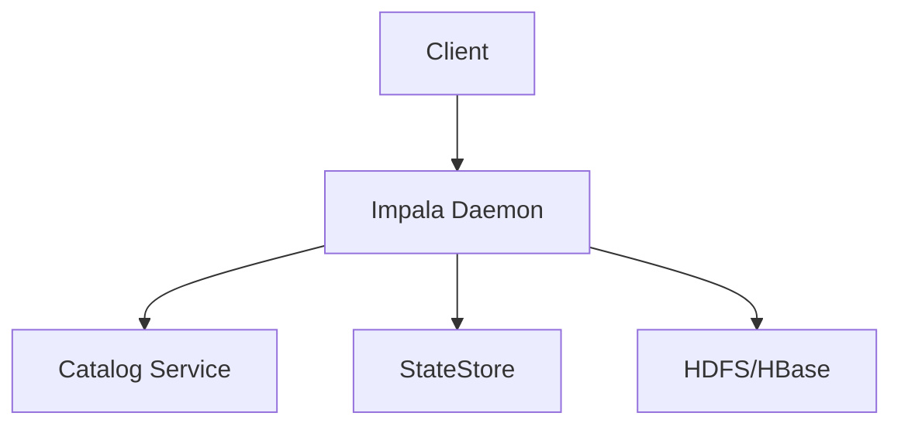

## 什么是Impala？

Impala是Apache Hadoop生态系统中的一个开源、分布式SQL查询引擎。它允许用户使用标准的SQL语法直接在HDFS（Hadoop分布式文件系统）或HBase上执行交互式查询。Impala的设计目标是提供低延迟和高并发的查询性能，特别适合用于数据分析和探索。

与传统的MapReduce任务相比，Impala的查询速度更快，因为它避免了MapReduce的开销，直接与HDFS交互。Impala还支持多种文件格式，如Parquet、Avro和Text，并且可以与Hive Metastore集成，共享元数据。

## Impala的核心特点

1. **高性能**：Impala通过并行执行查询和内存计算，提供了接近传统数据库的查询速度。
2. **低延迟**：Impala的设计目标是实现毫秒级的查询响应时间，适合交互式分析。
3. **SQL兼容性**：Impala支持标准的SQL语法，用户可以轻松地从其他数据库迁移到Impala。
4. **与Hadoop集成**：Impala可以直接访问HDFS和HBase中的数据，无需数据迁移。
5. **多用户支持**：Impala支持并发查询，适合多用户环境。

## Impala的架构

Impala的架构由以下几个主要组件组成：

1. **Impala Daemon（impalad）**：这是运行在每个节点上的守护进程，负责接收查询请求、执行查询并返回结果。
2. **Catalog Service（catalogd）**：负责管理元数据，如表结构和分区信息。
3. **StateStore（statestored）**：负责监控集群中所有Impala Daemon的状态，并协调查询的执行。



## 安装和配置Impala

在开始使用Impala之前，您需要在Hadoop集群上安装和配置Impala。以下是安装Impala的基本步骤：

1. **下载Impala**：从Cloudera或Apache官方网站下载Impala的安装包。
2. **配置Impala**：编辑Impala的配置文件（如`impala.conf`），设置HDFS和HBase的连接信息。
3. **启动Impala服务**：使用`service impala start`命令启动Impala Daemon、Catalog Service和StateStore。

:::note
确保您的Hadoop集群已经正确配置，并且HDFS和HBase服务正在运行。
:::

## 使用Impala进行查询

一旦Impala安装并配置完成，您就可以使用Impala Shell或JDBC/ODBC接口来执行SQL查询。以下是一个简单的查询示例：

```sql
-- 创建一个表
CREATE TABLE users (
    id INT,
    name STRING,
    age INT
) STORED AS PARQUET;

-- 插入数据
INSERT INTO users VALUES (1, 'Alice', 25), (2, 'Bob', 30);

-- 查询数据
SELECT * FROM users WHERE age > 28;
```

**输出结果：**

| id | name | age |
|----|------|-----|
| 2  | Bob  | 30  |

:::tip
Impala支持多种文件格式，如Parquet、Avro和Text。Parquet格式特别适合用于大数据分析，因为它支持列式存储和压缩。
:::

## 实际应用场景

Impala广泛应用于大数据分析和交互式查询场景。以下是一些常见的应用场景：

1. **实时数据分析**：Impala的低延迟特性使其非常适合用于实时数据分析，如监控系统日志或用户行为数据。
2. **数据探索**：数据科学家可以使用Impala快速查询和分析大规模数据集，而无需等待长时间的MapReduce任务。
3. **商业智能（BI）**：Impala可以与BI工具（如Tableau或Power BI）集成，提供快速的数据可视化。

## 总结

Impala是Hadoop生态系统中一个强大的交互式SQL查询引擎，特别适合用于低延迟和高并发的数据分析任务。通过本文，您已经了解了Impala的基本概念、架构、安装方法以及如何使用它进行查询。Impala的高性能和SQL兼容性使其成为大数据分析的有力工具。

## 附加资源

- [Impala官方文档](https://impala.apache.org/docs.html)
- [Cloudera Impala指南](https://docs.cloudera.com/documentation/enterprise/latest/topics/impala.html)
- [Hadoop生态系统概述](https://hadoop.apache.org/docs/current/)

## 练习

1. 在您的Hadoop集群上安装Impala，并尝试创建一个表并插入数据。
2. 使用Impala执行一个复杂的查询，如多表连接或聚合查询。
3. 将Impala与BI工具（如Tableau）集成，并创建一个简单的数据可视化仪表板。

通过完成这些练习，您将更深入地理解Impala的使用方法，并能够将其应用于实际的数据分析任务中。