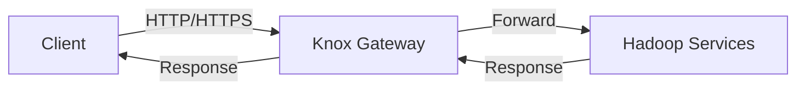

# Knox网关服务

## 介绍

Apache Knox网关服务（Knox Gateway）是Hadoop生态系统中的一个重要组件，主要用于为Hadoop集群提供统一的、安全的访问入口。Knox网关通过代理和认证机制，简化了外部客户端与Hadoop集群的交互，同时增强了集群的安全性。

Knox网关的主要功能包括：
- **统一访问入口**：通过一个单一的HTTP/HTTPS端点访问Hadoop集群的多个服务。
- **身份验证和授权**：支持多种认证机制（如LDAP、OAuth、SAML等），并可以与Hadoop的安全机制集成。
- **SSL/TLS加密**：确保客户端与集群之间的通信安全。
- **服务代理**：将客户端的请求转发到集群中的具体服务。

## Knox网关的工作原理

Knox网关的核心是一个轻量级的Java Web应用程序，运行在Apache Tomcat或Jetty等Servlet容器中。它通过配置文件定义路由规则和安全策略，将客户端的请求转发到Hadoop集群中的具体服务。

### 基本架构



1. **客户端请求**：客户端通过HTTP/HTTPS向Knox网关发送请求。
2. **请求转发**：Knox网关根据配置的路由规则，将请求转发到Hadoop集群中的具体服务。
3. **服务响应**：Hadoop服务处理请求并返回响应。
4. **响应返回**：Knox网关将响应返回给客户端。

## 安装与配置

### 安装Knox网关

Knox网关可以通过以下步骤安装：

1. 下载Knox的最新版本：
   ```bash
   wget https://downloads.apache.org/knox/1.6.0/knox-1.6.0.tar.gz
   ```
2. 解压缩：
   ```bash
   tar -xzf knox-1.6.0.tar.gz
   ```
3. 进入解压后的目录：
   ```bash
   cd knox-1.6.0
   ```

### 配置Knox网关

Knox网关的配置文件位于`conf`目录下。主要的配置文件包括：
- `gateway-site.xml`：定义Knox网关的全局配置。
- `topologies`：定义路由规则和服务拓扑。

以下是一个简单的`gateway-site.xml`配置示例：

```xml
<configuration>
    <property>
        <name>gateway.port</name>
        <value>8443</value>
    </property>
    <property>
        <name>gateway.path</name>
        <value>gateway</value>
    </property>
</configuration>
```

### 启动Knox网关

启动Knox网关的命令如下：

```bash
bin/gateway.sh start
```

启动后，Knox网关将在`https://localhost:8443/gateway`上监听请求。

## 实际应用场景

### 场景1：通过Knox网关访问HDFS

假设我们有一个Hadoop集群，HDFS的NameNode运行在`hdfs://namenode:50070`。我们可以通过Knox网关访问HDFS。

1. 创建一个拓扑文件`hdfs.xml`：

```xml
<topology>
    <gateway>
        <provider>
            <role>authentication</role>
            <name>ShiroProvider</name>
            <enabled>true</enabled>
        </provider>
    </gateway>
    <service>
        <role>HDFS</role>
        <url>hdfs://namenode:50070</url>
    </service>
</topology>
```

2. 将拓扑文件放置在`conf/topologies`目录下。

3. 通过Knox网关访问HDFS：

```bash
curl -k -u username:password https://localhost:8443/gateway/hdfs/webhdfs/v1/?op=LISTSTATUS
```

### 场景2：通过Knox网关访问YARN

类似地，我们可以通过Knox网关访问YARN ResourceManager。

1. 创建一个拓扑文件`yarn.xml`：

```xml
<topology>
    <gateway>
        <provider>
            <role>authentication</role>
            <name>ShiroProvider</name>
            <enabled>true</enabled>
        </provider>
    </gateway>
    <service>
        <role>YARN</role>
        <url>http://resourcemanager:8088</url>
    </service>
</topology>
```

2. 将拓扑文件放置在`conf/topologies`目录下。

3. 通过Knox网关访问YARN：

```bash
curl -k -u username:password https://localhost:8443/gateway/yarn/ws/v1/cluster/apps
```

## 总结

Knox网关服务为Hadoop集群提供了一个统一的、安全的访问入口，简化了外部客户端与集群的交互。通过Knox网关，用户可以轻松地访问HDFS、YARN等Hadoop服务，同时确保通信的安全性。

## 附加资源与练习

- **官方文档**：访问[Apache Knox官方文档](https://knox.apache.org/)了解更多详细信息。
- **练习**：尝试配置Knox网关以访问Hive或HBase服务，并测试其功能。

:::tip
Knox网关的配置和调试可能需要一些时间，建议在测试环境中逐步进行。
:::