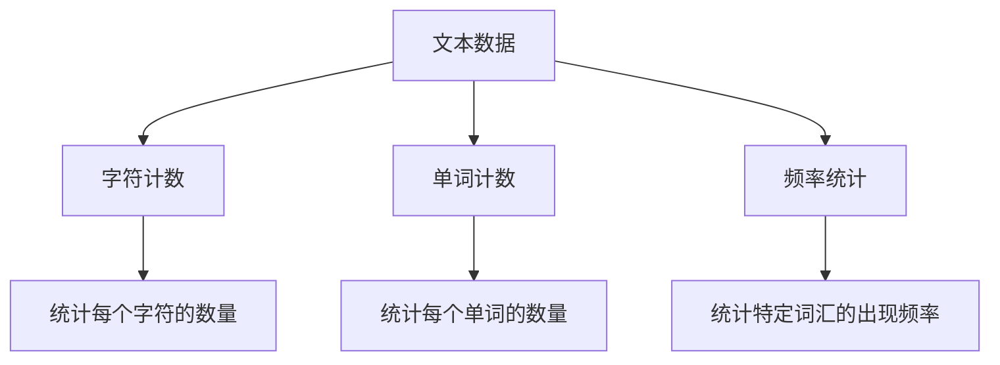

# Pandas 文本统计

在数据分析和处理中，文本数据是非常常见的一种数据类型。Pandas库提供了丰富的功能来处理和分析文本数据。本文将介绍如何使用Pandas进行文本数据的统计分析，包括字符计数、单词计数、频率统计等。

## 1. 字符计数

字符计数是指统计文本中每个字符的数量。Pandas提供了`str.len()`方法来计算字符串的长度。

### 示例代码

```python
import pandas as pd

# 创建一个包含文本数据的DataFrame
data = {'text': ['Hello', 'Pandas', 'Text Processing']}
df = pd.DataFrame(data)

# 计算每个字符串的长度
df['char_count'] = df['text'].str.len()

print(df)
```

### 输出

```
                text  char_count
0              Hello           5
1             Pandas           6
2  Text Processing          16
```

在这个例子中，我们创建了一个包含文本数据的DataFrame，并使用`str.len()`方法计算了每个字符串的长度。

## 2. 单词计数

单词计数是指统计文本中每个单词的数量。Pandas提供了`str.split()`方法和`str.len()`方法来实现这一功能。

### 示例代码

```python
# 计算每个字符串中的单词数量
df['word_count'] = df['text'].str.split().str.len()

print(df)
```

### 输出

```
                text  char_count  word_count
0              Hello           5           1
1             Pandas           6           1
2  Text Processing          16           2
```

在这个例子中，我们使用`str.split()`方法将字符串按空格分割成单词列表，然后使用`str.len()`方法计算单词的数量。

## 3. 频率统计

频率统计是指统计文本中每个单词或字符的出现频率。Pandas提供了`str.count()`方法来实现这一功能。

### 示例代码

```python
# 统计每个字符串中字母'e'的出现次数
df['e_count'] = df['text'].str.count('e')

print(df)
```

### 输出

```
                text  char_count  word_count  e_count
0              Hello           5           1        1
1             Pandas           6           1        0
2  Text Processing          16           2        2
```

在这个例子中，我们使用`str.count()`方法统计了每个字符串中字母'e'的出现次数。

## 4. 实际案例

假设我们有一个包含用户评论的DataFrame，我们希望统计每个评论中的单词数量和特定词汇的出现频率。

### 示例代码

```python
# 创建一个包含用户评论的DataFrame
data = {'comment': ['Great product!', 'Very useful.', 'Not worth the price.']}
df = pd.DataFrame(data)

# 计算每个评论中的单词数量
df['word_count'] = df['comment'].str.split().str.len()

# 统计每个评论中单词'product'的出现次数
df['product_count'] = df['comment'].str.count('product')

print(df)
```

### 输出

```
               comment  word_count  product_count
0       Great product!           2              1
1         Very useful.           2              0
2  Not worth the price.           5              0
```

在这个例子中，我们统计了每个评论中的单词数量和单词'product'的出现次数。

## 5. 总结

本文介绍了如何使用Pandas进行文本数据的统计分析，包括字符计数、单词计数和频率统计。通过这些方法，我们可以轻松地对文本数据进行各种统计分析，从而更好地理解和处理文本数据。

## 6. 附加资源与练习

- **练习1**：创建一个包含多个文本字符串的DataFrame，并统计每个字符串中特定字符的出现次数。
- **练习2**：使用Pandas统计一段文本中每个单词的出现频率，并绘制柱状图展示结果。



通过以上练习和资源，您可以进一步巩固和扩展对Pandas文本统计的理解和应用。