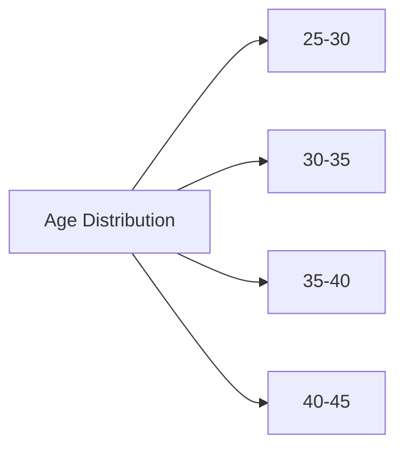
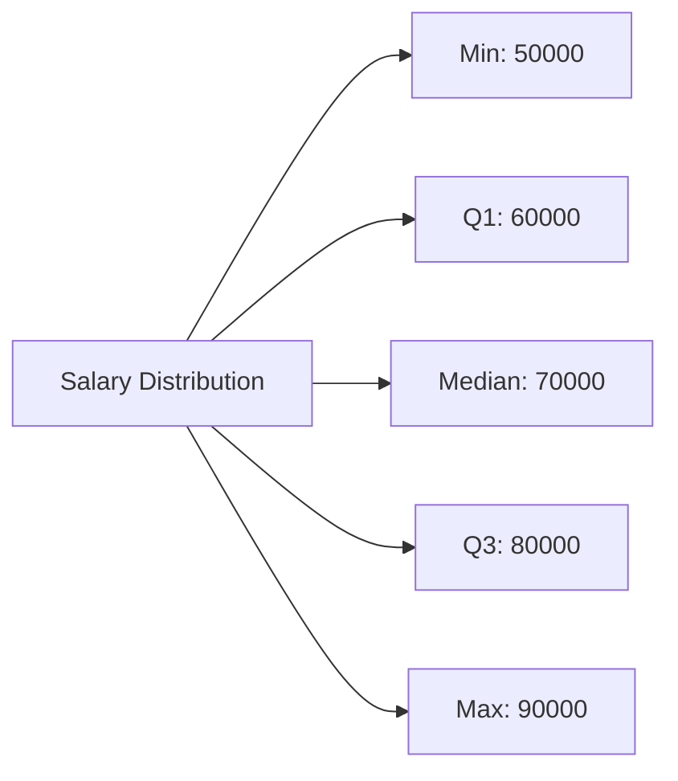
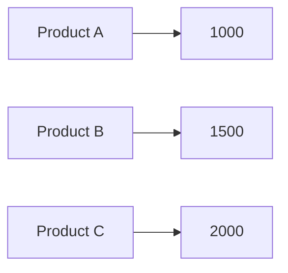

# Pandas 数据探索

在数据分析和处理中，**数据探索**是一个至关重要的步骤。它帮助我们理解数据的结构、分布和潜在问题，从而为后续的分析和建模奠定基础。Pandas 是 Python 中一个强大的数据处理库，提供了丰富的功能来帮助我们高效地进行数据探索。

## 1. 数据加载

在开始数据探索之前，我们首先需要将数据加载到 Pandas 中。Pandas 支持多种数据格式，包括 CSV、Excel、SQL 数据库等。以下是一个从 CSV 文件加载数据的示例：

```python
import pandas as pd

# 从 CSV 文件加载数据
df = pd.read_csv('data.csv')

# 查看前 5 行数据
print(df.head())
```

**输出示例：**

|   | Name  | Age | Gender | Salary |
|---|-------|-----|--------|--------|
| 0 | Alice | 25  | Female | 50000  |
| 1 | Bob   | 30  | Male   | 60000  |
| 2 | Charlie | 35 | Male   | 70000  |
| 3 | David | 40  | Male   | 80000  |
| 4 | Eve   | 45  | Female | 90000  |

## 2. 初步检查

加载数据后，我们需要对数据进行初步检查，以确保数据的完整性和正确性。

### 2.1 查看数据的基本信息

```python
# 查看数据的基本信息
print(df.info())
```

**输出示例：**

```
<class 'pandas.core.frame.DataFrame'>
RangeIndex: 5 entries, 0 to 4
Data columns (total 4 columns):
 #   Column  Non-Null Count  Dtype 
---  ------  --------------  ----- 
 0   Name    5 non-null      object
 1   Age     5 non-null      int64 
 2   Gender  5 non-null      object
 3   Salary  5 non-null      int64 
dtypes: int64(2), object(2)
memory usage: 288.0+ bytes
None
```

### 2.2 检查缺失值

```python
# 检查缺失值
print(df.isnull().sum())
```

**输出示例：**

```
Name      0
Age       0
Gender    0
Salary    0
dtype: int64
```

:::tip
如果数据中存在缺失值，可以使用 `df.fillna()` 或 `df.dropna()` 来处理。
:::

## 3. 统计分析

在初步检查之后，我们可以对数据进行一些统计分析，以了解数据的分布和特征。

### 3.1 描述性统计

```python
# 获取描述性统计信息
print(df.describe())
```

**输出示例：**

|       | Age      | Salary     |
|-------|----------|------------|
| count | 5.000000 | 5.000000   |
| mean  | 35.000000| 70000.000000|
| std   | 7.905694 | 15811.388301|
| min   | 25.000000| 50000.000000|
| 25%   | 30.000000| 60000.000000|
| 50%   | 35.000000| 70000.000000|
| 75%   | 40.000000| 80000.000000|
| max   | 45.000000| 90000.000000|

### 3.2 分组统计

```python
# 按性别分组统计平均薪资
print(df.groupby('Gender')['Salary'].mean())
```

**输出示例：**

```
Gender
Female    70000.0
Male      70000.0
Name: Salary, dtype: float64
```

## 4. 数据可视化

数据可视化是数据探索的重要部分，它可以帮助我们更直观地理解数据。

### 4.1 绘制直方图

```python
import matplotlib.pyplot as plt

# 绘制年龄的直方图
df['Age'].plot(kind='hist', bins=5, title='Age Distribution')
plt.show()
```

**输出示例：**



### 4.2 绘制箱线图

```python
# 绘制薪资的箱线图
df['Salary'].plot(kind='box', title='Salary Distribution')
plt.show()
```

**输出示例：**



## 5. 实际案例

假设我们有一个销售数据集，我们需要探索不同产品的销售情况。

```python
# 加载销售数据
sales_df = pd.read_csv('sales_data.csv')

# 按产品分组统计销售总量
product_sales = sales_df.groupby('Product')['Quantity'].sum()

# 绘制销售总量的柱状图
product_sales.plot(kind='bar', title='Total Sales by Product')
plt.show()
```

**输出示例：**



## 6. 总结

通过本教程，我们学习了如何使用 Pandas 进行数据探索。我们从数据加载开始，逐步进行了初步检查、统计分析和数据可视化。这些步骤帮助我们更好地理解数据的结构和特征，为后续的数据分析和建模奠定了基础。

:::note
**附加资源：**
- [Pandas 官方文档](https://pandas.pydata.org/pandas-docs/stable/)
- [Matplotlib 官方文档](https://matplotlib.org/stable/contents.html)
:::

:::caution
**练习：**
1. 加载一个你感兴趣的数据集，进行初步检查并描述其基本信息。
2. 对数据集中的数值列进行描述性统计，并绘制直方图或箱线图。
3. 尝试按某一列分组，并计算分组后的统计量。
:::

希望本教程对你有所帮助，祝你在数据探索的旅程中取得成功！