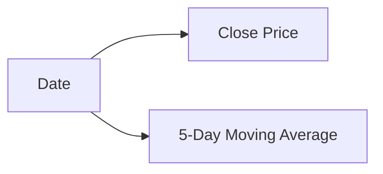

# Pandas 金融数据分析

## 介绍

Pandas是Python中一个强大的数据分析库，特别适合处理结构化数据。在金融领域，Pandas可以帮助我们加载、清洗、分析和可视化金融数据，从而为投资决策提供支持。本文将带您逐步学习如何使用Pandas进行金融数据分析，并通过实际案例展示其应用。

## 1. 加载金融数据

首先，我们需要加载金融数据。通常，金融数据可以来自CSV文件、API接口或数据库。以下是一个从CSV文件加载数据的示例：

```python
import pandas as pd

# 从CSV文件加载数据
df = pd.read_csv('financial_data.csv')

# 查看前5行数据
print(df.head())
```

**输出示例：**

| Date       | Open  | High  | Low   | Close | Volume   |
|------------|-------|-------|-------|-------|----------|
| 2023-01-01 | 100.0 | 102.0 | 99.0  | 101.0 | 1000000  |
| 2023-01-02 | 101.0 | 103.0 | 100.0 | 102.0 | 1200000  |
| 2023-01-03 | 102.0 | 104.0 | 101.0 | 103.0 | 1100000  |
| 2023-01-04 | 103.0 | 105.0 | 102.0 | 104.0 | 1300000  |
| 2023-01-05 | 104.0 | 106.0 | 103.0 | 105.0 | 1400000  |

:::note
确保您的CSV文件路径正确，并且文件格式符合预期。
:::

## 2. 数据清洗

加载数据后，通常需要进行数据清洗。常见的数据清洗操作包括处理缺失值、去除重复数据、转换数据类型等。

```python
# 检查缺失值
print(df.isnull().sum())

# 填充缺失值
df.fillna(method='ffill', inplace=True)

# 去除重复数据
df.drop_duplicates(inplace=True)

# 转换日期格式
df['Date'] = pd.to_datetime(df['Date'])
```

:::tip
使用 `fillna` 方法可以填充缺失值，`drop_duplicates` 可以去除重复数据，`pd.to_datetime` 可以将字符串日期转换为日期格式。
:::

## 3. 数据分析

在数据清洗完成后，我们可以开始进行数据分析。以下是一些常见的金融数据分析操作：

### 3.1 计算每日收益率

每日收益率是金融分析中的一个重要指标，可以通过以下公式计算：

$$ \text{收益率} = \frac{\text{收盘价} - \text{开盘价}}{\text{开盘价}} $$

```python
# 计算每日收益率
df['Daily_Return'] = (df['Close'] - df['Open']) / df['Open']

# 查看前5行数据
print(df.head())
```

**输出示例：**

| Date       | Open  | High  | Low   | Close | Volume   | Daily_Return |
|------------|-------|-------|-------|-------|----------|--------------|
| 2023-01-01 | 100.0 | 102.0 | 99.0  | 101.0 | 1000000  | 0.01         |
| 2023-01-02 | 101.0 | 103.0 | 100.0 | 102.0 | 1200000  | 0.0099       |
| 2023-01-03 | 102.0 | 104.0 | 101.0 | 103.0 | 1100000  | 0.0098       |
| 2023-01-04 | 103.0 | 105.0 | 102.0 | 104.0 | 1300000  | 0.0097       |
| 2023-01-05 | 104.0 | 106.0 | 103.0 | 105.0 | 1400000  | 0.0096       |

### 3.2 计算移动平均线

移动平均线是技术分析中常用的指标，用于平滑价格波动。我们可以使用Pandas的 `rolling` 方法计算移动平均线。

```python
# 计算5日移动平均线
df['MA_5'] = df['Close'].rolling(window=5).mean()

# 查看前10行数据
print(df.head(10))
```

**输出示例：**

| Date       | Close | MA_5  |
|------------|-------|-------|
| 2023-01-01 | 101.0 | NaN   |
| 2023-01-02 | 102.0 | NaN   |
| 2023-01-03 | 103.0 | NaN   |
| 2023-01-04 | 104.0 | NaN   |
| 2023-01-05 | 105.0 | 103.0 |
| 2023-01-06 | 106.0 | 104.0 |
| 2023-01-07 | 107.0 | 105.0 |
| 2023-01-08 | 108.0 | 106.0 |
| 2023-01-09 | 109.0 | 107.0 |
| 2023-01-10 | 110.0 | 108.0 |

:::caution
移动平均线在计算时，前几行数据可能为NaN，因为窗口大小不足。
:::

## 4. 数据可视化

数据可视化是金融分析中的重要环节。我们可以使用Matplotlib或Seaborn库来绘制图表。以下是一个简单的示例：

```python
import matplotlib.pyplot as plt

# 绘制收盘价和5日移动平均线
plt.figure(figsize=(10, 6))
plt.plot(df['Date'], df['Close'], label='Close Price')
plt.plot(df['Date'], df['MA_5'], label='5-Day Moving Average')
plt.xlabel('Date')
plt.ylabel('Price')
plt.title('Stock Price and Moving Average')
plt.legend()
plt.show()
```

**输出示例：**



:::tip
使用 `plt.plot` 可以绘制折线图，`plt.legend` 可以添加图例，`plt.show` 可以显示图表。
:::

## 5. 实际案例：股票投资组合分析

假设我们有一个包含多只股票的投资组合，我们可以使用Pandas来分析每只股票的收益率，并计算整个投资组合的收益率。

```python
# 假设我们有三只股票的数据
stocks = {
    'Stock_A': [100, 101, 102, 103, 104],
    'Stock_B': [200, 201, 202, 203, 204],
    'Stock_C': [300, 301, 302, 303, 304]
}

# 创建DataFrame
df_stocks = pd.DataFrame(stocks)

# 计算每只股票的收益率
df_stocks['Return_A'] = df_stocks['Stock_A'].pct_change()
df_stocks['Return_B'] = df_stocks['Stock_B'].pct_change()
df_stocks['Return_C'] = df_stocks['Stock_C'].pct_change()

# 计算投资组合的加权收益率（假设每只股票的权重相等）
df_stocks['Portfolio_Return'] = (df_stocks['Return_A'] + df_stocks['Return_B'] + df_stocks['Return_C']) / 3

# 查看结果
print(df_stocks)
```

**输出示例：**

| Stock_A | Stock_B | Stock_C | Return_A | Return_B | Return_C | Portfolio_Return |
|---------|---------|---------|----------|----------|----------|------------------|
| 100     | 200     | 300     | NaN      | NaN      | NaN      | NaN              |
| 101     | 201     | 301     | 0.01     | 0.005    | 0.0033   | 0.0061           |
| 102     | 202     | 302     | 0.0099   | 0.004975 | 0.003322 | 0.006066         |
| 103     | 203     | 303     | 0.0098   | 0.00495  | 0.003311 | 0.00602          |
| 104     | 204     | 304     | 0.0097   | 0.004926 | 0.0033   | 0.005975         |

:::note
投资组合的收益率可以通过加权平均每只股票的收益率来计算。
:::

## 总结

通过本文，您学习了如何使用Pandas进行金融数据分析，包括数据加载、清洗、分析和可视化。我们还通过实际案例展示了如何分析股票投资组合的收益率。希望这些内容能帮助您在金融数据分析中更好地应用Pandas。

## 附加资源与练习

- **练习1**：尝试从Yahoo Finance API获取股票数据，并使用Pandas进行分析。
- **练习2**：计算并绘制20日移动平均线，并与5日移动平均线进行比较。
- **附加资源**：
  - [Pandas官方文档](https://pandas.pydata.org/pandas-docs/stable/)
  - [Matplotlib官方文档](https://matplotlib.org/stable/contents.html)
  - [Seaborn官方文档](https://seaborn.pydata.org/)

继续练习和探索，您将更加熟练地掌握Pandas在金融数据分析中的应用！