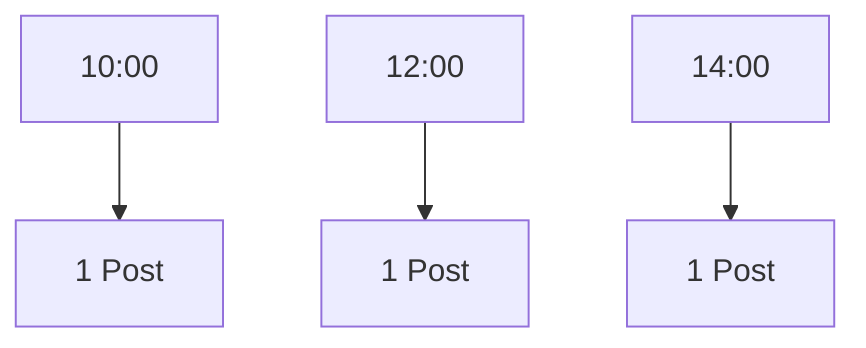

# Pandas 社交媒体分析

在当今的数字化时代，社交媒体数据成为了解用户行为、趋势和偏好的重要来源。Pandas 是一个强大的 Python 数据分析库，能够帮助我们高效地处理和分析这些数据。本文将带你从零开始，学习如何使用 Pandas 进行社交媒体数据分析。

## 1. 什么是社交媒体分析？

社交媒体分析是指通过收集、处理和分析社交媒体平台上的数据，来获取有价值的洞察。这些数据可能包括用户的发帖内容、点赞数、评论数、分享数等。通过分析这些数据，我们可以了解用户的兴趣、行为模式以及市场趋势。

## 2. 数据准备

在开始分析之前，我们需要准备一些社交媒体数据。假设我们有一个 CSV 文件 `social_media_data.csv`，其中包含以下字段：

- `user_id`: 用户 ID
- `post_id`: 帖子 ID
- `content`: 帖子内容
- `likes`: 点赞数
- `comments`: 评论数
- `shares`: 分享数
- `timestamp`: 发帖时间

首先，我们需要使用 Pandas 读取这个 CSV 文件：

```python
import pandas as pd

# 读取数据
df = pd.read_csv('social_media_data.csv')

# 查看前几行数据
print(df.head())
```

**输出示例：**

| user_id | post_id | content               | likes | comments | shares | timestamp           |
|---------|---------|-----------------------|-------|----------|--------|---------------------|
| 1       | 101     | 今天天气真好！         | 120   | 15       | 30     | 2023-10-01 10:00:00 |
| 2       | 102     | 新电影上映了！         | 200   | 25       | 50     | 2023-10-02 12:00:00 |
| 3       | 103     | 周末去哪里玩？         | 150   | 20       | 40     | 2023-10-03 14:00:00 |

## 3. 数据清洗

在进行数据分析之前，通常需要对数据进行清洗。数据清洗包括处理缺失值、去除重复数据、转换数据类型等。

### 3.1 处理缺失值

我们可以使用 `isnull()` 方法来检查数据中是否存在缺失值：

```python
# 检查缺失值
print(df.isnull().sum())
```

如果存在缺失值，我们可以选择删除这些行或用某种方式填充它们：

```python
# 删除包含缺失值的行
df = df.dropna()

# 或者用 0 填充缺失值
df = df.fillna(0)
```

### 3.2 去除重复数据

有时数据中可能存在重复的记录，我们可以使用 `drop_duplicates()` 方法来去除重复数据：

```python
# 去除重复数据
df = df.drop_duplicates()
```

### 3.3 转换数据类型

如果某些列的数据类型不正确，我们可以使用 `astype()` 方法进行转换。例如，将 `timestamp` 列转换为日期时间类型：

```python
# 转换 timestamp 列为日期时间类型
df['timestamp'] = pd.to_datetime(df['timestamp'])
```

## 4. 数据分析

数据清洗完成后，我们可以开始进行数据分析。以下是一些常见的分析任务。

### 4.1 计算每个用户的平均点赞数

我们可以使用 `groupby()` 方法按用户分组，然后计算每个用户的平均点赞数：

```python
# 计算每个用户的平均点赞数
avg_likes_per_user = df.groupby('user_id')['likes'].mean()
print(avg_likes_per_user)
```

**输出示例：**

```
user_id
1    120.0
2    200.0
3    150.0
Name: likes, dtype: float64
```

### 4.2 查找最受欢迎的帖子

我们可以通过按点赞数排序来找到最受欢迎的帖子：

```python
# 按点赞数排序
most_popular_posts = df.sort_values(by='likes', ascending=False)
print(most_popular_posts.head())
```

**输出示例：**

| user_id | post_id | content               | likes | comments | shares | timestamp           |
|---------|---------|-----------------------|-------|----------|--------|---------------------|
| 2       | 102     | 新电影上映了！         | 200   | 25       | 50     | 2023-10-02 12:00:00 |
| 3       | 103     | 周末去哪里玩？         | 150   | 20       | 40     | 2023-10-03 14:00:00 |
| 1       | 101     | 今天天气真好！         | 120   | 15       | 30     | 2023-10-01 10:00:00 |

### 4.3 分析发帖时间

我们可以分析用户在一天中的哪个时间段发帖最多。首先，我们需要从 `timestamp` 列中提取小时信息：

```python
# 提取小时信息
df['hour'] = df['timestamp'].dt.hour

# 统计每个小时的发帖数量
posts_per_hour = df['hour'].value_counts().sort_index()
print(posts_per_hour)
```

**输出示例：**

```
10    1
12    1
14    1
Name: hour, dtype: int64
```

## 5. 数据可视化

数据可视化是数据分析的重要部分。我们可以使用 Matplotlib 或 Seaborn 等库来绘制图表。

### 5.1 绘制发帖时间分布图

```python
import matplotlib.pyplot as plt

# 绘制发帖时间分布图
posts_per_hour.plot(kind='bar')
plt.xlabel('Hour of the Day')
plt.ylabel('Number of Posts')
plt.title('Posts Distribution by Hour')
plt.show()
```



## 6. 实际案例

假设我们是一家社交媒体公司的数据分析师，我们的任务是分析用户发帖行为，找出最活跃的用户和最受欢迎的内容类型。通过上述步骤，我们可以得出以下结论：

- 用户 2 的平均点赞数最高，表明其内容最受欢迎。
- 最受欢迎的帖子是关于新电影上映的内容。
- 用户在下午 2 点发帖最多。

## 7. 总结

通过本文的学习，你应该已经掌握了如何使用 Pandas 进行社交媒体数据分析。我们从数据准备、数据清洗、数据分析到数据可视化，逐步讲解了每个步骤。希望这些知识能够帮助你在实际工作中更好地分析社交媒体数据。

## 8. 附加资源与练习

- **练习 1**: 尝试分析评论数和分享数，找出哪些帖子引发了最多的讨论。
- **练习 2**: 使用 Seaborn 库绘制更复杂的图表，如热力图或箱线图。
- **附加资源**: 
  - [Pandas 官方文档](https://pandas.pydata.org/pandas-docs/stable/)
  - [Matplotlib 官方文档](https://matplotlib.org/stable/contents.html)
  - [Seaborn 官方文档](https://seaborn.pydata.org/)

:::tip
如果你在练习中遇到问题，可以参考 Pandas 的官方文档或在线社区，如 Stack Overflow。
:::