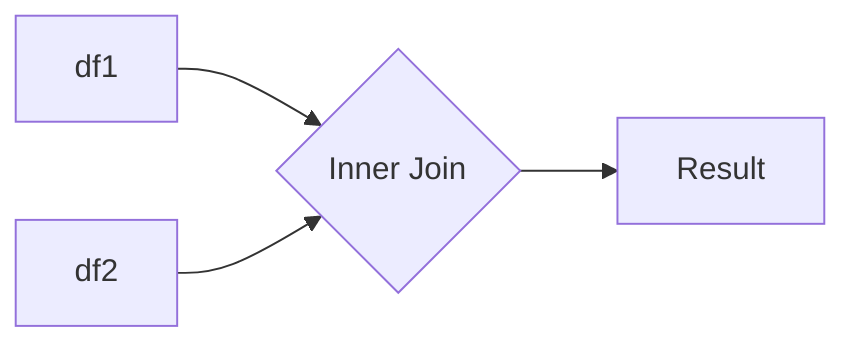

# Pandas 内连接

在数据处理中，合并数据集是一个常见的操作。Pandas提供了多种合并数据的方法，其中**内连接（inner join）**是最常用的之一。内连接允许我们根据两个数据集的共同列（键）来合并数据，并且只保留两个数据集中都存在的记录。

## 什么是内连接？

内连接是一种基于共同列（键）的合并操作。它会返回两个数据集中**键值匹配**的所有行，而忽略那些在其中一个数据集中不存在的键值。换句话说，内连接只保留两个数据集中**交集**的部分。

### 内连接的工作原理

假设我们有两个数据集 `df1` 和 `df2`，它们都有一个共同的列 `key`。内连接会找到 `df1` 和 `df2` 中 `key` 列值相同的行，并将这些行合并成一个新的数据集。



## 内连接的语法

在Pandas中，内连接可以通过 `merge()` 函数实现。以下是 `merge()` 函数的基本语法：

```python
pd.merge(left, right, how='inner', on=None, left_on=None, right_on=None)
```

- `left`：左侧的DataFrame。
- `right`：右侧的DataFrame。
- `how`：指定连接方式，默认为 `'inner'`。
- `on`：用于连接的列名。如果两个DataFrame的列名相同，可以直接使用 `on` 参数。
- `left_on` 和 `right_on`：如果两个DataFrame的列名不同，可以使用这两个参数分别指定左侧和右侧的列名。

## 代码示例

让我们通过一个简单的例子来理解内连接的使用。

### 示例数据

假设我们有两个数据集 `df1` 和 `df2`：

```python
import pandas as pd

# 创建第一个DataFrame
df1 = pd.DataFrame({
    'key': ['A', 'B', 'C', 'D'],
    'value1': [1, 2, 3, 4]
})

# 创建第二个DataFrame
df2 = pd.DataFrame({
    'key': ['B', 'C', 'D', 'E'],
    'value2': [5, 6, 7, 8]
})
```

### 执行内连接

我们可以使用 `merge()` 函数对这两个数据集进行内连接：

```python
result = pd.merge(df1, df2, on='key', how='inner')
print(result)
```

### 输出结果

```plaintext
  key  value1  value2
0   B       2       5
1   C       3       6
2   D       4       7
```

在这个例子中，`df1` 和 `df2` 都有一个共同的列 `key`。内连接只保留了 `key` 列中值相同的行，即 `B`、`C` 和 `D`。

## 实际应用场景

内连接在实际中有很多应用场景。例如：

1. **合并销售数据**：假设你有两个数据集，一个包含产品信息，另一个包含销售记录。你可以使用内连接将这两个数据集合并，以便分析每个产品的销售情况。

2. **用户数据分析**：如果你有一个用户信息表和一个用户行为表，你可以使用内连接将这两个表合并，以便分析用户的行为模式。

3. **数据清洗**：在数据清洗过程中，内连接可以帮助你过滤掉那些在另一个数据集中不存在的记录，从而确保数据的完整性。

## 总结

内连接是Pandas中一个非常强大的工具，它允许我们根据共同的列将两个数据集合并在一起。通过内连接，我们可以轻松地提取两个数据集中的交集部分，从而进行更深入的分析。

### 附加资源

- [Pandas官方文档 - merge](https://pandas.pydata.org/pandas-docs/stable/reference/api/pandas.merge.html)
- [Pandas数据合并与连接](https://pandas.pydata.org/pandas-docs/stable/user_guide/merging.html)

### 练习

1. 创建两个DataFrame，分别包含学生ID和成绩信息，使用内连接合并这两个数据集。
2. 尝试使用不同的列名进行内连接，并使用 `left_on` 和 `right_on` 参数指定连接列。

:::tip
在实际操作中，确保连接列的键值是唯一的，以避免意外的数据重复。
:::