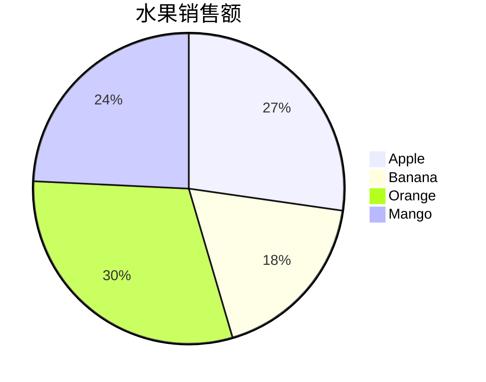
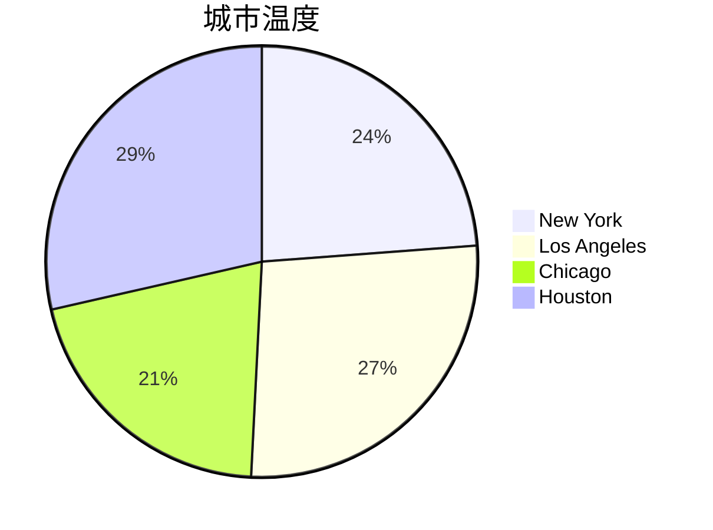

# Pandas 柱状图

柱状图是数据可视化中最常用的图表类型之一，用于展示不同类别之间的数值比较。Pandas库提供了简单而强大的工具来绘制柱状图，帮助初学者快速上手数据可视化。

## 什么是柱状图？

柱状图（Bar Chart）是一种用矩形条表示数据的图表，矩形条的长度或高度与数据的数值成正比。它通常用于比较不同类别的数据，例如不同产品的销售额、不同城市的人口数量等。

## 如何使用Pandas绘制柱状图？

Pandas的`DataFrame`和`Series`对象都提供了`plot.bar()`方法，用于绘制柱状图。下面我们将通过一个简单的例子来演示如何使用Pandas绘制柱状图。

### 示例：绘制简单的柱状图

假设我们有一个包含不同水果销售数据的`DataFrame`：

```python
import pandas as pd

data = {
    'Fruit': ['Apple', 'Banana', 'Orange', 'Mango'],
    'Sales': [45, 30, 50, 40]
}

df = pd.DataFrame(data)
```

我们可以使用`plot.bar()`方法来绘制柱状图：

```python
df.plot.bar(x='Fruit', y='Sales', legend=False)
```

### 输出结果



:::note
注意：`x`参数指定了横轴的数据列，`y`参数指定了纵轴的数据列。`legend=False`表示不显示图例。
:::

## 逐步讲解

### 1. 准备数据

首先，我们需要准备一个包含数据的`DataFrame`。数据可以是任何形式的，只要它包含类别和对应的数值即可。

### 2. 绘制柱状图

使用`plot.bar()`方法绘制柱状图。你可以通过`x`和`y`参数指定横轴和纵轴的数据列。

### 3. 自定义图表

你可以通过`color`参数自定义柱状图的颜色，通过`title`参数添加图表标题，通过`xlabel`和`ylabel`参数添加轴标签。

```python
df.plot.bar(x='Fruit', y='Sales', color='skyblue', title='水果销售额', xlabel='水果', ylabel='销售额')
```

## 实际案例

### 案例：不同城市的温度比较

假设我们有一个包含不同城市温度数据的`DataFrame`：

```python
data = {
    'City': ['New York', 'Los Angeles', 'Chicago', 'Houston'],
    'Temperature': [75, 85, 65, 90]
}

df = pd.DataFrame(data)
```

我们可以使用`plot.bar()`方法来绘制柱状图：

```python
df.plot.bar(x='City', y='Temperature', color='orange', title='城市温度比较', xlabel='城市', ylabel='温度（°F）')
```

### 输出结果



:::tip
提示：你可以通过调整`color`参数来改变柱状图的颜色，使其更符合你的需求。
:::

## 总结

通过本文，你学习了如何使用Pandas绘制柱状图。柱状图是数据可视化中非常重要的工具，能够帮助你直观地比较不同类别的数据。我们通过简单的示例和实际案例展示了如何绘制和自定义柱状图。

## 附加资源

- [Pandas官方文档](https://pandas.pydata.org/pandas-docs/stable/reference/api/pandas.DataFrame.plot.bar.html)
- [Matplotlib官方文档](https://matplotlib.org/stable/api/_as_gen/matplotlib.pyplot.bar.html)

## 练习

1. 创建一个包含不同国家人口数据的`DataFrame`，并绘制柱状图。
2. 尝试使用不同的颜色和标题自定义你的柱状图。
3. 使用`plot.barh()`方法绘制水平柱状图，并比较与垂直柱状图的区别。

祝你学习愉快！