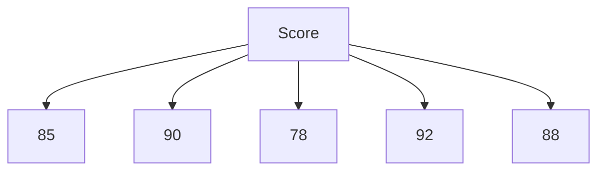

# Pandas 直方图

直方图是一种用于可视化数据分布的图表类型。它将数据分成多个区间（称为“bin”），并显示每个区间中数据点的数量。Pandas库提供了简单而强大的工具来绘制直方图，帮助我们快速理解数据的分布情况。

## 什么是直方图？

直方图是一种统计图表，用于显示连续数据的分布情况。它将数据划分为若干个区间（bin），并计算每个区间内数据点的数量。通过直方图，我们可以直观地看到数据的集中趋势、离散程度以及是否存在异常值。

## 使用Pandas绘制直方图

Pandas的`DataFrame`和`Series`对象都提供了`hist()`方法，用于绘制直方图。下面我们通过一个简单的例子来演示如何使用Pandas绘制直方图。

### 示例：绘制简单的直方图

假设我们有一个包含学生考试成绩的数据集，我们想要查看成绩的分布情况。

```python
import pandas as pd
import numpy as np

# 创建一个包含学生成绩的DataFrame
data = {
    'Student': ['Alice', 'Bob', 'Charlie', 'David', 'Eva'],
    'Score': [85, 90, 78, 92, 88]
}
df = pd.DataFrame(data)

# 绘制直方图
df['Score'].hist(bins=5)
```

在这个例子中，我们将学生的成绩划分为5个区间，并绘制了直方图。`bins`参数用于指定区间的数量。

### 解释代码

- `df['Score']`：选择`Score`列的数据。
- `hist(bins=5)`：绘制直方图，并将数据划分为5个区间。

### 输出结果



:::note
在实际运行代码时，你将看到一个直方图，显示了成绩在各个区间的分布情况。
:::

## 自定义直方图

Pandas的`hist()`方法提供了多个参数，允许我们自定义直方图的外观和行为。以下是一些常用的参数：

- `bins`：指定区间的数量。
- `color`：设置直方图的颜色。
- `alpha`：设置直方图的透明度。
- `figsize`：设置图表的大小。

### 示例：自定义直方图

```python
# 自定义直方图
df['Score'].hist(bins=5, color='blue', alpha=0.7, figsize=(8, 6))
```

在这个例子中，我们将直方图的颜色设置为蓝色，透明度为0.7，图表大小为8x6英寸。

## 实际应用场景

直方图在数据分析中有广泛的应用。以下是一些常见的应用场景：

1. **数据分布分析**：通过直方图可以快速了解数据的分布情况，例如数据的集中趋势、离散程度等。
2. **异常值检测**：直方图可以帮助我们识别数据中的异常值，例如某个区间内的数据点数量明显偏少或偏多。
3. **数据预处理**：在数据预处理阶段，直方图可以帮助我们决定是否需要对数据进行标准化或归一化处理。

### 示例：分析销售数据

假设我们有一个包含某公司销售数据的数据集，我们想要分析销售额的分布情况。

```python
# 创建一个包含销售数据的DataFrame
sales_data = {
    'Month': ['Jan', 'Feb', 'Mar', 'Apr', 'May'],
    'Sales': [200, 220, 210, 230, 240]
}
sales_df = pd.DataFrame(sales_data)

# 绘制直方图
sales_df['Sales'].hist(bins=5, color='green', alpha=0.7)
```

通过这个直方图，我们可以直观地看到销售额在各个区间的分布情况，从而更好地理解销售数据的特征。

## 总结

直方图是一种强大的工具，用于可视化数据的分布情况。Pandas库提供了简单易用的`hist()`方法，使我们能够轻松地绘制直方图。通过本文的学习，你应该已经掌握了如何使用Pandas绘制直方图，并理解了直方图在数据分析中的应用。

## 附加资源

- [Pandas官方文档](https://pandas.pydata.org/pandas-docs/stable/reference/api/pandas.DataFrame.hist.html)
- [Matplotlib直方图文档](https://matplotlib.org/stable/api/_as_gen/matplotlib.pyplot.hist.html)

## 练习

1. 使用Pandas加载一个包含年龄数据的数据集，并绘制年龄分布的直方图。
2. 尝试调整`bins`参数，观察直方图的变化。
3. 使用`color`和`alpha`参数自定义直方图的外观。

:::tip
在练习过程中，尝试使用不同的数据集和参数，以加深对直方图的理解。
:::