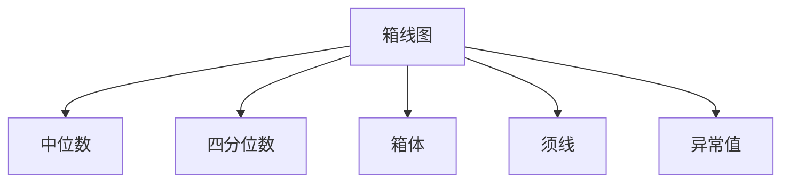
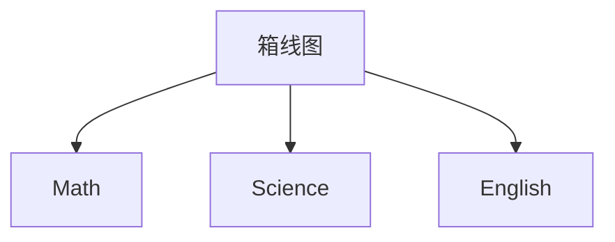

# Pandas 箱线图

箱线图（Box Plot）是一种用于显示数据分布和检测异常值的强大工具。它通过展示数据的中位数、四分位数以及可能的异常值，帮助我们快速了解数据的整体情况。在本教程中，我们将学习如何使用Pandas绘制箱线图，并通过实际案例展示其应用。

## 什么是箱线图？

箱线图由五个主要部分组成：

1. **中位数（Median）**：数据的中位数，表示数据的中心位置。
2. **四分位数（Quartiles）**：将数据分为四等份，分别是下四分位数（Q1）、中位数（Q2）和上四分位数（Q3）。
3. **箱体（Box）**：由Q1和Q3之间的区域组成，表示数据的中间50%。
4. **须线（Whiskers）**：从箱体延伸出的线，通常表示数据的正常范围。
5. **异常值（Outliers）**：超出须线范围的数据点，可能是异常值。

## 使用Pandas绘制箱线图

Pandas提供了简单的接口来绘制箱线图。我们可以使用 `DataFrame.plot.box()` 方法来绘制箱线图。

### 示例数据集

首先，让我们创建一个示例数据集：

```python
import pandas as pd
import numpy as np

# 创建一个包含随机数据的DataFrame
data = {
    'A': np.random.normal(0, 1, 100),
    'B': np.random.normal(1, 2, 100),
    'C': np.random.normal(2, 3, 100)
}
df = pd.DataFrame(data)
```

### 绘制箱线图

接下来，我们可以使用以下代码绘制箱线图：

```python
df.plot.box()
```

### 输出



:::note
在实际运行代码时，你将看到一个图形化的箱线图，展示了每列数据的中位数、四分位数、箱体、须线以及可能的异常值。
:::

## 逐步讲解

### 1. 中位数

中位数是数据的中心位置，表示数据集中50%的值低于中位数，50%的值高于中位数。

### 2. 四分位数

四分位数将数据分为四等份：

- **Q1（下四分位数）**：25%的数据低于Q1。
- **Q2（中位数）**：50%的数据低于Q2。
- **Q3（上四分位数）**：75%的数据低于Q3。

### 3. 箱体

箱体由Q1和Q3之间的区域组成，表示数据的中间50%。

### 4. 须线

须线通常从箱体延伸到1.5倍的四分位距（IQR，即Q3 - Q1）内的最远数据点。超出这个范围的数据点被认为是异常值。

### 5. 异常值

异常值是那些超出须线范围的数据点，可能是由于测量误差或其他原因导致的。

## 实际案例

假设我们有一个包含学生考试成绩的数据集，我们想要分析不同科目的成绩分布情况。

```python
# 创建示例数据集
scores = {
    'Math': [88, 92, 85, 78, 90, 95, 82, 87, 91, 89],
    'Science': [76, 81, 79, 84, 80, 77, 83, 78, 82, 85],
    'English': [92, 88, 90, 85, 87, 91, 89, 86, 93, 90]
}
df_scores = pd.DataFrame(scores)

# 绘制箱线图
df_scores.plot.box()
```

### 输出



:::tip
通过箱线图，我们可以快速比较不同科目的成绩分布，识别出哪些科目可能存在异常值或成绩分布不均的情况。
:::

## 总结

箱线图是一种强大的工具，用于可视化数据的分布和检测异常值。通过Pandas，我们可以轻松地绘制箱线图，并快速了解数据的整体情况。在实际应用中，箱线图可以帮助我们识别数据中的异常值、比较不同组的数据分布等。

## 附加资源与练习

- **练习**：尝试使用你自己的数据集绘制箱线图，并分析数据的分布情况。
- **资源**：了解更多关于Pandas绘图功能的内容，可以参考[Pandas官方文档](https://pandas.pydata.org/pandas-docs/stable/user_guide/visualization.html)。

:::caution
在绘制箱线图时，确保你的数据是数值型的，否则可能会导致错误。
:::