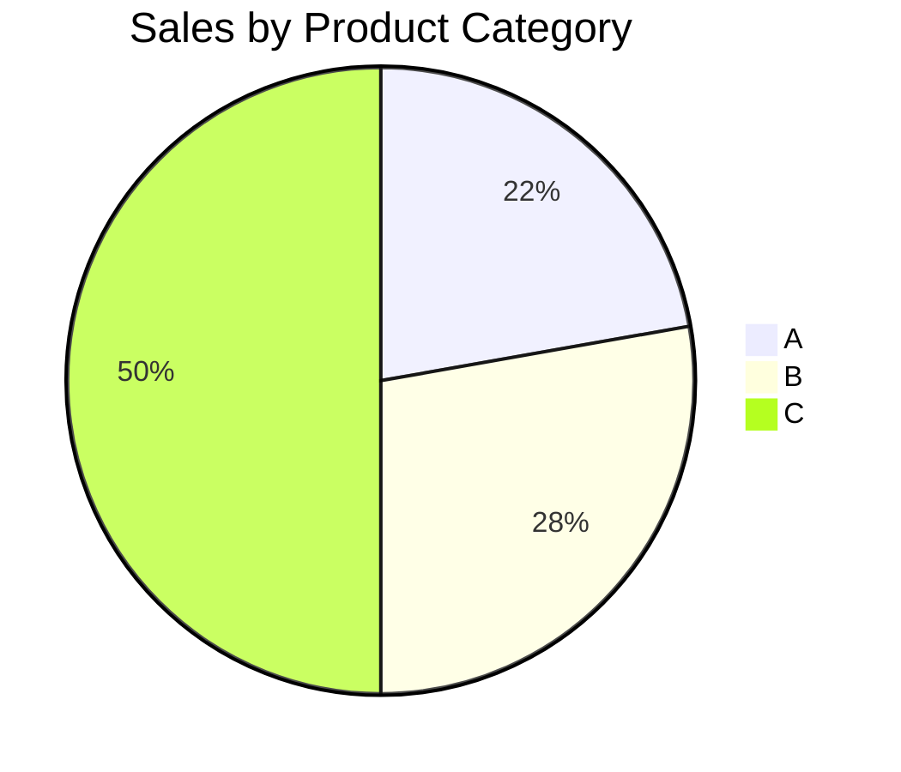
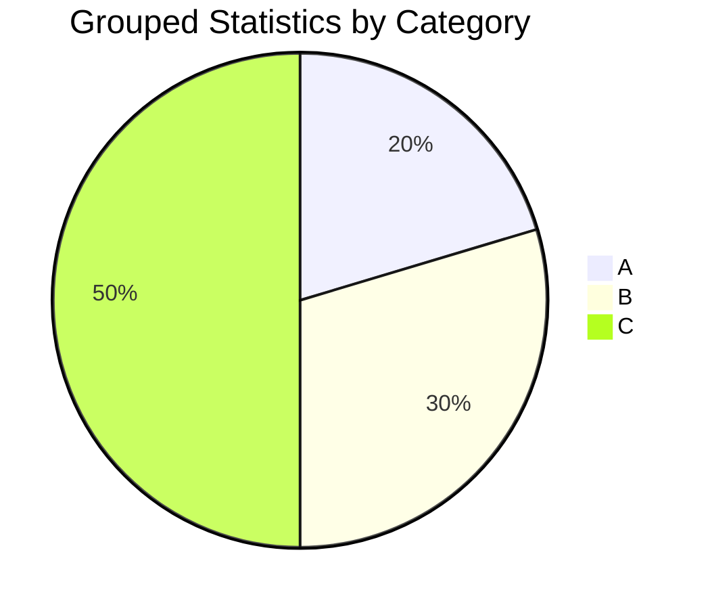

# Pandas 分组可视化

在数据分析中，分组（Grouping）是一个非常重要的操作。它允许我们根据某些条件将数据分成不同的组，然后对每个组进行单独的分析或操作。Pandas库提供了强大的分组功能，结合可视化工具，我们可以更直观地理解数据的分布和趋势。

## 什么是分组可视化？

分组可视化是指在对数据进行分组后，通过图表或图形的方式展示每个组的特征。例如，我们可以根据某个类别列（如“性别”或“地区”）对数据进行分组，然后绘制每个组的平均值、总和或其他统计量的图表。

## 基本分组操作

在Pandas中，我们使用 `groupby()` 方法对数据进行分组。以下是一个简单的示例，展示如何对数据进行分组并计算每组的平均值。

```python
import pandas as pd

# 创建一个示例DataFrame
data = {
    'Category': ['A', 'B', 'A', 'B', 'A', 'B'],
    'Values': [10, 20, 10, 25, 15, 30]
}
df = pd.DataFrame(data)

# 按 'Category' 列分组并计算每组的平均值
grouped = df.groupby('Category').mean()
print(grouped)
```

**输出：**

```
          Values
Category        
A         11.666667
B         25.000000
```

在这个例子中，我们按 `Category` 列对数据进行了分组，并计算了每组 `Values` 列的平均值。

## 分组可视化示例

接下来，我们将通过一个实际案例来展示如何对分组后的数据进行可视化。

### 案例：销售数据分析

假设我们有一个销售数据集，包含不同产品类别的销售额。我们想要分析每个产品类别的销售情况，并通过可视化展示结果。

```python
import pandas as pd
import matplotlib.pyplot as plt

# 创建一个示例销售数据集
data = {
    'Product': ['A', 'B', 'A', 'B', 'A', 'B', 'C', 'C', 'C'],
    'Sales': [100, 150, 200, 250, 300, 350, 400, 450, 500]
}
df = pd.DataFrame(data)

# 按 'Product' 列分组并计算每组的销售总额
grouped = df.groupby('Product').sum()

# 绘制柱状图
grouped.plot(kind='bar', legend=False)
plt.title('Sales by Product Category')
plt.xlabel('Product Category')
plt.ylabel('Total Sales')
plt.show()
```

**输出：**



在这个案例中，我们按 `Product` 列对销售数据进行了分组，并计算了每个产品类别的销售总额。然后，我们使用柱状图展示了每个产品类别的销售情况。

## 分组聚合与可视化

除了简单的求和或平均值，我们还可以对分组后的数据进行更复杂的聚合操作。例如，我们可以计算每个组的多个统计量，并将它们可视化。

```python
import pandas as pd
import matplotlib.pyplot as plt

# 创建一个示例数据集
data = {
    'Category': ['A', 'B', 'A', 'B', 'A', 'B', 'C', 'C', 'C'],
    'Values': [10, 20, 15, 25, 30, 35, 40, 45, 50]
}
df = pd.DataFrame(data)

# 按 'Category' 列分组并计算每组的多个统计量
grouped = df.groupby('Category').agg(['mean', 'sum', 'count'])

# 绘制多个统计量的柱状图
grouped.plot(kind='bar', legend=True)
plt.title('Grouped Statistics by Category')
plt.xlabel('Category')
plt.ylabel('Value')
plt.show()
```

**输出：**



在这个例子中，我们对每个组计算了平均值、总和和计数，并将这些统计量通过柱状图展示出来。

## 总结

通过Pandas的分组功能，我们可以轻松地对数据进行分组并进行分析。结合可视化工具，我们可以更直观地理解数据的分布和趋势。无论是简单的求和、平均值，还是复杂的聚合操作，分组可视化都是数据分析中不可或缺的一部分。

## 附加资源与练习

- **练习1**：尝试使用你自己的数据集，按某个类别列进行分组，并绘制每个组的柱状图。
- **练习2**：对分组后的数据计算多个统计量（如均值、中位数、标准差等），并将它们可视化。
- **资源**：Pandas官方文档中的[GroupBy](https://pandas.pydata.org/pandas-docs/stable/user_guide/groupby.html)部分提供了更多关于分组操作的详细信息。

:::tip
在实际项目中，分组可视化可以帮助你快速发现数据中的模式和异常。尝试将分组可视化应用到你的数据分析工作流中，看看它能为你带来哪些新的洞察！
:::