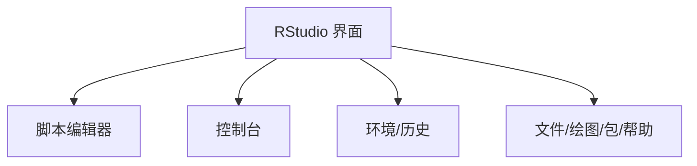

## 介绍

RStudio 是 R 语言最流行的集成开发环境（IDE），它为 R 编程提供了强大的工具和友好的用户界面。无论你是数据分析师、统计学家还是数据科学家，RStudio 都能帮助你更高效地编写、调试和运行 R 代码。本文将带你逐步了解 RStudio 的基本界面布局及其功能，帮助你快速上手 R 编程。

## RStudio 界面布局

RStudio 的界面主要由四个主要面板组成：

1. **脚本编辑器（Source）**：用于编写和编辑 R 脚本。
2. **控制台（Console）**：用于直接输入 R 命令并查看输出。
3. **环境/历史（Environment/History）**：显示当前工作环境中的变量和历史命令。
4. **文件/绘图/包/帮助（Files/Plots/Packages/Help）**：用于管理文件、查看绘图、安装和管理包以及查看帮助文档。



### 1. 脚本编辑器（Source）

脚本编辑器是编写和编辑 R 脚本的地方。你可以在这里编写多行代码，并通过点击“Run”按钮或使用快捷键 `Ctrl + Enter` 来执行选中的代码。

```r
# 示例代码
x <- 1:10
y <- x^2
plot(x, y)
```

:::tip
在脚本编辑器中编写代码时，建议将代码分段执行，这样可以更容易地调试和理解代码的运行过程。
:::

### 2. 控制台（Console）

控制台是直接与 R 交互的地方。你可以在这里输入单行命令并立即看到结果。控制台还显示脚本编辑器执行的代码的输出。

```r
# 在控制台中输入以下命令
sum(1:10)
```

输出：
```
[1] 55
```

:::caution
在控制台中输入的代码不会被保存，因此建议在脚本编辑器中编写代码并保存为 `.R` 文件。
:::

### 3. 环境/历史（Environment/History）

环境面板显示当前工作环境中定义的所有变量和对象。你可以在这里查看变量的值、类型和结构。

```r
# 定义一些变量
a <- 10
b <- "Hello, R!"
c <- data.frame(x = 1:5, y = 6:10)
```

在环境面板中，你将看到 `a`、`b` 和 `c` 的详细信息。

历史面板显示你在控制台中输入的所有命令。你可以通过双击历史命令来重新执行它们。

### 4. 文件/绘图/包/帮助（Files/Plots/Packages/Help）

- **文件**：用于浏览和管理项目中的文件。
- **绘图**：显示生成的图形。你可以在这里查看、保存和导出绘图。
- **包**：用于安装、加载和管理 R 包。
- **帮助**：提供 R 函数和包的文档。你可以在这里查找函数的用法和示例。

```r
# 查看帮助文档
?plot
```

:::note
使用帮助面板可以快速查找函数的用法和示例，这对于学习和调试代码非常有帮助。
:::

## 实际案例

假设你正在分析一组学生的考试成绩数据。你可以在 RStudio 中编写脚本，加载数据，进行统计分析，并生成可视化图表。

```r
# 加载数据
students <- data.frame(
  name = c("Alice", "Bob", "Charlie"),
  score = c(85, 90, 78)
)

# 计算平均分
mean_score <- mean(students$score)

# 绘制柱状图
barplot(students$score, names.arg = students$name, main = "学生成绩", ylab = "分数")
```

在 RStudio 中，你可以轻松地在脚本编辑器中编写上述代码，并在控制台中查看输出，在绘图面板中查看生成的图表。

## 总结

RStudio 是一个功能强大的 R 语言集成开发环境，它提供了脚本编辑器、控制台、环境/历史和文件/绘图/包/帮助等多个面板，帮助你更高效地进行 R 编程。通过本文的介绍，你应该已经对 RStudio 的基本界面布局和功能有了初步的了解。

## 附加资源

- [RStudio 官方文档](https://support.rstudio.com/hc/en-us)
- [R for Data Science](https://r4ds.had.co.nz/) - 一本非常适合初学者的 R 语言书籍。

## 练习

1. 打开 RStudio，尝试在脚本编辑器中编写一段简单的 R 代码，并在控制台中执行。
2. 使用环境面板查看你定义的变量。
3. 在帮助面板中查找 `mean` 函数的用法，并尝试在控制台中使用它。
