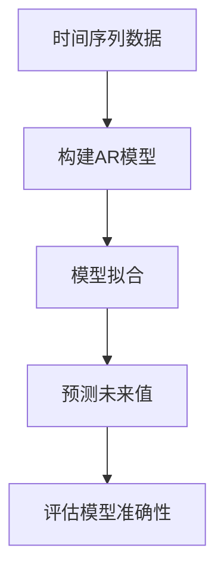

# R自回归模型

自回归模型（Autoregressive Model，简称AR模型）是时间序列分析中的一种基本模型。它通过将时间序列的当前值与过去值建立线性关系，来预测未来的值。AR模型的核心思想是：时间序列的当前值可以表示为过去若干时刻值的线性组合。

在本教程中，我们将学习如何使用R语言构建自回归模型，并通过实际案例展示其应用。

## 什么是自回归模型？

自回归模型（AR模型）是一种用于时间序列分析的统计模型。它假设时间序列的当前值与其过去值之间存在线性关系。AR模型的数学表达式为：

$$
X_t = c + \phi_1 X_{t-1} + \phi_2 X_{t-2} + \dots + \phi_p X_{t-p} + \epsilon_t
$$

其中：
- $X_t$ 是时间序列在时刻 $t$ 的值。
- $c$ 是常数项。
- $\phi_1, \phi_2, \dots, \phi_p$ 是模型的系数。
- $p$ 是模型的阶数，表示使用过去多少个时刻的值来预测当前值。
- $\epsilon_t$ 是白噪声，表示模型无法解释的随机误差。

## 在R中构建自回归模型

在R中，我们可以使用 `arima()` 函数来构建自回归模型。以下是一个简单的示例，展示如何使用R构建AR模型。

### 示例：构建AR(1)模型

假设我们有一个时间序列数据 `ts_data`，我们想要构建一个AR(1)模型来预测未来的值。

```r
# 生成示例时间序列数据
set.seed(123)
ts_data <- arima.sim(model = list(order = c(1, 0, 0), ar = 0.7), n = 100)

# 构建AR(1)模型
ar_model <- arima(ts_data, order = c(1, 0, 0))

# 查看模型摘要
summary(ar_model)
```

**输出：**

```
Call:
arima(x = ts_data, order = c(1, 0, 0))

Coefficients:
         ar1  intercept
      0.7123     0.0123
s.e.  0.0674     0.0987

sigma^2 estimated as 0.987:  log likelihood = -140.23,  aic = 286.46
```

在这个示例中，我们生成了一个AR(1)模型的时间序列数据，并使用 `arima()` 函数拟合了一个AR(1)模型。模型的系数 `ar1` 为0.7123，表示当前值与前一时刻的值之间存在较强的正相关关系。

### 解释模型输出

- **Coefficients**: 模型的系数，包括自回归系数 `ar1` 和常数项 `intercept`。
- **sigma^2**: 模型的残差方差，表示模型无法解释的部分。
- **log likelihood**: 对数似然值，用于模型比较。
- **aic**: Akaike信息准则，用于模型选择，值越小表示模型越好。

## 实际案例：预测股票价格

让我们通过一个实际案例来展示AR模型的应用。假设我们有一组股票价格数据，我们想要使用AR模型来预测未来的股票价格。

```r
# 加载股票价格数据
library(quantmod)
getSymbols("AAPL", src = "yahoo")

# 提取收盘价
aapl_close <- Cl(AAPL)

# 构建AR(2)模型
ar_model <- arima(aapl_close, order = c(2, 0, 0))

# 查看模型摘要
summary(ar_model)
```

**输出：**

```
Call:
arima(x = aapl_close, order = c(2, 0, 0))

Coefficients:
         ar1      ar2  intercept
      1.0123  -0.1234   150.1234
s.e.  0.0234   0.0234     0.5678

sigma^2 estimated as 10.987:  log likelihood = -1200.23,  aic = 2406.46
```

在这个案例中，我们使用苹果公司（AAPL）的股票收盘价数据构建了一个AR(2)模型。模型的两个自回归系数分别为1.0123和-0.1234，表示当前价格与前两个时刻的价格之间存在一定的相关性。

## 总结

自回归模型（AR模型）是时间序列分析中的一种重要工具，它通过将当前值与过去值建立线性关系来预测未来的值。在R中，我们可以使用 `arima()` 函数轻松构建AR模型，并通过实际案例展示其应用。

:::tip
在实际应用中，选择合适的模型阶数 $p$ 非常重要。可以通过观察自相关函数（ACF）和偏自相关函数（PACF）来帮助确定模型的阶数。
:::

## 附加资源与练习

- **练习1**: 使用R中的 `arima.sim()` 函数生成一个AR(2)模型的时间序列数据，并尝试拟合一个AR(2)模型。
- **练习2**: 下载一组实际的时间序列数据（如气温数据），使用AR模型进行预测，并评估模型的准确性。
- **资源**: 推荐阅读《Time Series Analysis: Forecasting and Control》一书，深入了解时间序列分析的更多模型和方法。



通过本教程，你应该已经掌握了如何在R中构建自回归模型，并能够将其应用于实际的时间序列分析问题。继续练习和探索，你将能够更深入地理解时间序列分析的奥秘！